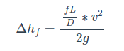

# Setup
```
pip3 install virtualenv
python3 -m venv env
source env/bin/activate

pip3 install Jinja2   
pip3 install lesscpy
pip3 install Markdown
pip3 install watchdog
pip3 install htmlmin
```


# Page Structure
## Metadata
Each page will show up in the table of contents using the file's name, without it's extension (i.e. pump_stuff.md will be "pump_stuff").  To allow better titles for the pages in the table of contents, you can place meta data in each page (at the top).

```
-----
title:  Pump Info
-----

... the page content ....
```

All metadata must appear at the top of the file, and the 
metadata is sectioned off from the rest of the page content with
a sequence of 5 dashes `-----`, and closed with the same 5 dashes.

The following metadata attributes are supported:

- **title** - title of the page to appear in the table of contents
- **author** - optional text to indicate who wrote the page.  Will be injected at the end of the page.
- **date** - optional date originally published.
- **edited** - optional date last edited.


## Directory (Topic Headings)
Each directory **must include a `index.md` file.  This file must include a meta data entry, but no additional content.  The meta data should at least include the title.

## Page ordering
The EDB is arranged in a heiarchy of topics.  Folder structure under the `/source` directory is used to arrange the heiarchy, however the order of pages within the same directory is determined by alphabetical order.

**Note** - this is why the actual page title is always included in the metadata section discussed above.  **The recommended way to create individual pages is to prefix their filenames with a number** - ensuring the order of the pages is always clear.

For example, the main topic "System Curves" has three pages within it - "Tutorial", "Demonstrator", and "Worked Example".  To ensure that the pages appear in the given order, you would arrange the folder structure as follows:

```
 source
   ---- index.md
   ---- 01_system-curves
        | -- index.md
        | -- 01_tutorial.md
        | -- 02_demonstrator.md
        | -- 03_worked-example.md
```
The `index.md` entry at the root of the directory structure is the front page of the EDB, and contains standard markup.  While it must have a meta data block, it is not necessary to place any values in it. See the current `index.md` for detail.

Within sub-directories, which represent sections of the EDB, the contents of `index.md` contains the true title of the section:

```
-----
title: System Curves
-----
```

The prefixes 01, 02, 03 ensure the topics held under System Curves appear in the correct order.  Their page titles will be derived from their metadata block.  For example - within `03_worked-example.md`:

```
-----
title: Worked Example
date: April 16th, 2019
-----
```
## Directory and File Naming
As described below, the title of directories and pages that *users* see in their browser is **not** determined by the file / directory names you create in the `source` directory - the public facing names are defined in the metadata blocks within the directories and files.

**It is absolutely critical that DO NOT INCLUDE spaces in the names of your files or folders.**

Likewise, **DO NOT use underscore characters `_` anywhere in the file or directory** name OTHER than to separate the numeric prefix used to order the pages.

For example, the following are all valid folder or file names:
- `01_system-curves`
- `01_SystemCurves`
- `01_systemcurves`

The following **are not valid names**, and will result in build failure
- `01_system_curves`  (multuple underscores will lead to malformed URLs)
- `01-system-curves`  (an underscore should always separate the ordering prefix)
- `01__system-curves` (multuple underscores will lead to malformed URLs)
- `01_system curves`  (spaces between words will create invalid URLs)

*You are highly recommended to follow the standard URL **slug** notation - which uses all lower cases, an separates words using a single dash `-` character.*  While not absolutely necessary, following this convention is known to improve search engine optimization.  You should make every effort to make the names of your directories and files be short, clear, and consistent - **they will be used to build URLs for your pages**.

## Section / Topic Nesting
The EDB is meant to be easily navigated.  Sections (directories) may have files (topics) in them - but no sub-directories.  Thus, the EDB consists of sections, which have several topics.  Each topic page can contain headings and sub headings - but there is no ability to create nested sections/pages.

This choice was made to ease navigation, and also to ensure each topic page can have adequeate detail.  It is critical for SEO to ensure the EDB has long content - not a series of very short pages.

# Page Content
All pages can contain general text.  Text is entered using Markdown, a simplified
syntax for HTML.

## Text

### Markdown Basics

### Units of Measure

### Supscripts and Superscript

## Formulas / Equations
All pages can contain blocks for equations, which are entered in LaTeX and automatically typset when the EDB is built.  All equations are block elements - meaning the occupy their own vertical real estate on the screen.

LaTex formulas are supported via a *custom extension* to markdown syntax.  The include LaTex equation, the LaTex line must have a `=+=` on the line preceding and after it.  The actual LaTex text must have `$$` at the beginning and end of the line as well.

For example:
```
=+=
$$ \Delta h_f = { {fL \over D} * v^2  \over 2g}$$
=+=
```

The block will compile and be typset as the following:



### About LaTeX 
LaTeX is a typesetting language used in many fields, primarily where technical and mathematical text appears in publication.  For the EDB, we are only using a very small subset of the language - the part that describes mathematical equations.

You may find the following links instructive - however remember that there is a lot more to LaTeX than what you need for EDB development.

- [http://www.personal.ceu.hu/tex/cookbook.html](http://www.personal.ceu.hu/tex/cookbook.html)
- [https://en.wikibooks.org/wiki/LaTeX/Mathematics](https://en.wikibooks.org/wiki/LaTeX/Mathematics)
- [https://www.youtube.com/watch?v=DvDO1mea1w0](https://www.youtube.com/watch?v=DvDO1mea1w0)

## Tables
All pages can contain blocks for tabular data.  Tabular data is entered into the EDB by supplying CSV files, and referencing them within the page.  Each CSV table can be provided with a `US__` or `METRIC__` prefix, and the system will select the correct data based on user settings.  Tables without the units prefix will not respond to units of measure. 

**Remember, CSV files are not Excel files - which end in a .xlsx extension**.  While it is convenient to edit CSV files in Excel, you must always remember to save as CSV (which have a .csv extension).  When opening a CSV in VSCode or whatever Markdown editor you are using, you will clearly see that CSV means "comman separated values".  CSV files are just straight text files, with rows on each line, columns separated by commas.

The CSV files do contain additional meta data to provide the platform information about how to format the table (or chart, see below).  This metadata appears in the first row and first column.

**Always leave the first column of the first row empty.**

### Column Meta Data - First row
The first row contains meta data to describe the column data.  Each column, except the first column, should contain one of the following:
- **text** - the column data will be formatted as standard text
- **number-[d]** - the column data will be formatted as a number, where `[d]` is the number of decimal places to output the data in.  For example, `number-3` will always output the values in the column using 3 decimal places.  `number-0` will output whole numbers only.  `d` values from 0-9 are supported.  *Note, it's best to enter data into the CSV file with the correct number of decimal places, as it will avoid having the app displaying unformated numbers on initial load - as the formatting is performed client side, a moment after page load.*

### Row Meta Data - First column of every (other) row
The first column of every row in the CSV file should always contain the following:

- **heading** - The row contains headings.  Multiple heading rows are permitted, and will appear in the order they are specified.
- **data** - The row is interpreted as standard data - not a heading.  

### Example
```
,text,Number-0,Number-3,Number-0
heading,Example,"Flow Rate
gpm","Velocity
ft/sec","Head Loss
feet"
data,ABC,0,0,265
data,DEF,20,0.504,265
data,GHI,40,1.008,266
data,JKL,60,1.512,268
data,MNO,80,2.016,270
data,PQR,100,2.52,273
data,STU,120,3.024,276
data,VWX,140,3.528,280
data,YZZ,160,4.032,285
data,,180,4.536,290
data,,200,5.04,296
data,,220,5.545,303
data,,240,6.049,310
data,,260,6.553,317
data,,280,7.057,326
data,,300,7.561,335
```

## Charts


## Images
Images are supported naturally by Markdown.  Images can be placed in the same directory as the page, or in a central `/image` directory.  The links you enter will be resolved as a relative URL.   External images can also be used using an absolute URL (not recommended).

For an image that is saved in the same directory as the text content you are developing, you can use the following syntax:

```

```

By default, the image will appear on the output page at its native size.  It's recommended to use image editing software to change the dimensions of all images to the size that best suites the page you are writing.  If you need to specify alternative image dimensions however, you may use standard HTML rather than the Markdown syntax.  The following would force the image to be 50x200 pixels on the screen.

```

```

For images that are going to appear on many pages, in different sections, a good option is to store the image in the `/images` directory, rather than in a section directory (or multiple section directories).  You can place any image in the `/image` directory, and reference it from any page like this:

```

```

Note that the image path begins with `/image`, which creates an absolute URL to the image in the output.

Finally, if you need to link to an external image, not within the EDB, you can use a full URL like so:
```

```

*Linking to external images is not recommended - we have no control over whether or not that image stays the same over time, or is always available.*

## Internal Links
When linking to other pages within the document, you must provide the non-prefixed file name, with a `.html` extension, using standard Markdown link syntax.

For example, a page linking to the Worked Example page under "System Curves" would contain a link to `/system-curves/worked-example.html`.  While that link will work globally, throughout the EDB (since it starts with a `/`), you may also use relative links.  For example, if you were linking to Worked Example under System Curves, from the System Curves Tutorial page, you caould simply link to `tutorial.html`.  If linking to Worked Example from another section (i.e., a page under "Specific Speed"), you could also use `../system-curves/worked-example.html`.

## External Links
External links follow standard Markdown link syntax.  Often, links to external sites should open in a new browser tab - to keep the user on the EDB page.  Markdown does not support this, in this case you should include the actual HTML markup - which will be honored by the system.  The following text, written within the page's markdown text, will open example.com in a new browser tab/window:  
```
<a href="http://example.com/" target="_blank">example</a>
```
## Sales Links

## Interactive Demonstrators
These are JavaScript apps - more details to come.

# Auto-Generated Content
## Cross-Links
## Search 
## PDF Document

# EDB Management
## Local Preview
All work should be done from within the `source` directory.  While you can build the EDB HTML site manually, the easiest way to do your
development is to execute the following command from the root project directory:

```
python3 serve.py
```
This script automatically builds the EDB, and monitors file changes in the `source` directory.  Any time you save a modification, the EDB is automatically rebuilt.

The EDB is always built to the `build` directory.  The files contained there are suitable for viewing with a web browser - *but you shouldn't open them directly* by clicking on them.  **Instead, the `server` script also launches a local web server** so you can view the built EDB in your web browser exactly as if it is deployed.

To view the EDB while you are developing, got to [http://localhost:8081](http://localhost:8081).  While the EDB is automatically rebuilt whenever any source files change, **you must click the refresh button on your web browser to see the changes**.

## Version control with `git`
## Deploying