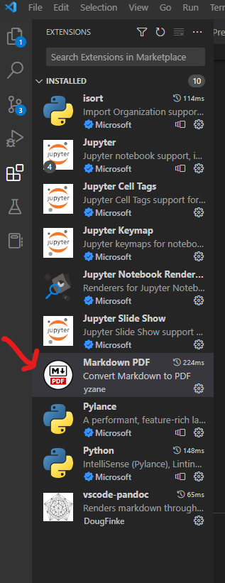

# Pre-requisite learning
The EDB application allows you to create pages containing text, equations, tables and charts in plain text files.  The application then builds a complete web site, including navigation links and SEO components.  The application also allows the site to be published to a beta URL and production URL.

## Basic commands
The EDB application is a set of **command line** Python programs.  The directory structure within the application is critical, as the application programs infer how the web site should be constructed by how you've arranged and named your text files in the `/source` directory.  You will not need to know anything about the Python programming language to use the EDB - only which commands to invoke to build, view, and publish the web site as you work.   Details on these commands are explained below.   If you are completely new to using the command line, please take a look at the following tutorial to familiarize yourself with the command prompt in Windows.  The relevant command you will need to understand is `cd` - all other file and folder manipulation will be done through your text editor (VSCode) - which is discussed below.

[Basic Command Prompt Tutorial](https://www.digitalcitizen.life/command-prompt-how-use-basic-commands)

## Getting the Application
The application consists of many folders and files.  In order to allow multiple people to work on the EDB content, and for continued application development, the EDB is managed through a `git` repository.  `git` is a platform that allows for very powerful version control - it tracks changes and allows you to "commit" them and "push" your changes to a central repository so others can always see the latest work.  

Git needs to be installed on your machine.  You can download it [here](https://git-scm.com/download/win)

We will not be using many features of `git`, and since the number of people editing the EDB content will somewhat limited, it will be rare for you to need any advanced knowledge of how git works.

The initial step is to create a Github account - this website is the central repository for the EDB, and it is a private repository - you will need to be granted access before moving forward.  Create your account [here](https://github.com/join?source=header-home), and contact me (sfrees@intelliquip.com) for access.

Once you have access, open the Command Prompt and use the `cd` command to navigate to the directory you want to put the EDB application in. For example, create a directory called `C:\projects\`, and navigate the command prompt there by entering `cd C:\projects` at the command prompt.

Next, clone the repository with the following command:

```
git clone https://github.com/hydraulic-institute/edb
```

This will create a directory called `edb` under your `C:\projects` directory.

Later, as you begin to make changes to the EDB, you will need to use `git` to commit your changes.  The details of this is covered below in the "Version control with `git`" section.

## Text Editor - Visual Studio Code
While any text editor is suitable for creating the EDB content, you should use something geared towards programming, to avoid character encoding problems.  You may download and install this [here](https://code.visualstudio.com/).

Once installed, you can open the `edb` directory.  **Important** - to develop content, you will *only* make edits and additions to the `/source` directory.  The other directories contain application code (which you should not edit) and output artifacts (`/build`) that is content the application generates for publishing the site.

Visual Studio Code allows you to open a folder - `edb` - which is the most efficient way of working.  This will give you a side panel on the left side of the screen that you can use to navigate and open any file in the directory structure.  Under the `/source` directory, you should see folders like `01_system-curves` and a number of `.md` files - among other types.  As will be explained below, you will do all of your work by creating and editing `.md` text files and `.csv` data files (for tables and charts).

<div style="page-break-after: always;"></div>

## Python Setup
To build EDB content, you will need Python installed, and you will need to install a series of dependencies.

Download and install Python version 3.7 or above [here](https://www.python.org/downloads/release/python-373/)

During installation, make sure you add Python to your path, and check off the following options:


After you install Python, close the Command Prompt (if you already have it open) and re-launch it.  Navigate to into the `edb` directory using the `cd` command (`cd C:\projects\edb`).

Next, execute the following commands one by one. There are dependencies for the EDB application itself. The `pip3 install` commands will contain a good deal of output - please make sure each completes successfully.

*Note, depending on how Python was installed, particularly on Windows, you may need to type `python`, and not `python3` on the command line.  Same with `pip` / `pip3`.*

```
#Install the Virtual Environment
$> pip3 install virtualenv
$> python3 -m venv env

#Activate the Virtual Environment
$> .\env\Scripts\activate <- # IF USING WINDOWS CMD or POWERSHELL
$> source env/bin/activate  <- # IF USING LINUX or MAC or BASH SHELL

#Open an new terminal window to confirm your virtual environment is active.  If you are using VSCode, a window may pop up and ask if you want to activate the virtual environment for your workspace.  Click on "Yes"

#Either install requirements.txt file:
$> pip3 install -r requirements.txt

#OR Install each library separately:
$> pip3 install Jinja2   
$> pip3 install lesscpy
$> pip3 install Markdown
$> pip3 install watchdog
$> pip3 install htmlmin
$> pip3 install pypandoc
$> pip3 install selenium
$> pip3 install six
$> pip3 install pandas
```

Select the Python Interpreter:
- Press **Ctrl + Shift + P (or Cmd + Shift + P on macOS)** to open the Command Palette.
- Type **Python select interpreter** and press Enter.
- In the list of available interpreters, you should see the Python interpreter from your virtual environment. It will have the python virtual environment (env) that you created above in the path.
- Select the desired Python interpreter from the list

**Windows Note** When using Windows, some of these dependencies will require additional work to get to run.  As they install, you will likely see something along the lines of `The script markdown_py.exe is install in... ` and then a directory will be listed.  This directory must be added to the Windows PATH.

To do this, issue the following command, where `C:\your\path\here` is the directory path indicated in the message that was printed.

```
set PATH=%PATH%;C:\your\path\here\
```
*Do not deal with the PATH issue unless your install is not working.  Make sure you use the correct `pip`/`pip3` combination (`pip` with `python`, `pip3` with `python3`)

### Verify Setup
There is already content in the EDB, so as a quick check that you have everythign setup correctly on your machine, issue the following command:

```
python3 serve.py
```

This builds the EDB content and launches a web server locally on your machine.  The functionality of this tool is described in more detail later in this readme, but for now, open a web browser and navigate to [http://localhost:8080](http://localhost:8080).

You should see the web site:


# Creating Content
All content is created in the `/source` directory.  The contents of the directory include a top level `index.md` which is the home page of the site, and directories which define the section structure of the EDB.  Each directory will contain additional `.md` files which become HTML pages, along with additional data like images and csv file to support the pages.  **Sub-directories in sections are not supported**.

## Metadata
Each content page, along with index.md files in each directory, contain meta data sections that define basic properties of the page/section to be created.  At the very least, each `.md` file will have a title - which will be what is used to identify the content on the HTML page.

```
-----
title:  Pump Info
-----

... the page content ....
```

All metadata must appear at the top of the file, and the 
metadata is sectioned off from the rest of the page content with
a sequence of 5 dashes `-----`, and closed with the same 5 dashes.

The following metadata attributes are supported:

- **title** - title of the page to appear in the table of contents
- **author** - optional text to indicate who wrote the page.  Will be injected at the end of the page.
- **date** - optional date of last update.

## Directory (Section Headings)
Each directory **must include a `index.md` file**.  This file must include a meta data entry, but no additional content.  The meta data should at least include the title.

Note that each directory is prefixed with a number (i.e. 03_specific_speed).  The naming convention is used to define the order of the sections in the table of contents.  You can change the ordering simply by changing the directory names and rebuilding.

## Page ordering within sections
The EDB is arranged in a heiarchy of topics.  Folder structure under the `/source` directory is used to arrange the heiarchy, however the order of pages within the same directory is determined by alphabetical order.

**Note** - this is why the actual page title is always included in the metadata section discussed above.  **The recommended way to create individual pages is to prefix their filenames with a number** - ensuring the order of the pages is always clear.

For example, the main topic "System Curves" has three pages within it - "Tutorial", "Demonstrator", and "Worked Example".  To ensure that the pages appear in the given order, you would arrange the folder structure as follows:

```
 source
   ---- index.md
   ---- 01_system-curves
        | -- index.md
        | -- 01_tutorial.md
        | -- 02_demonstrator.md
        | -- 03_worked-example.md
```
The `index.md` entry at the root of the directory structure is the front page of the EDB, and contains standard markup.  While it must have a meta data block, it is not necessary to place any values in it. See the current `index.md` for detail.

Within sub-directories, which represent sections of the EDB, the contents of `index.md` contains the true title of the section:

```
-----
title: System Curves
-----
```

The prefixes 01, 02, 03 ensure the topics held under System Curves appear in the correct order.  Their page titles will be derived from their metadata block.  For example - within `03_worked-example.md`:

```
-----
title: Worked Example
date: April 16th, 2019
author: Scott Frees
-----
```

Note that `date` and `author` are optional.  If you add them, they will appear at the bottom of the page.

## Directory and File Naming
As described below, the title of directories and pages that *users* see in their browser is **not** determined by the file / directory names you create in the `source` directory - the public facing names are defined in the metadata blocks within the directories and files.

**It is absolutely critical that you DO NOT INCLUDE spaces in the names of your files or folders.**

Likewise, **DO NOT use underscore characters `_` anywhere in the file or directory** name OTHER than to separate the numeric prefix used to order the pages.

For example, the following are all valid folder or file names:
- `01_system-curves`
- `01_SystemCurves`
- `01_systemcurves`

The following **are not valid names**, and will result in build failure
- `01_system_curves`  (multuple underscores will lead to malformed URLs)
- `01-system-curves`  (an underscore should always separate the ordering prefix)
- `01__system-curves` (multuple underscores will lead to malformed URLs)
- `01_system curves`  (spaces between words will create invalid URLs)

*You are highly recommended to follow the standard URL **slug** notation - which uses all lower cases, an separates words using a single dash `-` character.*  While not absolutely necessary, following this convention is known to improve search engine optimization.  You should make every effort to make the names of your directories and files be short, clear, and consistent - **they will be used to build URLs for your pages**.

## Section / Topic Nesting
The EDB is meant to be easily navigated.  Sections (directories) may have files (topics) in them - but no sub-directories.  Thus, the EDB consists of sections, which have several topics.  Each topic page can contain headings and sub headings - but there is no ability to create nested sections/pages.

This choice was made to ease navigation, and also to ensure each topic page can have adequeate detail.  It is critical for SEO to ensure the EDB has long content - not a series of very short pages.

## Page Content
All pages can contain general text.  Text is entered using Markdown, a simplified
syntax for HTML.

### Text
Regular text is entered using Markdown, which is a very simple way of entering text that can later be transformed into HTML by a program.

#### Markdown Basics
Markdown is just text - but it also lets you describe when certain parts of text should appear as headings, in **bold** and *italics*, or when links and images should appear in the text.

The following is a Markdown block:
```
# Heading 1
This is **BOLD** and this is *italics*.  [Here](www.google.com) is where you can find out more.
A list:
- Thing 1
- Thing 2
And a numberd list
1. Thing 1
2. Thing 2
1. Thing 3 (notice you don't need correct numbers...)
```

It is rendered like this:

---
# Heading 1
This is **BOLD** and this is *italics*.  [Here](http://www.google.com) is where you can find out more.
A list:
- Thing 1
- Thing 2
And a numberd list
1. Thing 1
2. Thing 2
1. Thing 3 (notice you don't need correct numbers...)
---

See the following resources for additional information:
- [https://commonmark.org/help/](https://commonmark.org/help/)
- [https://www.markdownguide.org/cheat-sheet](https://www.markdownguide.org/cheat-sheet)
- [https://www.markdowntutorial.com/](https://www.markdowntutorial.com/)

You can also use the existing content as examples to learn how to create the content.

#### Units of Measure
The application allows a user to switch between US customary units and metric units.  Tables and Charts (see below) can be created with both data sets, and the application will display the data according to the current unit set.

There are situations where you will be placing quantity data within text itself, and you might want that text to reflect the current unit set as well.  This is supported through an extension HTML element - `units`.  As markdown supports HTML elements embedded in text, you may place these elements directly within any flowing text.  You will supply `us` and `metric` text - which typically would be the quantity and the unit label - and the app will automatically display the correct text based on the current unit set.

**Example**
The Fluid Property section has an Auxiliary Data page, which displays Enthalpy reference state.  You can see this implemented using the `units` element, embedded right into the markdown text.

If there is no text following the tag, you can end it with `/>`.  Otherwise, you need the ending `</units>` tag.
```
H = <units us = "19771.296093 Btu/lb-mole at 80.3 F and 0.15 psia" metric="2551.013479 kJ/kg at 26.9 C and 0.010 bar."/>

H = <units us = "19771.296093 Btu/lb-mole at 80.3 F and 0.15 psia" metric="2551.013479 kJ/kg at 26.9 C and 0.010 bar."></units> followed by more text.
```

Note that no actual unit conversion are ever being done by the app - you are responsible for adding the text for both unit sets.

#### Supscripts and Superscript
Markdown allows HTML elements to be embedded into text content.  In order to use subscripts and superscripts (outside of LaTex formulas - see below), you can simply use the associated HTML elements.  

Here is some sample Markdown text with superscript:
```
Using the combined frictional loss equation above, we can determine the head loss (in feet) as a function of velocity (in ft/sec<sup>2</sup>).
```

Here is some sample Markdown text with subscript:
```
The US customary symbol N<sub>SS</sub> is sometimes used to designate suction specific speed.
```
#### Special Characters

The `special_characters_code.csv` file has (most) all of the unicode keys for special characters.

To use the special characters in the unit-converter or other tables/areas
		- For the plus/minus sign, you can use the key from the file (ex: `&#x00B1;` or decimal representation of `0x00B1` = 177 - `&#177;`) in your data table or markup code.
		- Insert the string `&#x00B1;` in the place where you want the plus-minus sign to display

Here is some sample Markdown text with subscript:
```
The following is a rho character: <span>&#x03A1;</span>
```

#### Helpful links:
- https://www.freeformatter.com/html-entities.html
- https://www.mastertemplate.co.uk/jsonescapedcharacterentities.php
Note - any HTML element can be used within Markdown - if you are not familiar with HTML, you might want to read up on some of the elements.

[https://www.w3schools.com/tags/](https://www.w3schools.com/tags/)

It is best to use as few of these as possible however - you should only use HTML elements when there is no equivelant Markdown support.  **Do not use HTML to support alternative page layouts and styling** - this may cause conflicts with the way the rest of the site is auto-generated.

### Formulas / Equations
All pages can contain blocks for equations, which are entered in LaTeX and automatically typset when the EDB is built.  All equations are block elements - meaning the occupy their own vertical real estate on the screen.

Mathematical formulas are not very well support by HTML - so we need  an alternative method of defining them such that they are rendered to the screen correctly.  We use [LaTex](https://www.latex-project.org/about/) to do this.

LaTex formulas are supported via a *custom extension* to markdown syntax.  To include LaTex equations, the LaTex line must have a `=+=` on the line preceding and after it.  The actual LaTex text must have `$$` at the beginning and end of the line as well. 

Equations are displayed in italics.  To prevent a variable or constant from being italicized, use `\mathrm{<var>}`.

For example:
```
=+=
$$ \Delta h_f = { {fL \over D} * v^2  \over 2g}$$
=+=
```

This block will compile and be typset as the following:


Equations are displayed in italics when wrapped with `$$`.  To prevent a variable or constant from being italicized, use `\mathrm{<var>}`:

```
=+=
$$ \mathrm{\Delta} \mathrm{h}_{stat} = (z_{destination} - z_{supply}) + {(p_{destination} - p_{supply}) \over \rho ·g} $$
=+=
```

This block will compile and be typset as the following:


#### About LaTeX 
LaTeX is a typesetting language used in many scientific and engineering fields, primarily where technical and mathematical text appears in publication.  For the EDB, we are only using a very small subset of the language - the part that describes mathematical equations.

The 00_latex.md page under "System Curves" was developed to help you learn the basics of using LaTeX.  Obviously we will delete this page from the EDB, but keep it around until you are comfortable with LaTex.

[http://hi-edb-beta.s3-website-us-east-1.amazonaws.com/system-curves/latex.html](http://hi-edb-beta.s3-website-us-east-1.amazonaws.com/system-curves/latex.html)

You may find the following links instructive - however remember that there is a lot more to LaTeX than what you need for EDB development.

- [http://www.personal.ceu.hu/tex/cookbook.html](http://www.personal.ceu.hu/tex/cookbook.html)
- [https://en.wikibooks.org/wiki/LaTeX/Mathematics](https://en.wikibooks.org/wiki/LaTeX/Mathematics)
- [https://www.youtube.com/watch?v=DvDO1mea1w0](https://www.youtube.com/watch?v=DvDO1mea1w0)

#### Numbered Equations
Often within text content you will want to embed references to equations, figures, calculations, tables, demonstrators etc.  You may apply labels (i.e. Eq. 2.1) to equations by embedding using `<div>` element with class `figure-label`, `equation-label`, `calculation-label`, `demo-label` before, afer or in the first line within the block.  These classes are defined in ```style.less```:

```
<div class='equation-label'>Eq. 1</div>
=+= 
$$ \sqrt {x + 9} $$
=+= 
```

### Tables
All pages can contain blocks for tabular data.  Tabular data is entered into the EDB by supplying CSV files, and referencing them within the page.  If the data table has US and Metric values, two CSV files can be specified, and the platform will select the correct one based on the chosen unit set of the user.

**Updating the Piping Materials Data for the Friction Loss Calculator and Tables in Section IV** - Please refer to the `Process for Updated PIPE MATERIALS Data` below

**Important** - while HTML supports tables, using them directly will be extremely error-prone, and you will not be able to take advantage of the unit conversions and formatting that the EDB will give you.

Instead, tables are supported via a *custom extenstion* to markdown syntax. To include a table, you must define a `=|=` line, followed by 
meta data describing the table, and finally end the block with an other line containing only `=|=`.

For example:
```
=|=
title: Data Points
data-us: datapoints_us.csv
data-metric: datapoints_metric.csv
=|=
```

The block above would create a table in the page titled "Data Points".  The `data-us` and `data-metric` lines in the meta data block point to a CSV file containing the data.  Alternatively, if the table does not need to support units, then you may specify a `data` value instead of the `us` and `metric` variants.

**Options**
- **hide_units: true** - 
Including **hide_units** in the markdown will HIDE the units block on the horizontal nav bar otherwise, the Units block will be VISIBLE.
- **scrolling: false** - 
Setting to "false" will generate a static table vs. a scrolling table, otherwise tables WILL be scrolling.
- **fixed-columns: columns** -
Enter the number of columns on the left side of the table to fix.  
- **special: style: value;** -
Special allows you to set special styles for your table just as you would in html.  Use the same format:  
Ex:  special: height:600px;width:100%;
- **column_tags: tag** -
This allows you to select specific columns you've "tagged" in a csv file to display in a data table.  See **Row Meta Data** below

#### Using TAGS for tables

1. Here is an example of using *tags* to select specific columns to display from a csv file.  This way, a csv file can be used for multiple tables as shown in section 04 - Piping Materials.

	```
	=|=
	title: Threaded Steel Pipe Flanges per ASME B16.5 (Class 150, 300)
	data-us: flange-16.5-150-300-us.csv
	data-metric: flange-16.5-150-300-metric.csv
	column_tags: Th
	=|=
	```
	In this example, the columns that will be included will be the ones tagged with 'Th' on the *tags* row in the CSV files.
	The CSV file(s) can be used for multiple flanges.
  
**Remember, CSV files are not Excel files - which end in a .xlsx extension**.  While it is convenient to edit CSV files in Excel, you must always remember to save as CSV (which have a .csv extension).  When opening a CSV in VSCode or whatever Markdown editor you are using, you will clearly see that CSV means "comman separated values".  CSV files are just straight text files, with rows on each line, columns separated by commas.

The CSV files do contain additional meta data to provide the platform information about how to format the table (or chart, see below).  This metadata appears in the first row and first column.

**Always leave the first column of the first row empty.**

#### Column Meta Data - First row
The first row contains meta data to describe the column data.  Each column, except the first column, should contain one of the following (these are strictly for formatting, not for processing.):
- **text** - the column data will be formatted as standard text.  Left justified.
- **numeric** - the column data will be formatted as a number (Right justified).  *Note, the application does not handle specifying decimal places - whatever is written in the CSV file is displayed to the user.*

#### Row Meta Data - First column of every (other) row
The first column of every row in the CSV file should always contain the following:

- **heading** - The row contains headings.  Multiple heading rows are permitted, and will appear in the order they are specified.
	- More than one row can contain the **heading** meta data.  The font size of the 2nd and following heading rows will be reduced by 1/4 to `.75rem`. 
	- To have a header span multiple columns, just leave any number of following columns blank that you want the header to span.  This can be seen in Section 3 - Losses in Nozzles.
		- One thing to note is to make sure the CSV file does NOT have extra empty columns at the end.
- **tags** - *(OPTIONAL)* The row contains tags (see above).  Columns with no tag or "All" will be included in ever table generated.  Columns with "None" will not be included at all.  Otherwise, the tag will be searched in the `tag` row.
- **data** - The row is interpreted as standard data - not a heading.  

#### Example
Consider the following CSV file, created in Excel.


When properly saved, it would appear as a plain text file in a coding editor:

```
,text,numeric,numeric,numeric,numeric
heading,TYPE,Flange Class,Min Thickness Flange (tf),Min Thickness Lap Joint (tf),Bore- Min Lapped (B2)
tags,None,All,"Th, SO, SW, WN",La,La
data,ASME 16.5,150,0.38,0.44,0.9
data,ASME 16.5,150,0.44,0.5,1.11
data,ASME 16.5,150,0.5,0.56,1.38
data,ASME 16.5,150,0.56,0.62,1.72
data,ASME 16.5,150,0.62,0.69,1.97
data,ASME 16.5,150,0.69,0.75,2.46
data,ASME 16.5,150,0.81,0.88,2.97
data,ASME 16.5,150,0.88,0.94,3.6
data,ASME 16.5,150,0.88,0.94,4.1
data,ASME 16.5,150,0.88,0.94,4.6
data,ASME 16.5,150,0.88,0.94,5.69
data,ASME 16.5,150,0.94,1,6.75
data,ASME 16.5,150,1.06,1.12,8.75
data,ASME 16.5,150,1.12,1.19,10.92
data,ASME 16.5,150,1.19,1.25,12.92
data,ASME 16.5,150,1.31,1.38,14.18
data,ASME 16.5,150,1.38,1.44,16.19
data,ASME 16.5,150,1.5,1.56,18.2
data,ASME 16.5,150,1.62,1.69,20.25
data,ASME 16.5,150,1.75,1.81,22.25
data,ASME 16.5,150,1.81,1.88,24.25
```
Notice the leading comma - this is because the first column on the first row is blank.  In this case, the first row defines the first column as text data, and the other three as numeric data - which is displayed differently in the HTML.

Each subsequent row is either a heading or data.
  
### Scrolling Logos
Scrolling Logos can be placed in any page by using  *custom extension* markdown syntax. To include Scrolling Logos on a page, a subfolder under the `source` folder should be created for the logos (ex:  `source/logos`). Once generated, images should be stored in this folder.

#### Suggested Image Requirements
- PNG (or JPEG) with white background.
- Width:  200px
- Height:  100px
- Horizontal resolution:  96 dpi (min) 150dpi (max)
- Vertical resolution: same as above
- Bit depth:  24 (min) 32 (max)

#### Scrolling Images Markdown
```
=scrolling-logos=
folder: logos
title: Data Tool Site Supports:
font_style: bold; italic
align: center
=scrolling-logos=
```
- `folder` - This notes the subfolder in the `source` folder where the logos are located. 
- `title` - This is any text desired above the scrolling images.
- `font_style` - `bold` and `italic` are available.  If you would like a separate font style, use the standard css styling:
  - ex:  `font_style:  font-size: smaller;`
- `align` - This notes the horizontal alignment of the title (`center`, `left`, `right`)

### Definitions and References Tables
*(Section 00-Introduction, Definitions, References & Resources)*

Like tables, Definition/Reference tables are supported via a *custom extenstion* to markdown syntax. To include a definiton table, you must define a `=defs=` line, followed by meta data describing the table, and finally end the block with an other line containing only `=defs=`.

***Definition and Reference Tables are generated automatically by following these instructions:***

1.	All tables should be saved in CSV UTF-8 character set format.  It's easiest to use LibreOffice to open CSV files (this is a free download available at: https://www.libreoffice.org) and save them in the appropriate format. Especially if you use special characters (like Delta, rho, superscripting, etc).
2. When opening a .CSV file, select the "Unicode - UTF-8" character set. 

***Reference & Resource Tables***

The first row must contain Section information as noted in the following bullets.  
   - There can be multiple Sections in a single CSV file. You can see this in any of the subsections under the Intro, Definitions, Resources & References Section on the website.
1. *Column A* should contain a Section Title (*"Hydraulic Institute Reference Standards and Guidelines",  "Pump Types"*, etc) to separate the sections. The Section name will be displayed on the webpage. Please do not put any other information in *Column A* other than a section title.
2. Continuing on the same row as the Section Title (*Column A*), *Column B* and on should contain that section's table headers.
3. Any column after *Column B* can contain an image identifier that will be displayed between the Section Header and the table. This column will otherwise be ignored.:
   - Identify the image with: *"Image?filename.png"* 
   - To limit the size of the file, *"Image?filename.png?75%"* (100% is default)
   - The image should be saved to the source section `images` folder.  Ex:  `source/00_introduction-definitions-references/images/filename.png`
4. Any comments should come after the last column of actual data.  The heading for a comment column can be one of: *Comment, Search, or an empty string*.  The first column that matches any of these strings will be ignored and no more columns will be parsed for that section.
5. Data should follow the Section/Header row and should be aligned underneath the appropriate header title.
6. To automatically generate a consistent URL for a column, the header for that column should be followed by "::" and then the URL. Insert *"{{REF}}"* into the URL to designate where the column data should be inserted into the URL.  A link will automatically be generated using the data in the column.
7. To generate a link to a Section in the EDL navigation sidebar, use the word *"Section"* in the column header title. This will tell the code to generate a link to the specific EDL page.  The data for that column should use the EDL navigation sidebar section name EXACTLY as it appears.  If it's not a unique section name (ex: General), then include the parent name followed by *:* and then the section name. A link will automatically be generated to the specific section.

***Acronyms & Definitions Tables***

1. Acronyms and Definitions tables are unique in that page tags are generated for Acronyms and links are generated in the Definitions table that link back to the tags automatically. All notes above in the *"Resources & References Tables"* section apply to this section.
2. ACRONYMS - *Column A* of the first row will be the section name as noted above. If the title of the section is *"Acronyms"*, the section will be parsed as Acronyms.
   - *Column B* will be the first heading and should be *"Term"*.  The data under this heading should be an acronym.  The acronym will be linked to the Definition in the 2nd table (below).
   - *Column C* should be *"Description"* and the data under this heading should spell out the Acronym in *Column B*	
   - Any other columns after *Column C* should follow the guidelines in *"Resources & References Tables"*.
3. DEFINITIONS - *Column A*, the section title, should be *"Definitions"*.
   - *Column B* will be the first heading and should be *"Term"* (as above). The data should be terms you want to define. If an acronym from th Acronyms section applies to a Term, make sure to include the Acronym after the title in parenthesis.
   - *Column C* should be *"Description"* as above and should describe the term.
   - Links will be autogenerated from the Acronym table to the Definitions table.

Refer to the ***Infroduction, Definitions, References & Resources** Section and the table_of_acronyms-definitions.csv file.

### Charts
Charts - currently only simply line/curve charts - are supported using the same type of CSV files you create tables with.  In many cases, the same CSV file you build a table out of may also be used for curves - and can be referenced that way.

Chart blocs are delimited with `=/=` lines, similar to the table blocks.  The title of the chart is specified, along with `data-us` and `data-metric` CSV files - which must point to `csv` files within the same directory of the page.

The X axis of the chart is defined by specifying the *column* within the CSV that contains the X axis data.  In the example below, assuming the CSV files are the same as the ones used in the table example above, the X axis is setup to correspond to "Flow Rate" - since that was the second data column.

A chart can contain any number of series - specified by a list of columns.  In this case, we are creating a series for Velocity and Head Loss - based on the previous example.

Finally, the series title index is the row number where the labels for each series should be derived.  Note that this is a 0-based index scheme - and does not include the first row in the CSV file which was used to define data types.  

```
=/=
title: Data Points
data-us: datapoints_us.csv
data-metric: datapoints_metric.csv
x: 2
series: 4, 3
series_title_index: 0
=/=
```

### Images
Images are supported naturally by Markdown.  Images can be placed in the same directory as the page, or in a central `/image` directory.  The links you enter will be resolved as a relative URL.   External images can also be used using an absolute URL (not recommended).

For an image that is saved in the same directory as the text content you are developing, you can use the following syntax:

```

```

To center the image on the page, add the `#center` element to the image:
```

```

By default, the image will appear on the output page at its native size.  It's recommended to use image editing software to change the dimensions of all images to the size that best suites the page you are writing.  If you need to specify alternative image dimensions however, you may use standard HTML rather than the Markdown syntax.  The following would force the image to be 50x200 pixels on the screen.

```

```

For images that are going to appear on many pages, in different sections, a good option is to store the image in the `/images` directory, rather than in a section directory (or multiple section directories).  You can place any image in the `/image` directory, and reference it from any page like this:

```

```

Note that the image path begins with `/image`, which creates an absolute URL to the image in the output.

Finally, if you need to link to an external image, not within the EDB, you can use a full URL like so:
```

```

*Linking to external images is not recommended - we have no control over whether or not that image stays the same over time, or is always available.*

### Internal Links
When linking to other pages within the document, you must provide the non-prefixed file name, with a `.html` extension, using standard Markdown link syntax.

For example, a page linking to the Worked Example page under "System Curves" would contain a link to `/system-curves/worked-example.html`.  While that link will work globally, throughout the EDB (since it starts with a `/`), you may also use relative links.  For example, if you were linking to Worked Example under System Curves, from the System Curves Tutorial page, you caould simply link to `tutorial.html`.  If linking to Worked Example from another section (i.e., a page under "Specific Speed"), you could also use `../system-curves/worked-example.html`.

### External Links
External links follow standard Markdown link syntax.  Often, links to external sites should open in a new browser tab - to keep the user on the EDB page.  Markdown does not support this, in this case you should include the actual HTML markup - which will be honored by the system.  The following text, written within the page's markdown text, will open example.com in a new browser tab/window:  
```
<a href="http://example.com/" target="_blank">example</a>
```
### Sales Links
Hydraulic Institute offer seminars, courses, books, and resources that deliver added value to readers of the EDB.  

```
=^=
title: Pump System Assessments - 2 Part Webinar
description: Pump system assessments and pump system optimization present significant opportunities for operations and maintenance cost savings and for reducing energy consumption. In this course, the user will learn the tasks and knowledge required for pump system assessments, the different levels of assessments, and the steps required to implement a pump system assessment. Also covered are the elements and format of the pump system assessment report, including examples. The user is also presented with case studies and real-world examples of pump system assessments and examples of how to use analysis tools, such as hydraulic modeling, to assist with the assessment.
image: /images/pumpsystemsmatter.png
url: https://training.pumps.org/products/pump-systems-assessment-e-learning-course
price: 99.99
hide_price: true
=^=
```

### Interactive Demonstrators
Some pages within the EDB will be interactive applications - allowing users to get a better understanding of a particular topic.  These interactive application pages will be created by software developers using JavaScript.

---

## Process for Updated UNIT CONVERSION Data

*Note: All python commands are run from the edb root directory*

### Background
1. Spreadsheets with Unit Conversion data are in `kb/unit-converter` folder.
2. When any of these files change, the `generate/static/unit-conversions.json` file needs to be rebuilt.
	- Run the build file in the `kb/unit-converter` folder
		- `python kb/unit-converter/build.py`
		- This will parse all of the `xlsx` files and build the `unit-conversions.json` file.  
			- This file is used by the *Unit Conversion Tool*
3. If any of the labels have changed in `kb/unit-converter/volume.xlsx`, you MUST modify `source/javascript/tank_calculators.js`
	- The `tank-demo` vue component has a mapping dictionary, `conversion_mapper`.
		- Update the value of the key/value pair to match the label from the `volume.xlsx` file.
		- If any of the mapping is in error, you will see `<map-error>` in the conversion table on the tank calculator webpage.
---

## Process for Updated PIPE MATERIALS Data
*"Section IV - Pipe Materials.xlsx"*

*Notes:*
- *All python commands are run from the edb root directory*
- *This process generates the tables for the `Pipe, Flange & Motor Dimensions` section (aka Section 4).  It also generates the json data for the `Pipe Friction Loss Calculator` in the `Calculators` section.*

### Prep the Data
1. Download the new Pipe Materials spreadsheet to your Downloads folder.
2. Rename the new file to *"Section IV - Pipe Materials.xlsx"*.
3. Open the file and select all rows/columns and clear all highlighting.
4. Save the *"Pipe Data"* tab from the spreadsheet as a separate CSV file (UTF-8 encoded) as: *"Section IV - Pipe-Tube Data.csv"*
5. Replace the existing files in the `edb/kb/friction-loss` folder with these 2 files.
6. Open the `edb/kb/friction-loss/Section IV - Pipe-Tube Data.csv` file.
	-  Add a new row under the header row (which is/should be at row 4)
	-  On that new row, put the word *"include"* in every column that you want displayed on the tables in **Section IV** on the EDL website.
    -  Make sure to always *"include"* the **Group Name, Sub-Division and Sub-Division Name**.

### Build the tables and json file for the Friction Calculator
1.  Run the friction-loss build file:
	-  `$> python kb/friction-loss/build-full.py`
	-  This will parse the `edb/kb/friction-loss/Section IV - Pipe-Tube Data.csv` file (filename is hard coded in the script `edb/kb/friction-loss/build-full.py`), generate .csv files for each Group Name-Sub-Division Name grouped by Sub-Division.  It will dump these files in the `edb/kb/friction-loss/piping-losses` folder. (see the file naming convention below)
	-  A single file `processed.csv` will be generated in that same folder at the same time.  It will contain all of the data from the individual .csv files.
	-  Finally, the individual .csv files of the same material type wil be combined into a single .csv file and will be deposited in the `edb/source/04_piping-materials-IV/table-data` folder.
	-  This will generate the data tables in `edb/source/04_piping-materials-IV/table-data`.
	-  These tables are referenced in the *.md files in `edb/source/04_piping-materials-IV`
    -  This build will also generate the `friction-loss-materials-full.json` file in the `edb/generate/static` folder.
        - This file is used by the friction calculator implemented in the `edb/source/javascript/calculators.js` file.<br/>
	-  File Naming Convention:
		- The file names are auto-created based on the **Group Name** and then the **Sub-Division Name**:  <br/>
        `<Group Name Initials>_<First 4 letters of each of the words in the Sub-Division Name followed by '-'>.csv`
		- Ex:  **Group:** Steel Pipe <br/>
			**Sub-Division Name:** Welded and Seamless Wrought Steel Pipe <br/>
			Filename generated:  `sp_weld-and-seam-wrou-stee-pipe.csv` <br/>

### Note
- There is a special case for *Plastic Pipes* in the `build-full.py` file.  Instead of *Wall Thickness, inches* heading and selector, *Plastic Pipes* has *Minimum Thickness, inches* for the heading and selector.

---

## Process for Updated FLANGE Data 
*"Section IV - Flange Data.xlsx"* 

### Prep the Data	
1. Download the new Flange Data spreadsheet to your Downloads folder.
2. Rename the new file to *"Section IV - Flange Data.xlsx"*.
3. Replace the existing file in the `source/04_piping-materials-IV/table-data` folder.
4. For each tab in the spreadsheet:
	-  There exists a CSV file for each tab in the spreadsheet in this same folder.
	-  Copy JUST the data (US or Metric) and replace the data in the existing CSV file.
	-  There is a row under the *header* row called *tags*.  This row is for tagging the columns you want to who on the table.
		- If you leave a column blank or tag it 'All', it WILL be included.
		- If you tag the column 'None', it will NOT be included
		- For the files with multiple types of flanges, the appropriate *"Section IV - Flange Data.xlsx"* tab/sheet will have a row of *tags* that can be copy/pasted into the appropriate CSV file in the *tags* row.
	-  Save the file.

### Build the tables
1.  The tables will automatically be built in the `output.py` file in the `table_data()` function when you build the system:
	- `python serve.py`

---

## Auto-Generated Content
There are several features of the EDB web site that are created automatically.  These features will continue to be developed - however these enhancements will not require any content changes.

### Cross-Links
Within each section (directory), links appear at the bottom of each topic page to all other pages within the same directory.  These links are automatic, and cannot be changed - however you may also elect to link to other pages from within the page content using the strategy defined above in "Internal Links".

### Search 
All text content you create in the topic pages is indexed and made available to the search functionality.  Users can perform a fuzzy text search to find different topic pages by keyword.

### PDF Document
A PDF version of the EDB will be generated from the same content as the web site.  This feature is not yet complete.

# EDB Management
To build, view, and publish the EDB, you will need to invoke Python programs.  Before doing anything, always make sure you open the Command Prompt, navigate into the `edb` directory, and issue the following command:

```
source ./env/bin/activate
```

**If you fail to do this, the commands will error out**.

## Local Preview
All work should be done from within the `source` directory.  While you can build the EDB HTML site manually, the easiest way to do your
development is to execute the following command from the root project directory:

```
python3 serve.py
```
This script automatically builds the EDB, and monitors file changes in the `source` directory.  Any time you save a modification, the EDB is automatically rebuilt.

*The file system monitoring is not perfect.*  When creating new files, for example, it is possible the `server.py` script will fail, as it will attempt to generate the site from partial / empty files.  If this happens, type Ctrl+c a few times to kill the script, and re-launch it when ready to view.

The EDB is always built to the `build` directory.  The files contained there are suitable for viewing with a web browser - *but you shouldn't open them directly* by clicking on them.  **Instead, the `server` script also launches a local web server** so you can view the built EDB in your web browser exactly as if it is deployed.

To view the EDB while you are developing, got to [http://localhost:8080](http://localhost:8080).  While the EDB is automatically rebuilt whenever any source files change, **you must click the refresh button on your web browser to see the changes**.

## Version control with `git`
It is critical that we all remain in sync with eachother while working on the EDB.  Even if only one person is creating content, developers will be creating code enhancements to the application.  Therefore, you must take care to always ensure you keep up to date with changes, and also always upload your changes regularly.  When used properly, `git` will allow us to roll back any mistakes that may be made.  It's important to understand that pushing your changes to `git` does **not** cause the content on the EDB website to change - so don't hesitate to push changes frequently!

### Keeping up to date
Before you begin working on the EDB each day (or more frequently), it is a good idea to ensure you have the latest content and application code.  This may include bug fixes to the application, feature enhancments, or additional content created by others.  To get up to date, issue the following command:

```
git pull origin master
```

In most cases, this command will work without issue.  Any changes made by others will be automatically merged into your workspace.  If you have failed to commit your own changes for a while, or if someone is working on exactly the same content as you are (unlikely!), you may get merge conflicts.  If so, you can either take care of these your self - or ask a developer for assistance.

Here are some helpful links on using git from the command line, and dealing with merges in VS Code:

- [https://git-scm.com/docs/git-merge](https://git-scm.com/docs/git-merge)
- [https://code.visualstudio.com/Docs/editor/versioncontrol](https://code.visualstudio.com/Docs/editor/versioncontrol)

**Note** we will not use branches - we will do all work in `master`.  You can safely disregard branch discussions in these resources - these are features of `git` used in more complex situations.

### Adding your changes
Whenever you've completed a chunk of work (for example, complete a page), it is important to commit your changes and push to the central repository.  Doing this regularly dramatically reduces the chances of merge conflicts.  **Please make sure you do this!**.

First - make sure there are no new changes available

```
git pull origin master
```
This will make sure you don't try to push your changes overwriting changes someone else has made while you were working.

Next, you must add your changes to git.  Do this by entering the `edb` folder with the command prompt and issuing the following command:

```
git add .
```

Next, you commit the changes, adding a message to describe your changes:

```
git commit -m "Completed suction specific speed page"
```

The first time you run this command, you may be asked to identify yourself to git.  If so, enter the following commands (using your own name and email!)

```
git config --global user.name "Mona Lisa"
git config --global user.email "mlisa@pumps.org"
```

Finally, you must push your changes to the central repository.
```
git push origin master
```

Once that completes successfully, you can go back to working on other things.

# Hosting
The HI DATATOOL is deployed to **Netlify.com** and served to the public from there.

## Deploying to Beta & Production
#### Beta Site
We have a Beta account on **Netlify.com** - [https://datatool-beta.pumps.org](https://datatool-beta.pumps.org) (also `edl-beta.netlify.app`)
- Login with `higladetech@gmail.com`

#### Production Site
We have a Production account on **Netlify.com** [https://datatool.pumps.org](https://datatool.pumps.org) (also `edl-prod.netlify.app`)
- Login with `erdb@gladetech.net`
  
#### Phase 2 Information
The `pumps.org` subdomain was `edl.pumps.org`.  As of the Phase 2 release (7/2024), this has been changed to `datatool.pumps.org`.   Because of this change, all `edl.pumps.org` endpoints needed to be redirected to `datatool.pumps.org`.  

Changes were made to the `pumps.org` domain on NetworkSolutions.  Both `edl.pumps.org` and `datatool.pumps.org` have DNS CNAME records pointing to `edl-prod.netlify.app` (see below).

Changes were also made for the `beta` endpoint (`edl-beta.pumps.org` and `datatool-beta.pumps.org` point to `edl-beta.netlify.app`).

In order to implement the redirect from `edl.pumps.org` do `datatool.pumps.org`, a file needed to be created for the **Netlify.com** app.  

The `_redirect*` files exist in `edb/root_specials/netlify`. One for production and one for beta.  The build process will copy the appropriate `_redirect` file and deposit in the root directory of the `build` directory.

Prepping for Deployment:
- In your development environment, stash any local changes you have
```
$> git stash
```
- Checkout the `beta` or `master` branch
```
$> git checkout [beta | master]
```
- Update the local [beta | master] branch 
```
$> git pull
```
- Run the server and verify it is the website you want to deploy.
```
$> python serve.py
```

To Deploy:

- Build the code for `Production` or `Beta`:

  - `$> python beta.py`
  - `$> python prod.py`
  - The code to deploy to `Netlify.com` will be generated and deposited in the `edb/build` folder.
  
- Log onto `Netlify.com` with the appropriate Login and Password
- Click on `Sites`
- Select the appropriate site (beta or production)
- Click on `Deploys` and scroll to the bottom 
- Drag the `builds` folder that was just generated in your development environment
onto the `Drag and Drop` section of the webpage (under the `Deploys` section )
- Follow any additional instructions.  Include a description if you are able.
- Your website will be deployed!

# Website PDF Generation
Relies on `pandoc`

```
sudo apt-get install pandoc
sudo apt-get install texlive-fonts-recommended texlive-latex-recommended
sudo apt-get install texlive-latex-extra
sudo apt-get install texlive-xetex
```

```
python3 build-pdf
```

sudo apt-get install chromium-browser
 
# On Windows:
```
winget install pandoc
```

Install texlive at:  https://tug.org/texlive/windows.html


# Creating README PDF using the Markdown PDF Extension
Install the `Markdown PDF` extension in Visual Studio Code

<br><br>

Open the markdown file in Visual Studio Code

**Either:**
- Click in the searchbar at the top of VSC and select
`Show and Run Commands`<br><br>

<br><br>
**OR**
- Press `F1`<br><br>

**Finally:**
- Type `export` and you should see `markdown...` options

<br><br>

- Select whatever option you want and it should download the converted file to the same directory as your markdown file