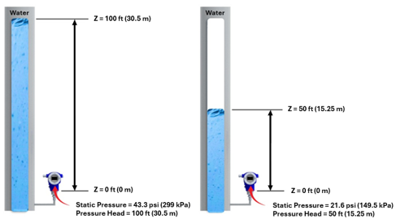

-----
title: A) Foundational Concepts
tabtitle: Pump System Foundational Concepts | HI Data Tool 
date: August 31, 2026
description: Describes head and pressure related to liquid pumping systems, why head is used for centrifugal pumps, how fluid properties affect pressure and head and the equations for how head and pressure relate, velocity head, velocity or dynamic pressure and frictional head losses from minor losses in fittings and valves and major losses in pipe. 
-----
# Foundational Pump System Concepts
There are several foundational concepts that one needs to understand when working with pumps. These include: 
- What is head and why it is used when talking about pumps
- How are head and pressure related?
- What are the general types of pumps (rotodynamic/centrifugal)
- How the shape of a rotodynamic pump impeller is selected
- How does the system and pump curve determine where the pump will operate. 

**Note**: Everything represented on this page is for an incompressible fluid flow and the term liquid is used.
### What are Pressure and Head?
Head (h) expresses the energy per unit weight relative to a reference condition and is expressed in <units us = "feet (ft)" metric = "meters (m)"></units> of the liquid being pumped relative to a defined datum elevation. 

Pressure (p) is the force acting on a given area typically expressed in <units us = "pounds per square inch (psi)" metric = "pascals (Pa)"></units>. It is energy density or energy per unit volume in the liquid.
### How are Head and Pressure Related?
Pressure and head are directly related in pump systems. Head is energy per unit weight and pressure is energy per unit volume, which relates them directly when the liquid density is considered. Pressure is a common measurement in pump systems and is often used to calculate head. Assuming static conditions (no flow or velocity) the column height of liquid or elevation head (Z) results in a pressure at a given point in the system that is dependent on the liquid's density or specific gravity as noted in Figure 1.A.1 per Equations 1.A.1 – 1.A.3.

 

Fig. 1.A.1 Illustration of static pressure and pressure head relationship with respect to elevation head (Z) with specific gravity of 1.0

Eq. 1.A.1a Head from Pressure

=+=

[units us]
$$ h={32.2 \over 1}∙{144 \over 1}∙{p \over {ρ∙g}}$$

=+=

=+=

[metric units]
$$ h = {{p} \over ρ·g} $$

=+=

Eq. 1.A.1b Pressure from Head

=+=

[units us]
$$ p = {{ρ·g·h}·{1 \over 32.2}}·{1 \over 144}  $$

=+=

=+=

[units metric]
$$ p = {ρ·g·h} $$

=+=

Where:
<!-- Had to do it this way because we had 2 us-only bullets -->
<ul>
<li>p is static pressure <units us = “(psi)” metric = “(Pa)”/></li>
<li>h is pressure head <units us = “(ft)” metric = “(m)” ></li>
<li>ρ is density of the liquid <units us = “(lbm/ft^3)” metric = “(kg/m^3)”/></li>
<li>g is acceleration due to gravity <units us = “(ft/s^2)” metric = “(m/s^2)”/></li>
<li v-if='unit_set=="us"'>144 is to convert between square inches (in2) and square feet (ft2)</li> 
<li v-if='unit_set=="us"'>32.2 is to convert mass to force</li>
</ul>

It is also common to express the pressure and head relationship using specific gravity (s), which is the relative density of the liquid to water at standard conditions. Specific gravity is defined by equation 1.A.2 and values of specific gravity for water and other liquids can be found in the fluid properties section[Link].

Eq. 1.A.2 Specific Gravity

=+=
$$ s = {ρ_{L} \over ρ_{w}} $$
=+=

where:

- s is specific gravity
- ρ = density, typically in <units us = "lbm/ft^3" metric = "kg/m^3"></units>
- L subscript is the liquid for which specific gravity is calculated
- w subscript is water at standard temperature 

Using specific gravity and a unit conversion constant head can be calculated from pressure as outlined in Equation 1.A.3.

Eq. 1.A.3 Head from Pressure using Specific Gravity

=+=
$$ h = {{C_{units}·p} \over s} $$
=+=

Where:

- h is head <units us = “(ft)” metric= “(m)” ></units> 
- p is pressure <units us = “(psi)” metric= “(Pa)” ></units>
- s is specific gravity (dimensionless)
- Cunits to achieve head units <units us = "(2.31)" metric = "(1.02×10-4)"></units>

### What is total head or total pressure?
The total energy at a specific location or point in the system includes both potential (static) and kinetic (dynamic or velocity) energy and the terms total head or total pressure are used. As described in the Bernoulli equation in the System Curve section[Link], in pumping systems there is a need to understand the total energy at a specific location or the total differential that the pump is required to develop. Total head and total pressure at a location in the pump system include energy due to liquid elevation (Z), static pressure (pg), and velocity. They represent the energy at that location if the flow was brought to a stop (to zero velocity) without any energy losses.
Total head (ht) at a specific location in the system includes both static head (hstat) and dynamic head which is referred to as velocity head (hv). Total pressure or stagnation pressure (pt) at a specific location in the system is the same concept as total head but in units of pressure, including both static pressure (pg) and dynamic pressure or velocity pressure (pv). 

Eq. 1.A.4 Static Head

=+=

$$ h_{stat}=Z+h_{g} $$

=+=

Eq. 1.A.5 Velocity Head 

=+=

$$ h_{v} = {v^2 \over {2·g}} $$

=+=

Eq. 1.A.6 Total Head at a Point 

=+=

$$ h_{t}= h_{stat}+ h_{v} $$

=+=

Eq. 1.A.7 Velocity Pressure

=+=

[units us]
$$ p_{v} = {1 \over 144} · {1 \over 32} · {1 \over {2}} · ρ ·v^2 $$

=+=

=+=

[units metric]
$$ p_{v} = {1 \over {2}} · ρ · v^2 $$

=+=

Eq. 1.A.8 Total or Stagnation Pressure

=+=

$$ p_{t}= p_{v}+ p_{g} $$

=+=
<!-- Had to do it this way because we had 2 us-only bullets -->
Where:
<ul>
<li>p is static pressure <units us = “(psi)” metric = “(Pa)”/></li>
<li>ht is total head at a specific location <units us = “(ft)” metric = “(m)” /></li>
<li>hstat is static head <units us = “(ft)” metric = “(m)” /></li>
<li>hv is velocity head <units us = “(ft)” metric = “(m)” /></li>
<li>Z is elevation head (height of the liquid column) <units us = “(ft)” metric = “(m)” /></li>
<li>hg is pressure head <units us = “(ft)” metric = “(m)” /></li>
<li>pt is total or stagnation pressure <units us = “(psi)” metric= “(Pa)” /></li>
<li>pg is static pressure <units us = “(psi)” metric= “(Pa)” /></li>
<li>pv is velocity pressure <units us = “(psi)” metric= “(Pa)” /></li>
<li>v is velocity <units us = “(ft/s)” metric= “(m/s)” /></li>
<li>g is acceleration due to gravity <units us = “(ft/s^2^)” metric = “(m/s^2^)” /></li>
<li>ρ is density <units us = “(lbm/ft^3^)” metric = “(kg/m^3^)” /></li>
<li v-if='unit_set=="us"'>144 is to convert between square inches (in2) and square feet (ft2)</li> 
<li v-if='unit_set=="us"'>32.2 is to convert mass to force</li>
</ul>

The above discussion on total head and total pressure at specific locations in a piping system do not consider viscous losses. However, as described in detail in the System Curve section[Link], when considering the pump developed head, which is same as the head requirement of the system at a specific flow rate, we need to consider differential total heads or total pressures and viscous losses between the system static pressure locations and the respective pump flanges. When considering the differentials and the viscous losses we use the term pump total head (H) and total differential pressure (&#x0394;pt).  Pump total head is the energy (work) increase per unit weight of the liquid, imparted by the pump and is the difference between total discharge head (hd) and total suction head (hs). The total suction head and total discharge head are referenced to the pump suction and discharge flanges respectively, and a common elevation datum. Total head is calculated from static and dynamic head components and viscous head losses (hf) to represent the head required by the system and for the pump to develop at a given flow rate. 
### What are Major and Minor Losses in Pipe Systems?
Viscous head losses are the losses in energy, expressed as head, caused by fluid friction as liquid flows through a piping system. These losses are split into major losses and minor losses. Major losses represent pipe friction, and minor losses represent losses in fittings, such as elbows, tees, reducers, expansions, valves, and entrances and exits. These are referred to as head losses or frictional head losses (hf) and are described in detail in the fluid flow section[Link] and the system curve section.
### Why is Head used in Pump Systems?
Positive displacement pumps commonly use pressure to describe their performance. However, because the head developed by rotodynamic pumps and the frictional head losses in the piping system are independent of liquid density, it is more convenient to work in terms of head. If pressure were to be used, the representative performance would vary for different or changes in liquid density. Head may not be intuitive at first, but it is the most useful way of calculating and expressing the energy contained in pump piping systems, which enables the performance of the pump and the energy requirements of the system to be expressed independent of the liquid density and velocity. 
