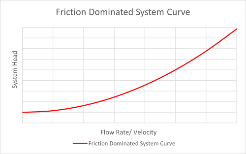
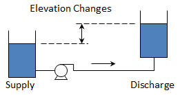
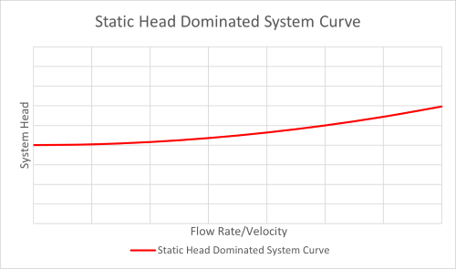
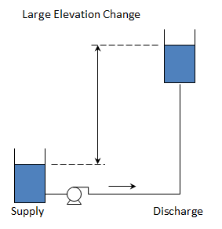
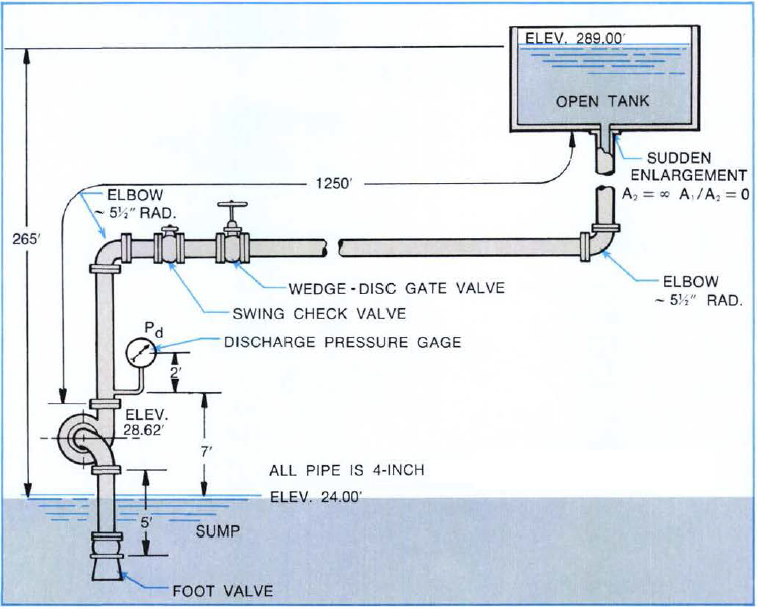

-----
title: A) System Curves 
date: May 26th, 2020
description: Contains a system curves tutorial, demonstration, and worked examples.
-----

# System Curves 

### Tutorial

The total head loss at any given flow rate consists of two parts: **static head** and **dynamic head**. The dynamic head consists of frictional head losses (major losses)
and minor head losses (component losses). Each of these is described in further detail below. A **system curve** shows the total head loss of the system over a range of flow rates.

### Static Head
**Static head** consists of both the elevation and pressure difference between the supply and destination of the system. This, typically, does not depend on velocity and is therefore constant for the system curve. This can be calculated using the following equation:

=+=
(Eq. 1.A.1)
$$ \Delta h_{stat} = (z_{destination} - z_{supply}) + {(P_{destination} - P_{supply}) \over \rho g} $$
=+=

where:

- z is elevation, in <units us = "feet" metric = "meters"/>
- P is pressure, in <units us = "psi" metric = "kPa"/>
- ρ is fluid density, in <units us = "lbm / ft^3" metric = "kg/m^3"/>
- g is gravitational acceleration, <units us = "32.2 ft/s^2" metric = "9.81 m/s^2"/>

Note that if the supply and destination are at the same pressure, as is the case when they are open tanks, then the static head is simply the difference in the liquid elevation.

### Frictional Head (Major Losses)

The **head loss due to friction** will vary based on flow rate (velocity) and can be calculated for the system components, such as piping, valves, elbows and bends, and end-use equipment, etc. These losses typically vary proportionally to the square of the velocity.

Frictional head losses in pipes can be calculated using the Darcy-Weisbach equation. The Darcy-Weisbach friction factor, *f*, can be determined using the Colebrook-White equation
(defined in <a href="/fluid-flow-III/general.html" target="_blank">Fluid Flow – General</a>).

These equations will approximate the Moody diagram. The friction factor is based on the Reynolds Number (Re), the 
pipe diameter (Dh), and the pipe roughness (ε). The pipe roughness is dependent on the type of pipe being used. Other aspects,
such as age, fouling, and coatings will also affect the pipe roughness.

The Hazen-Williams equation is another method to 
determine pipe losses. These values are only valid for water and do not account for temperature or viscosity. 
These values are a function of pipe material only and are not dependent on Reynolds Number. A table of typical values 
for various pipe materials can be found <a href="/piping-materials-IV/steel-pipe.html" target="_blank">here</a>.

### Minor Losses

Minor losses in a piping system occur when fluid passes through a fitting, valve, area change, or enters or exits a tank, etc. Any system component that obstructs or changes the 
direction or pressure of the flow can be considered a minor loss. These are categorized differently than the pipe frictional loss (or major loss). These minor losses can be the
dominant system loss. 

The loss created by the component is often characterized by a constant, K, and tabulated for several types of components. Head loss is determined by the
equation defined in <a href="/fluid-flow-III/general.html" target="_blank">Fluid Flow – General</a>
(K values are also tabulated here).

=^=
title: Basic System Hydraulics - 1 Part On-Demand Webinar
description: It’s important to be able to visualize pump curves and system curves to understand their interaction. Learn the basics of system hydraulics in this 1-part webinar.
image: https://www.pumps.org/wp-content/uploads/2022/02/On-Demand-for-EDL-1-e1645114699527.png
url: https://training.pumps.org/products/basic-system-hydraulics-pump-system-curves-energy-consumption-control-methods-1-part-on-demand-webinar
price: 119.00
hide_price: true
=^=

### System Curve

Based on these concepts, the total head losses at any given flow rate is the sum of the static head, frictional head losses, and the minor head losses of the system. It, therefore, can
be represented using the following equation:

=+=
(Eq. 1.A.2)
$$ \Delta h_{system} = (z_{destination}-z_{supply}) + {(P_{destination}-P_{supply}) \over \rho g} + {({fL \over D} + ΣK) * {v^2 \over 2g}} $$
=+=

A system curve is a graphical representation of the relationship between flow rate and the associated head losses.  It is generated by calculating the total head losses at various flow rates
and plotting them on a common set of axes.

### Shape of the System Curve

In some systems the frictional losses will be the majority of overall head loss. These systems will have a steeper system curve.

(Fig. 1.A.1)

In other systems the elevation change, or static head, will be the majority of the overall head loss. The system curve in this case will start at a higher
value at zero flow and will tend to be flatter.

(Fig. 1.A.2)

It is important to accurately characterize the system curve to select the correct pump for various operating conditions as the operating point of your system will be dependent
on the intersection between the system curve and the pump curve.

### System Curve Application

Real-world applications tend to consider a range or family of system curves. This would bracket the range of liquid levels,
operating pressures, valve arrangements, etc. 

=^=
title: Introduction to Vibration in Rotodynamic Pumps: 1-Part On-Demand Webinar
description: This webinar presents an introduction to vibration analysis of rotodynamic pumps and will provide basic concepts of vibration analysis and provide some guidelines to help the diagnostic process of dynamic behavior on rotodynamic pumps and their systems. The focus is on centrifugal pumps of all types regarding their typical vibration issues such as imbalance, misalignment, rubs, looseness, etc.  Troubleshooting methods and fixes are discussed with real life case histories.
image: https://www.pumps.org/wp-content/uploads/2022/02/On-Demand-for-EDL-1-e1645114699527.png
url: https://training.pumps.org/products/introduction-to-vibration-in-rotodynamic-pumps-1-part-on-demand-webinar 
price: 159.99
hide_price: true
=^=

### Educational Demonstration

=d=
title: System Curve
kind: pump-curve
type: system
pumpCount: 0
lowerLevel: 5
upperLevel: 5
upperPressure: 10
totalResistance: 5
=d=

### Worked Example (U.S. & Metric Units)
<units us = "Consider the system below and develop a system curve for the flows from 0 to 300 GPM." metric = "Consider the system below and develop a system curve for the flows from 0 to 68.14 m^3^/h"/>

(Fig. 1.A.3)

**Determine the Static Head**

Since both tanks have the same surface pressure, the static head is only dependent on the difference in surface elevation.

=+=
$$\Delta h_{stat} = (z_{destination}-z_{supply})$$
=+=

=+=
[units = us]
$$ \Delta h_{stat} = (289\,{ft}-24\,{ft}) = 265\,{ft} $$
=+=

=+=
[units = metric]
$$ \Delta h_{stat} = (88.09\,{m}-7.315\,{m}) = 80.77\,{m} $$
=+=

**Determine the Pipe Friction and Properties**

To simplify this example, we will consider the friction factor to be constant at 0.02. In general, the friction factor would vary as the flow rate (velocity) varies. Additionally, the flow would be laminar for low velocities. These considerations should be taken into account when calculating the pipe losses.

<units us = "A 4-inch, schedule 40 steel pipe has an inner diameter of 4.026 inches (0.3355 feet). The overall pipe length in this example is 1255 feet." metric = "A 4-inch, schedule 40 steel pipe has an inner diameter of 102.26 mm (0.10226 m). The overall pipe length in this example is 382.5 meters."/>

**Determine the Minor or Component Loss**

The losses for the components can be found in tables. In this example we have the following:

- Regular flanged elbow (2), k = 0.31 each
- Swing check valve, k = 2.0
- Wedge-disc gate valve, k = 0.17
- Sudden enlargement, k = 1.0

This gives a total K factor equal to 3.79

Using the combined frictional loss equation above, we can determine the head loss (in feet) as a function of velocity <units us = "(in ft/s^2^)" metric = "(in m/s^2^)"/>

=+=
$$ \Delta h_f = {({fL \over D} + ΣK) * {v^2 \over 2g}}$$
=+=

=+=
[units = us]
$$ \Delta h_f = {({0.02 * 1255ft \over 0.3355ft} + 3.79) * {v^2 \over 2 * 32.17 {ft/sec^2}}} $$
=+=

=+=
[units = metric]
$$ \Delta h_f = {({0.02 * 382.52m \over 0.10226m} + 3.79) * {v^2 \over 2 * 9.81 {m/sec^2}}} $$
=+=

=+=
[units = us]
$$ \Delta h_f = 1.22v^2 $$
=+=

=+=
[units = metric]
$$ \Delta h_f = 4.01v^2 $$
=+=

**Determine the System Curve**

The system curve can be calculated by varying the flow rate (velocity) using the above values. Combining the static and dynamic (pipe friction and minor losses)
we have the following as a function of velocity.

=+=
$$ \Delta h_{system} = \Delta h_{stat} + \Delta h_{f} $$
=+=

=+=
[units = us]
$$\Delta h_{system} = 265{ft} + 1.22v^2$$
=+=

=+=
[units = metric]
$$\Delta h_{system} = 80.77{m} + 4.01v^2$$
=+=

<units us = "The following can be used to convert a flow rate in gpm (gallons per minute) to a velocity in ft/sec (with the pipe diameter D in inches)."
metric = "The following can be used to convert a flow rate in m3/h (cubic meters per hour) to a velocity in m/sec (with the pipe diameter D in meters)."/>

=+=
[units us]
$$ v = 0.320833*Q*({4 \over \pi D^2}) $$
=+=

=+=
[units metric]
$$ v = 0.000278*Q*({4 \over \pi D^2}) $$
=+=

Substituting this in for velocity and using the 4-inch pipe <units us ="(ID = 4.026 inches)" metric ="(ID = 0.10226 m)"/> we can get the following as the system curve equation as a function
of flow rate in gpm.

=+=
[units us]
$$ \Delta h_{system} = 265{ft} + {{(7.75E{-04})}{Q^2}} $$
=+=

=+=
[units metric]
$$ \Delta h_{system} = 80.77{m} + {({4.59E{-03})}{Q^2}} $$
=+=

This, then, gives the following system curve data. This is a system that is dominated by the static head (there is a lift of <units us = "(there is a lift of 265 feet compared to little loss in piping and components)." metric = "there is a lift of 77.72 meters compared to little loss in piping and components)."/> 

=/=
title: Data 
data-us: datapoints_us.csv
data-metric: datapoints_metric.csv
x: 1
series: 3, 2
series_title_index: 0
=/=

=|=
title: Data 
data-us: datapoints_us.csv
data-metric: datapoints_metric.csv
=|=
