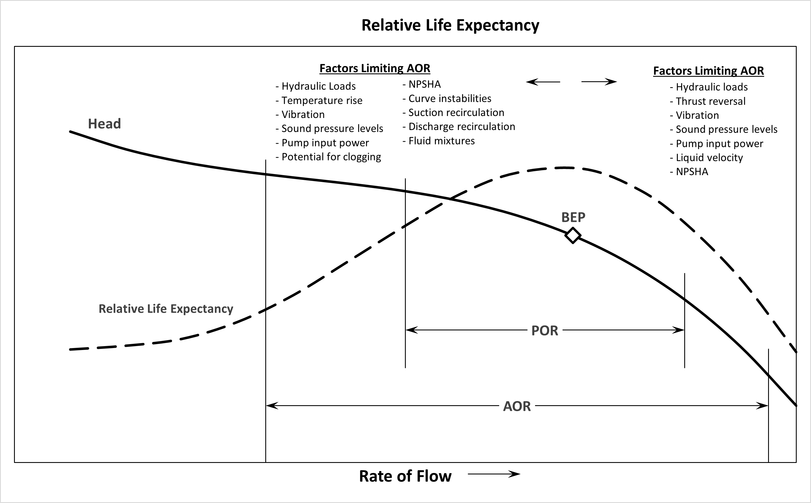

-----
title: B) Pump Curves
date: Oct 14th, 2023
description: Contains a pump curves tutorial, demonstration, and worked examples.
-----

# Pump Curves 

### Tutorial

A **pump performance curve** is a graphical representation of the head generated by a specific pump model at rates of flow from zero to maximum at a given operating speed.

### Head and Flow Curve

The **head and flow curve** <units us = "is the most commonly used curve to describe pump performance. It shows the amount of pressure developed 
across a range of flow rates. On the y-axis is the pressure developed, typically converted to head in units of feet (ft). On the
x-axis is the flow rate, typically in units of gallons per minute (GPM). Head can be determined from the following equation:" metric = "is the most commonly used curve to describe pump performance. It shows the amount of pressure developed 
across a range of flow rates. On the y-axis is the pressure developed, typically converted to head in units of meters (m). On the
x-axis is the flow rate, typically in units of cubic meters per hour (m^3^/h). Head can be determined from the following equation:"/>

Eq. 1.B.1

=+=
[units = us]
$$ H =  {{2.31 · p} \over s} $$
=+=
=+=
[units = metric]
$$ H =  {{0.102 · p} \over s} $$
=+=

where:

- H = head in <units us = "feet" metric = "meters"/>
- P = pressure in <units us = "psi" metric = "kPa"/>
- s = specific gravity (unitless)

Specific gravity can be found by using the following equation:

Eq. 1.B.2

=+=
$$ s = {ρ_{pumped fluid} \over ρ_{water}}  $$
=+=

where:

- ρ = density, typically in <units us = "lbm/ft^3" metric = "kg/m^3"/>

Using head, the performance of the pump can be shown independent of the density of the fluid pumped. 

=/=
title: Head vs. Flow
data-us: pc-data.csv
data-metric: pc-data-metric.csv
x: 1
series: 2
series_title_index: 0
=/=

Fig. 1.B.1

### Efficiency Curve

**Pump efficiency** is shown as a percentage on most pump curves. Pump efficiency is defined by the equation below:

Eq. 1.B.3

=+=
$$ η_{p} = {P_{w} \over P_{p}}  $$
=+=

where:

- Pw is pump output power (power imparted to the liquid), typically in <units us = "hp" metric = "kW"/>
- Pp is pump input power, typically in <units us = "hp" metric = "kW"/>

The **efficiency curve** shows pump efficiency at various flow rates. The flow rate where efficiency is at a maximum
is called the pump’s best efficiency point (BEP). BEP is an important operating point that is further described later in this section.

=/=
title: Efficiency Curve
data-us: pc-data.csv
data-metric: pc-data-metric.csv
x: 1
series: 3
series_title_index: 0
=/=

Fig. 1.B.2

### Pump Input Power Curve

The **pump input power curve** shows the amount of input power required for different flow rates. Pp can be determined by the following equation 
where Q is flow in <units us = "GPM:" metric = "m^3^/h:"/>

Eq. 1.B.4

=+=
[units = us]
$$ P_p = {{Q · H· s} \over {3960 · η_{p}}} $$
=+=
=+=
[units = metric]
$$ P_p = {{Q · H · s} \over {366.6 · η_{p}}} $$
=+=

where:

- Pp = pump input power, in <units us = "hp" metric = "kW"/>
- Q = rate of flow, in <units us = "gallons per minute" metric = "m^3^/h"/>
- H = total head, in <units us = "feet" metric = "meters"/>
- s = specific gravity
- np = pump efficiency

Pump input power can also be determined if the amount of power absorbed by the fluid and efficiency are known by rearranging the equation shown for the efficiency curve:

Eq. 1.B.5

=+=
$$ P_p = {P_{w} \over η_{p}}  $$
=+=

The pump input power curve is important, as it allows proper selection of a driver for the pump. 

=/=
title: Pump Input Power Curve
data-us: pc-data-PIP.csv
data-metric: pc-data-metric-PIP.csv
x: 1
series: 4
series_title_index: 0
=/=

Fig. 1.B.3

### Net Positive Suction Head Required (NPSHr) Curve

The final curve typically shown on a pump performance chart is the NPSHr for different flow rates. NPSHr is the minimum NPSH needed to achieve the specified performance 
at the specified flow rate, speed, and pumped liquid. NPSHr is further defined in <a href="/pump-fundamentals/pump-principles.html" target="blank">Pump Principles.</a> 

=/=
title: NPSHr Curve
data-us: pc-data-npshr.csv
data-metric: pc-data-metric-npshr.csv
x: 1
series: 2
series_title_index: 0
=/=

Fig. 1.B.4

### Operating Regions and Points

Fig. 1.B.5

**Best Efficiency Point (BEP):**

A pump’s best efficiency point is defined as the flow rate and head at which the pump efficiency is the maximum at a given speed and impeller diameter. Typically, a pump is specified to have
its duty point, or designed operating point, at BEP. At BEP, a pump will have low vibration and noise when compared to other operating points. Also, there
is minimum recirculation within the impeller and shockless entry into the impeller. Shockless entry is when the flow entering the impeller matches the angle 
of the impeller vanes at entry.

**Preferred Operating Region (POR):**

The preferred operating region (POR) is a range of rates of flow to either side of the BEP within which the hydraulic
efficiency and the operational reliability of the pump are not substantially degraded. Flow induced vibrations and internal hydraulic loading is low in this region. 
Depending on the specific speed of the pump, which is further defined in the pump principles section, the POR can be anywhere from 90-110% of BEP flow to 70-120% of BEP flow.

**Allowable Operating Region (AOR):**

The AOR is the flow range at the rated speed with the impeller supplied in which the pump may be allowed to operate,
as limited by cavitation, heating, vibration, noise, shaft deflection, fatigue, and other similar criteria. It is the flow range at which the pump can be run with acceptable service life.
The pump manufacturer should be consulted to define this region. Typically, operating 
intermittently within this region does not cause issues over the life of the pump. The graph above shows the various operating regions and the types of 
issues that can occur when operating outside of the POR and AOR.

**Shut-off Head and Pump Runout:**

These points are important during manufacturer testing to fully define the shape of the pump curve. They are the furthest points to the left and right on the curve.
Shut-off is the condition of zero flow rate where no liquid is flowing through the pump, but the pump is primed and running. 
Operating at this point for more than a few seconds can cause serious mechanical issues. Pump Runout is the point at which
flow is at a maximum. Operating at this flow can cause cavitation, vibration and, in some pumps, overloading of the driver. These points are to be avoided when
operating pumps.

=^=
title: Preferred and Allowable Operating Regions for Rotodynamic Pumps to Maximize Reliability - 1 Part Webinar
description: Learn how the Preferred Operating Region (POR) and Allowable Operating Region (AOR) are defined for centrifugal, mixed and axial flow pumps and their impact on efficiency and reliably.  Curve shape, hydraulic loading, temperature rise, vibration/noise, suction recirculation, priming, NPSH margin and more will be discussed related to a pumps AOR as well as methods to ensure operating in the AOR will be presented.  This webinar is a must for pump end users, application engineers, pump system designers, specifying engineers and pump service providers.
image: https://www.pumps.org/wp-content/uploads/2022/02/On-Demand-for-EDL-1-e1645114699527.png
url: https://training.pumps.org/products/preferred-and-allowable-operating-regions-for-rotodynamic-pumps-to-maximize-reliability-1-part-on-demand-webinar
price: 119.00
hide_price: true
=^=

### Affinity Rules

Affinity rules describe the relationship of the pump performance curve (flow, head, and power) relative to pump rotational speed (or frequency) changes and limited changes in impeller diameter. Refer to <a href="https://www.pumps.org/what-we-do/standards/?pumps-search-product=14.3&hi-order=asc&hi-order-by=name" target="_blank">ANSI/HI 14.3</a> regarding limitations in using the affinity rules for impeller diameter changes.

Under the assumption that changing speed or impeller diameter of a pump maintains the same efficiencies, 
the Affinity Rules show the relationships between pump parameters (flow, pressure/head, power) and pump 
characteristics (speed and impeller size) or a change in impeller size while maintaining a constant speed.

**1. Changing Speed / Constant Impeller Size**

As seen below flow (Q), head (H), and power (P) are all proportional to the rotational speed (n):

Eq. 1.B.6a

=+=
$$ {Q_2 \over Q_1} = {n_2 \over n_1} $$
=+=

Eq. 1.B.6b

=+=
$$ {H_2 \over H_1} = ({n_2 \over n_1})^2 $$
=+=

Eq. 1.B.6c

=+=
$$ {P_2 \over P_1} = ({n_2 \over n_1})^3  $$
=+=

**2. Changing Impeller Size / Constant Speed**

As seen below flow (Q), head (H), and power (P) are all proportional to the impeller Size (D):

Eq. 1.B.7a

=+=
$$ {Q_2 \over Q_1} = {D_2 \over D_1} $$
=+=

Eq. 1.B.7b

=+=
$$ {H_2 \over H_1} = ({D_2 \over D_1})^2  $$
=+=

Eq. 1.B.7c

=+=
$$ {P_2 \over P_1} = ({D_2 \over D_1})^3  $$
=+=

**Speed Reduction and Impeller Trimming**

Part 1 of the affinity rules is ideal for instances where you have a Variable Speed Drive (VSD). The VSD will reduce or increase the pump speed
therefore allowing it to operate at a multitude of operating conditions. Part 2 is essential in calculating the new pump characteristics after impeller trimming 
which is the reduction of the impeller diameter.

=^=
title: Application Guideline for Variable Speed Pumping
description: This guideline has been created to provide pump industry professionals and the end user operators of pumps with the knowledge required to apply variable speed pumping so that it will result in improved energy efficiency and increased reliability. This intension of this guidebook is to educate the pumping industry and to ensure the safe, reliable, and efficient operation of the pumping equipment we all depend on every day.
image: https://www.pumps.org/wp-content/uploads/2021/10/VSP-2017.png
url: https://www.pumps.org/product/application-guideline-for-variable-speed-pumping/
price: 166.00
hide_price: true
=^=

### Pump Fundamentals: Parallel and Series Pump Implications

Two or more pumps in a system can be placed either in parallel or in series.  In **parallel**, a system consists of two or more pumps that are configured such that each 
draw from the same suction reservoir, wet well, or header, and each discharge to the same discharge reservoir or header.  In **series**, a system consists of two or more 
pumps that are configured such that the discharge of one pump feeds the suction of a subsequent pump.

**Pumps in Parallel**

Pumps operating in parallel allow the pumping system to deliver greater flows than is possible with just one such pump.  To determine the composite pump curve
of two or more pumps operating in parallel, at each head value, the flowrate of each pump must be added together to obtain the composite flowrate.

Fig. 1.B.6

The amount of increased flow that occurs within the system depends on both the shape of the system curve and shape of the pump curves.  The **composite pump curve** intersects the 
system curve at different operating points yielding different flowrates. As more pumps are called to operate, the flow will increase accordingly:

Fig. 1.B.7

It should be noted, however, that unless the system curve is completely flat (which means friction and other dynamic losses are negligible), bringing a second 
pump on-line does not double the flow rate. The increased flow will be something less than double. How much less depends on the steepness of the system curve.

**Pumps in Series**

While pumps placed in parallel provide greater flow capabilities at the same head as one pump operating individually, pumps placed in series provide greater head capabilities at the same flowrate.

A composite pump curve representing pumps in series can be generated by adding the individual head values of the pumps for a given flow.  Plotting this sum at various flow values will yield a 
composite pump curve for the group of pumps.  Figure 3 shows a composite pump curve for two and three identically sized pumps operating in series:

Fig. 1.B.8

Pumps operating in series allow the pumping system to deliver greater heads than is possible with just one such pump.  This allows a pump station to be designed to satisfy systems that
require large discharge pressures that may not be practical with one pump.  Where certain applications require, it may also allow a pump station to address a wide variation in system pressures
by staging the number of operating pumps.  Figure 4 shows how applying a configuration with pumps in series to a system with a steep system curve may allow the pumps to address different head
requirements so long as inter-stage discharge piping is configured to permit so.

Fig. 1.B.9

### Educational Demonstration (Pumps in Series)

Content will be added soon.

=^=
title: Factory Performance Testing: Hydraulic, Mechanical, and Hydrostatic: 1-Part On-Demand Webinar
-description: This webinar will provide a summary of all HI laboratory test standards for rotodynamic pumps. The presenter will cover test procedures, setups, and arrangements along with data acquisition, acceptance grades, and instrumentation. Learn the basics of factory performance testing in this 1-part on-demand webinar
image: https://a200661cdda2de08c184-8a545ee6d682984872a72f5ce2cc68be.ssl.cf2.rackcdn.com/hi_393becd30058bdaf236507781e2c8a19.png
url: https://training.pumps.org/products/factory-performance-testing-hydraulic-mechanical-and-hydrostatic-1-part-on-demand-webinar
price: 119.00
hide_price: true
=^=

## Worked Examples

### Example 1 (U.S. Customary Units Only)

A booster pump is designed to operate at 1800 GPM and 135 ft., with a speed of 1740 RPM. Due to fluctuating flows the booster pump is equipped with a Variable 
Frequency Drive which reduces the pump speed by 10% during low flow conditions. Using the pump curve below and the affinity rules, generate the pump curve for low 
flow conditions and the new pumping conditions. 

=|=
title: Data (Normal Conditions)
data: total-head-feet.csv
=|=

=/=
title: 
data: total-head-feet.csv
x: 1
series: 2
series_title_index: 0
=/=

Fig. 1.B.10

**Determine the Reduced Speed**

During low flow conditions the speed of the pump is reduced by 10%.

=+=
$$ n_2= n_1 (1-.10) $$
$$ n_2= 1740(1-.10) $$
$$ n_2= 1566\,RPM $$
=+=

**Calculate New Flow Values**

Using Equation [Eq. 1.B.6a](#eq1b6a), calculate the new values (repeat until you convert all points under the flow column):

Calc. 1.B.6a(1)

=+= 
$$ {Q_2 \over Q_1} = {n_2 \over n_1} $$
$$ \,\,\,\,\,\,\,\,\,\,\,\,{Q_2 \over 0} = {1566 \over 1740} $$
$$ \,\,\,\,\,\,\,\,\,\,Q_2 = 0\,GPM $$
=+=

Calc. 1.B.6a(2)

=+= 
$$ {Q_2 \over 200} = {1566 \over 1740} $$
$$ \,\,\,\,\,\,\,\,Q_2 = 180\,GPM $$
=+=

Calc. 1.B.6a(3)

=+= 
$$ {Q_2 \over 400} = {1566 \over 1740} $$
$$ \,\,\,\,\,\,\,\,Q_2 = 360\,GPM $$
=+=

**Calculate New Total Head Values**

Using Equation [Eq. 1.B.6b](#eq1b6b), calculate the new values (repeat until you convert all points under the Total Head column):

Calc. 1.B.6b(1)

=+=
$$ {H_2 \over H_1} = ({n_2 \over n_1})^2 $$
$$ \,\,\,\,\,\,\,\,\,\,{H_2 \over 173} = ({1566 \over 1740})^2 $$
$$ \,\,\,\,\,\,\,\,\,\,\,\,\,\,\,H_2 = 173\,ft. $$
=+=

Calc. 1.B.6b(2)

=+=
$$ {H_2 \over 173} = ({1566 \over 1740})^2 $$
$$ \,\,\,\,\,\,\,\,\,\,\,\,\,\,H_2 = 167\,ft. $$
=+=

Calc. 1.B.6b(3)

=+=
$$ {H_2 \over 198} = ({1566 \over 1740})^2 $$
$$ \,\,\,\,\,\,\,\,\,\,\,\,\,\,H_2 = 160\,ft. $$
=+=

**Plot Pump Curve for low flow conditions**

=|=
title: Data (Low Flow Conditions)
data: total-head-feet-2.csv
=|=

=/=
title: 
data: total-head-feet-2.csv
x: 1
series: 2
series_title_index: 0
=/=

Fig. 1.B.11

**Comparison of normal flow and low flow conditions:**

Fig. 1.B.12

### Example 2 (U.S. & Metric Units)

A pump designed with a <units us = "10-5/8” diameter impeller will be operating at 2000 GPM @ 80 ft. During installation it was found the total head was 67 ft. 
Instead of designing a new pump the manufacturer recommends trimming the impeller. Using the affinity rules, determine the new impeller diameter and operating flow." 
metric = "270  mm diameter impeller will be operating at 454 m^3^/h @ 24.38 m. During installation it was found the total head was 20.42 m. 
Instead of designing a new pump the manufacturer recommends trimming the impeller. Using the affinity rules, determine the new impeller diameter and operating flow."/>

**Calculate the New Impeller Diameter**

Using Equation [Eq. 1.B.7b](#eq1b7b), calculate the new values:

Calc. 1.B.7b(1)

=+=
[units = us]
$$ {H_2 \over H_1} = ({D_2 \over D_1})^2 $$
$$ {67 \over 80} = ({D_2 \over 10.625})^2 $$
$$ {\sqrt {67 \over 80}} = \sqrt(({D_2 \over 10.625})^2) $$
$$ 0.915 = {D_2 \over 10.625} $$
$$ D_2 = 9.72\,in. \approx 9.75\,in. $$
=+=
=+=
[units = metric]
$$ {H_2 \over H_1} = ({D_2 \over D_1})^2 $$
$$ {20.42 \over 24.38} = ({D_2 \over 270})^2 $$
$$ {\sqrt {20.42 \over 24.38}} = \sqrt(({D_2 \over 270})^2) $$
$$ 0.915 = {D_2 \over 270} $$
$$ D_2 = 247\,mm $$
=+=

**Calculate the New Flow**

Using Equation [Eq. 1.B.7a](#eq1b7a), calculate the new values:

Calc. 1.B.7a(1)

=+=
[units = us]
$$ {Q_2 \over Q_1} = {D_2 \over D_1} $$
$$ {Q_2 \over 2000} = {9.75 \over 10.625} $$
$$ Q_2 = 1835\,GPM $$
=+=
=+=
[units = metric]
$$ {Q_2 \over Q_1} = {D_2 \over D_1} $$
$$ {Q_2 \over 454.2} = {247 \over 270} $$
$$ Q_2 = 416.8\,{m^3}/h $$
=+=
