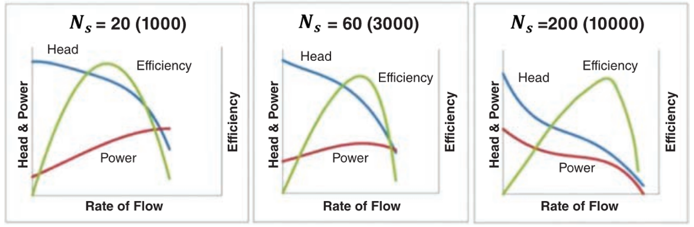
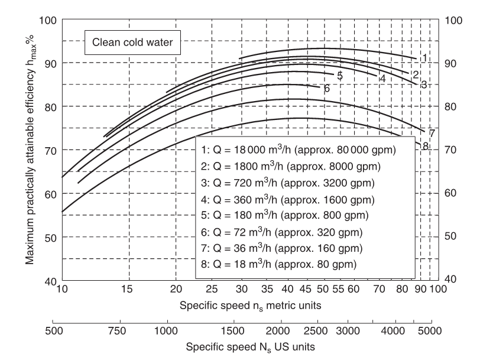
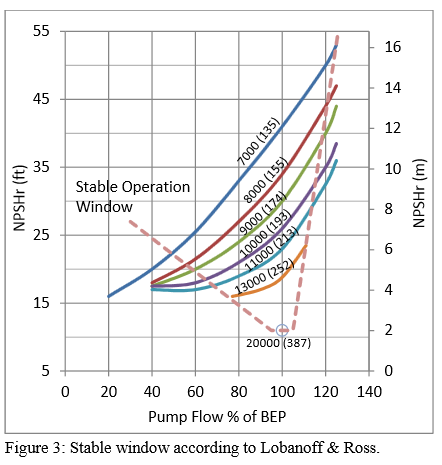
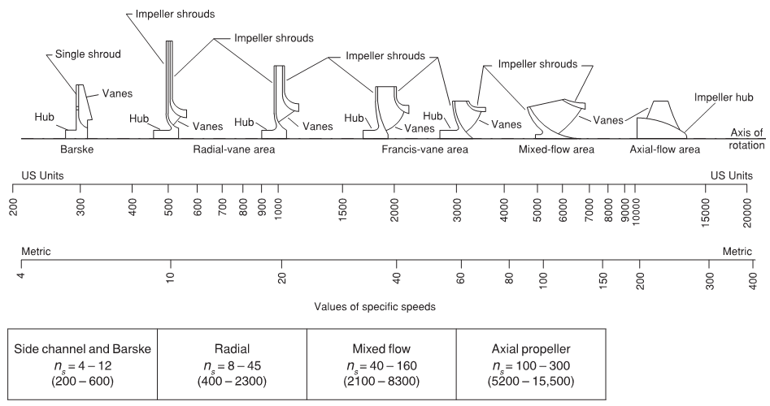
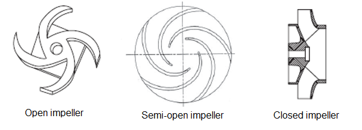
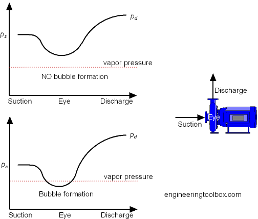
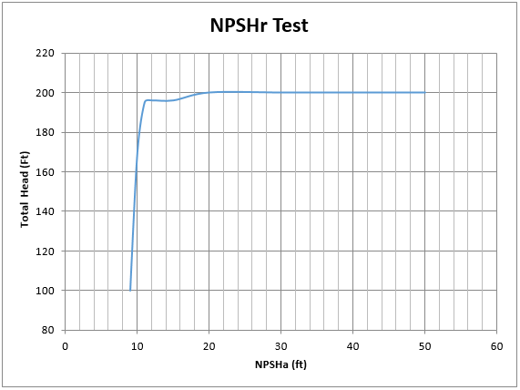

-----
title: D) Pump Principles
date: May 26th, 2020
description: Overview of specific speed, suction specific speed, other pump principles like NPSH.
-----

## Pump Principles

### Impeller Specific Speed 

**Impeller specific speed** is an index of pump performance at the pump’s best efficiency point (BEP) rate of flow, with the maximum diameter impeller, and at a given rotational speed. 

Specific speed, Ns, is used with US customary units and is expressed by the following equation: 

(1.D.1)

$$ Ns = { {n(Q)^{0.5} } \over {(H)^{0.75} } } $$ 

where:

- Ns = Specific Speed  
- n = Rotational speed, in revolutions per minute 
- Q = Total Pump flow rate at best efficiency point in gallons per minute
- H = Head per stage, in feet

Specific speed, ns, is used with metric customary and is expressed by the following equation:

(1.D.2)

$$ n_s = { {n(Q)^{0.5} } \over {(H)^{0.75} } } $$

where:

- ns = Specific Speed  
- n = Rotational speed, in revolutions per minute 
- Q = Total Pump flow rate at best efficiency point (BEP) in cubic meters per second 
- H = Head per stage in meters

When converting specific speed values between the US and metric convention, 51.6 is the conversion factor (  51.6 x ns  = Ns )

An alternate definition for specific speed is also used based on flow rate per impeller eye (Q’) rather than total flow rate.  When applying this alternative method to the 
double suction impeller pump, the resultant value of specific speed is less by a factor of 0.707 times less.
The user is cautioned to check carefully the basis of calculation of specific speed and suction specific speed before making comparisons because there are subtle but significant 
differences in methods used throughout industry and in related textbooks and literature.  For more information on the specific speed definition refer to 
<a href="https://estore.pumps.org/Standards/Rotodynamic/NomenclaturePDF.aspx" target="_blank">ANSI/HI 14.1-14.2 – Rotodynamic Pumps for Nomenclature and Definitions</a>.

Below is the approximate shape of performance curves based on the impeller specific speed with metric and (US) units:

=^=
title: Rotodynamic Pump Efficiency Prediction
description: ANSI/HI 20.3 presents a simplified method to predict normally attainable efficiency levels at the best efficiency point for selected types of rotodynamic pumps when the rate of flow, total head per stage, net positive suction head available (NPSHA), and the service conditions are known.
image: https://estore.pumps.org/GetImage.ashx?&maintainAspectRatio=true&maxHeight=300&maxWidth=300&Path=%7e%2fAssets%2fProductImages%2f20_3-2015.png
url: https://estore.pumps.org/Standards/Rotodynamic/EfficiencyPrediction.aspx
price: 50.00
hide_price: true
=^=

Below is a graph that shows the maximum practically attainable efficiency for different flow rates. This proves useful in selection of hydraulics for 
particular applications, based on desired flow and head.

**Type number** is a variation of impeller specific speed. Type number is a dimensionless quantity calculated at the point of best efficiency. 
Note, that to obtain a dimensionless value, the specified units of measure for each variable below may be different than the units of measure assigned 
to that variable in other parts of the Engineering Data Library.  Close attention to the units of measure for the variables in any calculation is advised.  
Type number is  defined by the following formula:

=+=
(1.D.3)
$$ K = {{2πnQ'^{0.5}} \over {(gH')^{0.75}}} $$
=+=

where in US Units:

- K = type number
- Q’ = flowrate per impeller eye in cubic feet per second
- H’ = head of first stage in feet
- n = rotational speed, in revolutions per second
- g = gravitational acceleration in feet per second squared

where in Metric Units:

- K = type number
- Q’ = flowrate per impeller eye in cubic meters per second
- H’ = head of first stage in meters
- n = rotational speed, in revolutions per second
- g = gravitational acceleration in meters per second squared

### Suction Specific Speed

**Suction Specific Speed** is an index of pump suction operating characteristics.
It is determined at the BEP flow rate with the maximum diameter impeller.
Suction specific speed is an indicator of the NPSHR for a 3% drop in head (NPSH3) at a given
rate of flow and rotational speed.

Suction specific speed Nss, is used with US customary units, and is expressed by the following equation:

(1.D.4)

$$ Nss = { {n(Q')^{0.5} } \over {(NPSH3)^{0.75} } } $$

where:

- Nss = Suction Specific Speed
- n = Rotational speed, in revolutions per minute
- Q' = flow rate per impeller eye in US gallons per minute 
    - =total flow rate for single suction impellers
    - =one half total flow rate for double suction impellers, 
- NPSH3 = Net positive suctions head required in feet that will cause the total head (or first stage head of multistage pumps) to be reduced by 3%

Suction Specific speed, S, is used with metric customary units, and is expressed by the following equation:

(1.D.5)

$$ S = { {n(Q')^{0.5} } \over {(NPSH3)^{0.75} } } $$

where:

- S = Suction Specific Speed
- n = Rotational speed, in revolutions per minute
- Q' = flow rate per impeller eye in cubic meters per second 
    - =total flow rate for single suction impellers
    - =one half total flow rate for double suction impellers, 
- NPSH3 = Net positive suctions head required in feet that will cause the total head (or first stage head of multistage pumps) to be reduced by 3%

When converting suction specific speed values between the US and metric convention, 51.6 is the conversion factor ( 51.6 x S  = Nss )

The user is cautioned to check carefully the basis of calculation of specific speed and suction specific speed before making any 
comparisons because there are subtle but significant differences in methods used throughout industry and in related textbooks and literature. 
For more information on the suction specific speed definition refer to <a href="https://estore.pumps.org/Standards/Rotodynamic/NomenclaturePDF.aspx" target="_blank">ANSI/HI 14.1-14.2 – Rotodynamic Pumps for Nomenclature and Definitions</a>.

### Impeller Types

There are many different impeller types (pictured below) based on desired performance characteristics and type of fluid pumped. The main types of impellers are shown below. 
As the flow increases with respect to the developed head, the larger the waterways become and the smaller the diameter becomes.

The three configurations (pictured below) for an impeller are open, semi-open, and closed. Open impellers do not have a front or rear shroud. Semi-open impellers only have a
rear shroud. Closed impellers have a front and rear shroud.

**Centrifugal open impellers** are typically used on smaller pumps, axial flow pumps, and for speciality applications such as non-clog pumps. They are typically cheaper to 
manufacture and easier to clean, but become inefficient as the pump wears. **Closed impellers** are more expensive to manufacture, more difficult to clean, and cannot pump
as many types of fluids as open impellers, but they are stronger and experience a much lower decrease in efficiency over the life of the pump. **Semi-open impellers** 
share some of the advantages and disadvantages of each. The reason for loss of efficiency in an open or semi-open impeller is that the distance between the vanes and 
the pump case surface increases over time due to wear. This allows for leakage back to suction, reducing efficiency. Another benefit of closed impellers is that 
setting axial distance doesn’t need to be as precise for this same reason.

=^=
title: Rotodynamic Pumps for Design and Application
description: The purpose of this standard is to provide guidance and recommendations for the general application and design of rotodynamic pumps. This standard provides accepted methods for the evaluation of the hydraulic performance and design of all related and supporting equipment. It does not include detailed hydraulic design methods. This standard recognizes and identifies application requirements, principal features, performance considerations, and the necessary precautions for proper use of rotodynamic pumps.
image: https://estore.pumps.org/GetImage.ashx?&maintainAspectRatio=true&maxHeight=300&maxWidth=300&Path=%7e%2fAssets%2fProductImages%2f143web.jpg
url: https://estore.pumps.org/Standards/Rotodynamic/Design.aspx
price: 240.00
hide_price: true
=^=

### Net Positive Suction Head (NPSH)

**NPSH is the net positive suction head** in <units us = "feet (US). Impellers require a certain amount of head at suction beyond the vapor pressure of the pumped
fluid in order to operate properly. This is due to the fact that there is a drop in pressure as the flow enters the eye of the impeller. If the flow’s pressure drops 
below the vapor pressure of the fluid being pumped, bubbles can form – a phenomenon called cavitation. These bubbles collapse with high energy and can cause damage to
the surrounding parts of the pump through cavitation erosion. In addition to direct damage to the waterways, cavitation can cause higher vibration leading to damage 
to other parts as the pump such as seals and bearings. Below is a simplified graph showing the pressure of a fluid as it moves through a pump, with the bottom graph
showing the fluid reaching a pressure below that of its vapor pressure, causing cavitation." metric = "meters (metric). Impellers require a certain amount of head at suction beyond the vapor pressure of the pumped
fluid in order to operate properly. This is due to the fact that there is a drop in pressure as the flow enters the eye of the impeller. If the flow’s pressure drops 
below the vapor pressure of the fluid being pumped, bubbles can form – a phenomenon called cavitation. These bubbles collapse with high energy and can cause damage to
the surrounding parts of the pump through cavitation erosion. In addition to direct damage to the waterways, cavitation can cause higher vibration leading to damage 
to other parts as the pump such as seals and bearings. Below is a simplified graph showing the pressure of a fluid as it moves through a pump, with the bottom graph
showing the fluid reaching a pressure below that of its vapor pressure, causing cavitation."/>

The **net positive suction head available (NPSHa)**, which is the NPSH available at the pump site, is defined as:

=+=
(1.D.6)
$$ NPSH_{a} = {h_{sa}} - {h_{vp}} $$
=+=

where:

- hsa = Total suction head absolute in <units us = "feet = h_atm_ + h_s_" metric = "meters =  h_atm_ + h_s_"/>
- hatm = Atmospheric pressure in head in <units us = "feet" metric = "meters"/>
- hs = Suction head
- hvp = Vapor pressure of fluid in <units us = "feet of head" metric = "meters of head"/>

A pump’s **net positive suction head required (NPSHr)** is important, as it allows a pump user to determine the amount of NPSHa needed at their pump site to ensure pump
performance is met. The occurrence of visible cavitation, increase of noise and vibration due to cavitation, beginning of head or efficiency drop, and cavitation 
erosion can occur when margin above NPSHr is present. NPSH3 is the value of NPSHr when the first-stage total head drops by 3% due to cavitation. 
<a href="https://estore.pumps.org/Standards/Rotodynamic/NPSH.aspx" target="_blank">ANSI/HI 9.6.1 – Rotodynamic Pumps – Guideline for NPSH Margin</a> establishes
recommended net positive suction head available (NPSHA) above the published NPSH required (NPSHR) that will lead to acceptable pump performance and service life.

Below is a common graph seen when testing a pump for NPSHr. This shows that as NPSHa is reduced, there is a point at which the head starts to drop off. On this test,
the NPSH3 is approximately 11 feet, as this is when the head drops 3% - in this case from 200 feet to 194 feet.

