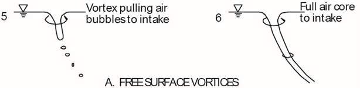
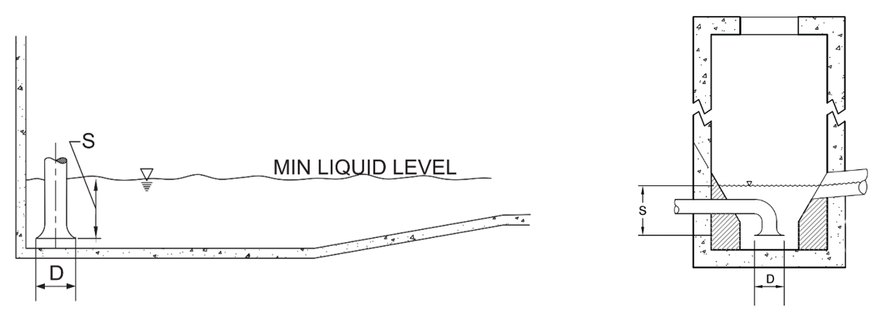

-----
title: E) Submergence
date:  Sept 13th, 2023
description: 
hide_units: true
-----

## Submergence

Submergence (S) is defined as the height of liquid level over the suction bell or pipe inlet per *ANSI/HI 9.8 Rotodynamic Pumps for Pump Intake Design*. The following is an excerpt regarding submergence and the reader is encouraged to refer to ANSI/HI 9.8 for full details on pump intake design. 

In addition to contributing to the available Net Positive Suction Head (NPSH), a minimum submergence is also needed to prevent strong air core vortices from entering the pump or piping, such as illustrated in figure 1.E.1. 

(Fig. 1.E.1)

The minimum submergence required to prevent strong air core vortices is based in part on a dimensionless flow parameter, the Froud number, defined as:

=+=
(Eq. 1.E.1)
$$ F_{D} = {{V} \over {(g · D)^{0.5}}} $$
=+=

where: 

- FD is Froud number at D (dimensionless)
- V is velocity at the suction inlet = Flow/Area, based on D
- D is the outside diameter of the bell or inside diameter of pipe inlet (Refer to ANSI/HI 9.8)
- g is the gravitational acceleration

Consistent units must be used for V, D, and g so that FD is dimensionless. The minimum submergence (S) shall be calculated from (Hecker, G.E., 1987), where the units are those used for D. Section 9.8.6 of ANSI/HI 9.8 provides further information on the background and development of this relationship. The minimum submergence (S) is figure 1.E.2 for a vertical pump with a suction bell, and a pipe outlet with flared opening.

=+=
(Eq. 1.E.2)
$$ S = D · (1 + 2.3·F_{D}) $$
=+=

(Fig. 1.E.2)
 

Note that the minimum submergence may need to be increased to satisfy the pump NPSHR. Refer to sections <a href="/pump-fundamentals/pump-principles.html" target="_blank">Pump Principles</a>, and <a href="/pump-fundamentals/pump-curves.html" target="_blank">Pump Curves</a>.