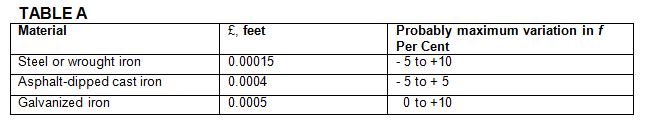

-----
title:  IIIA. General
date: June 10th, 2019
-----

# Fluid Flow – General

## Section 1 – Pipe Friction

The resistance to the incompressible flow of any fluid in any pipe may be computed from the equation:

=+=
(1) $$ h(f) = f * {L \over D} * {v^2 \over 2g} $$ 
=+=

wherein

- h(f) = Frictional resistance in feet of fluid
- L = Length of pipe in feet
- D = Average internal diameter of pipe in feet
- V = Average velocity in pipe in feet/second
- g = Acceleration due to gravity in feet/ second/ second. Hereafter, the value 32.17 feet/second/ second for sea level and 45 degrees latitude will be used.
- f = Friction factor

## Section 2 – Construction of Charts and Tables

The Colebrook Equation

=+=
(2) $$ {1 \over \sqrt f} = -2 \log_{10}({\epsilon \over (3.7*D)} + [{2.51 \over R * \sqrt f}]) $$
=+=

offers a reliable means for computing the friction factor (*f*) to be used in Equation (1).

The Reynolds Number (R) is given by the equation:

=+=
(3) $$ R = {V * D \over v}  $$
=+=

wherein

- V = Average velocity in feet/second
- D = Average internal diameter in feet
- v = Kinematic viscosity of the fluid in square feel/second

References 1, 2, 3, 4, 5, 6 and 7 in Section VJ were studied to obtain the best value of the roughness parameter (£) and the probable variations in the friction factors for new pipes. The probable variations
in (f) for some classes of new clean pipe are given in Table A.

Equation (2) was combined with Equation (1) and solutions carried out for each kind and size of pipe. These were used to construct large-scale logarithmic plots from which
the values of (hf) shown in Section IIIB, Tables 1-31 incl., were obtained.

## Section 3 – Old Pipes

A study of References 8, 9, 10, 11 in Section VI showed that the problem of estimating the friction
factors for old pipes or allowing for the deterioration of new pipes is beyond the scope of this Handbook.
The deterioration of pipes with age depends on the particular chemical properties of the fluid and the
metal with which it is in contact. It is recommended that prior experience be considered and local water
supply officials be consulted where it is necessary to estimate the friction losses in old pipes or to
allow for the aging of new pipes. References 8, 9. 10, 11 of Section VI may be consulted for general
information on the subject. For commercial installations, it is recommended that 15 percent be
added to the values shown in Tables 1- 31.

## Section 4 – Tables of Friction Loss for Water, Explanation

Frictional resistances for water flowing in new, clean steel pipe (Schedule 40)* or in asphalt-dipped
cast iron pipe are given in Section lIIB, Tables 1-31 incl., herein.** 

The tables show the discharge in cubic feet per second, the average velocity in feet per second,
and the velocity head in feet for any fluid in a circular pipe of the same diameter as that specified in each table for rates of flow in gallons per minute. 
The values of the friction head (hf) in feet of fluid per 100 feet of pipe apply to any fluid having a kinematic viscosity, v  = 0.00001216 square feet per second
(1.130 centistokes) which is the value for pure fresh water at 60° F. * * * The friction heads are average values for pipes having the £/D values given in the tables, 
where (£) is a li near measure of the absolute roughness of the pipe walls and (D) is the internal diameter of the pipe. Further information on the roughness parameter
is given in Section IV.

The tabulated values of (h1) are in feet of pure fresh water (60° F) per 100 feet of new clean steel
pipe (Schedule 40)* or of new clean asphalt-dipped cast iron pipe as specified.

No allowance has been made for age, differences in diameter resulting from manufacturing
tolerances, or any abnormal conditions of interior surface. Any factor of safety must be estimated
from the local conditions and the requirements of each particular installation. An example illustrating
the use of the tables will be found in Section IIIB.
