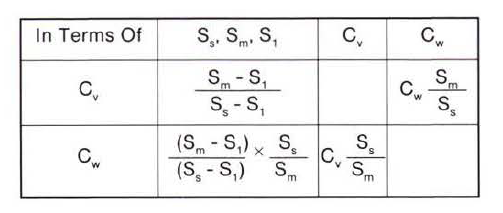
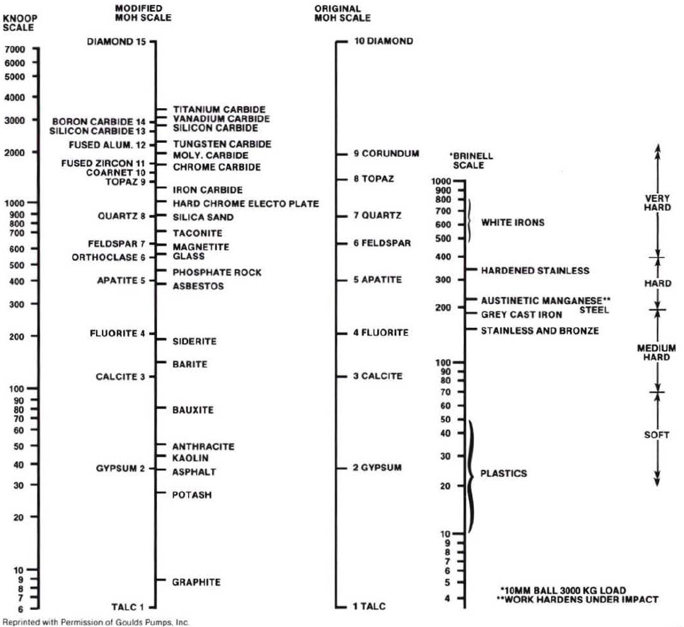
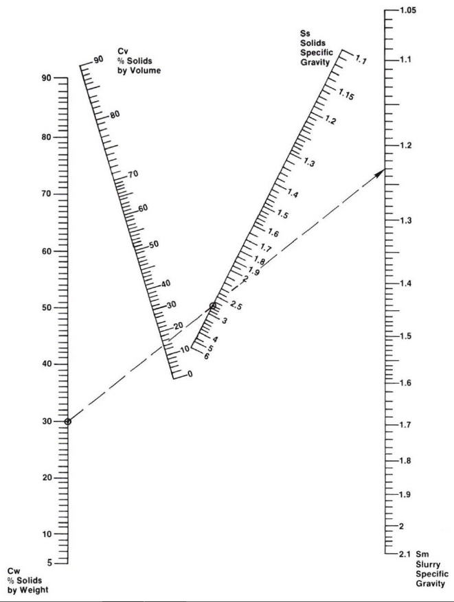
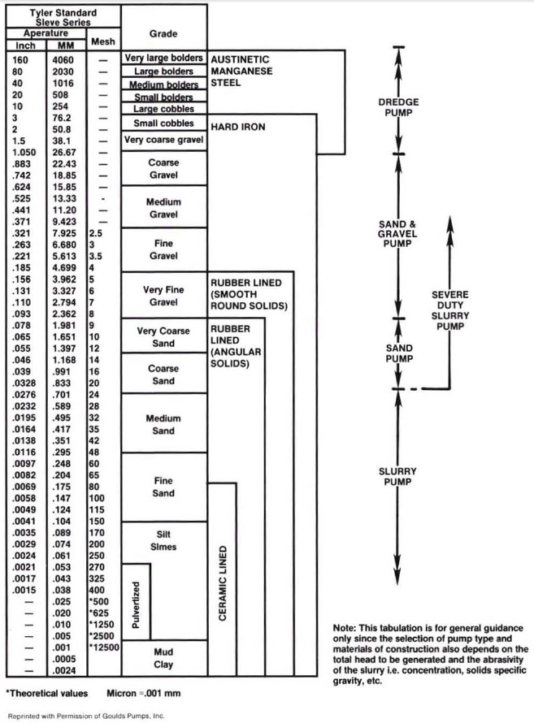
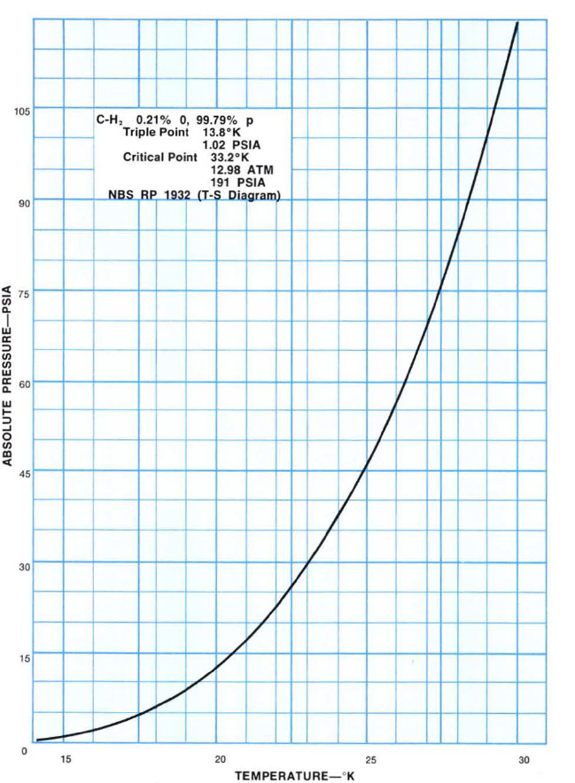
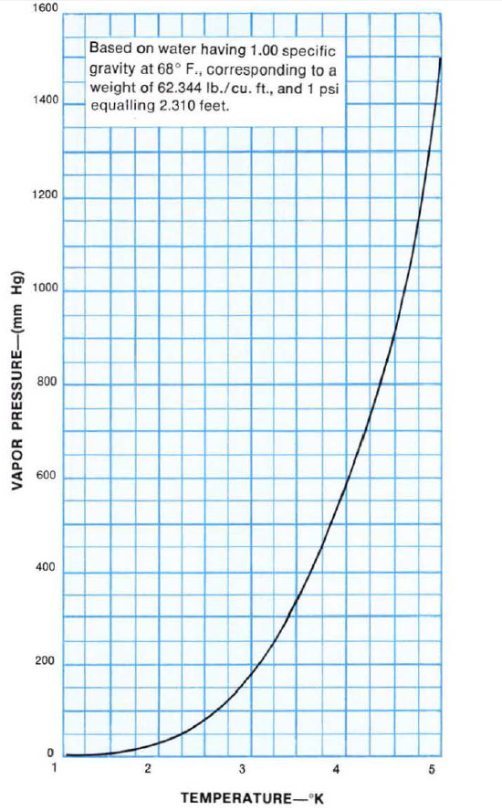

-----
title: IIB. Other Fluids
date:  June 20th, 2019
description: Properties of other fluids, such as mixtures or slurries. Determining specific gravity of mixture or slurry.
-----

# Properties of Other Fluids

## IIB-3 – Solids and Slurries 

###Useful Formulas

a. The formula for specific gravity of a solids-liquids
mixture or slurry, Sm is:

=+=
$$ S_{m} = {{S_{s} * S_{1}} \over {S_{s} + C_{w}(S_{1} - S{s})}} $$
=+=

Where:

- Sm = specific gravity of mixture or slurry
- S1 = specific gravity of liquid phase
- Ss = specific gravity of solids phase
- Cw = concentration of solids by weight
- Cv = concentration of solids by volume

Example: If the liquid has a specific gravity of 1.2
and the concentration of solids by weight is 35% with
the solids having a specific gravity of 2.2 then:

=+=
$$ S_{m} = {{2.2 * 1.2} \over {2.2 + .35(1.2 - 2.2)}} = 1.43 $$
=+=

b. Basic relationships among concentration and
specific gravities of solid liquid mixtures are shown
below.

Where pumps are to be applied to mixtues which are
both corrosive and abrasive, the predominant factor
causing wear should be identified and the materials
of construction selected accordingly. This often
results in a compromise and in many cases can only
be decided as a result of test or operational
experience.

For any slurry pump application a complete description
of the mixture components is requi red in order to select 
the correct type of pump and materials of construction.

=+=
$$ C_{w} = {weight\, of\, dry\, solids \over { weight\, of\, dry\, solids\, + weight\, of\, liquid\, phase }} $$
=+=

=+=
$$ C_{v} = {volume\, of\, dry\, solids \over { volume\, of\, dry\, solids\, + volume\, of\, liquid\, phase }} $$
=+=

A nomograph for the relationship of concentration
to specific gravity of dry solids in water is shown in
Figure IIB-5.

c. Slurry flow requirements can be determined from
the expression:

=+=
$$ Q_{m} = {{4 * dry\, solids\, (tons\, per\, hour)} \over {C_{w} * S_{m}}} $$
=+=

Where:

- Qm = slurry flow <units us = "(U.S. gallons per minute)" metric = "(conversion)"/>
- <units us = "1 ton = 2000 lbs." metric = "(conversion)"/>

Example: If 2,400 tons of dry solids is processed in 24
hours in water with a specific gravity of 1.0 and the
concentration of solids by weight is 30% with the
solids having a specific gravity of 2.7 then:

=+=
$$ S_{m} = {{2.7 * 1.0} \over {2.7 + .3(1 - 2.7)}} = 1.23 $$
=+=

=+=
[units = us]
$$ Q_{m} = {{4 * 100} \over {.3 * 1.23}} = 1,084\, U.S.\, GPM $$
=+=

=+=
[units = metric]
$$ (conversion) $$
=+=

d. Abrasive wear:

Wear increases rapidly when the particle hardness
exceeds that of the metal surfaces being abraded.
Always select metals with a higher relative hardness
to that of the particle hardness. There is little to be
gained by increasing the hardness of the metal
unless it can be made to exceed that of the particles.
The effective abrasion resistance of any metal will
depend on its position on the mohs or knoop
hardness scale. The relationships of various common
ore minerals and metals is shown in Figure IIB-4.

Wear increases rapidly when the particle size increases.
The life of the pump parts can be extended
by choosing the correct materials of construction.

Sharp angular particles cause about twice the wear
of rounded particles.

Austinetic maganese steel is used when pumping
large dense solids where the impact is high.

Hard irons are used to resist erosion and to a lesser
extent impact wear.

Elastomeric materials are used when pumping concentrations
of fine material but total head is usually
restricted to about <units us = "100 ft. per stage." metric = "30 m per stage."/>

Castable ceramic materials have excellent resistance
to cutting erosion but impeller tip velocities
are usually restricted to <units us = "100 ft/s." metric = "30 m/s."/> 

Classification of pumps according to particle size is
shown in Figure IIB-6.

## IIB-4 – Approximate Comparison of Hardness Values of Common Ores and Minerals

## IIB-5 – Nomograph of the Relationship of Concentration to Specific Gravity in Aqueous Slurries

## IIB-6 – Classification of Pumps According to Solid Size

## IIB-7 – Vapor Pressure of Liquid H2

## IIB-8 – Vapor Pressure of Helium

