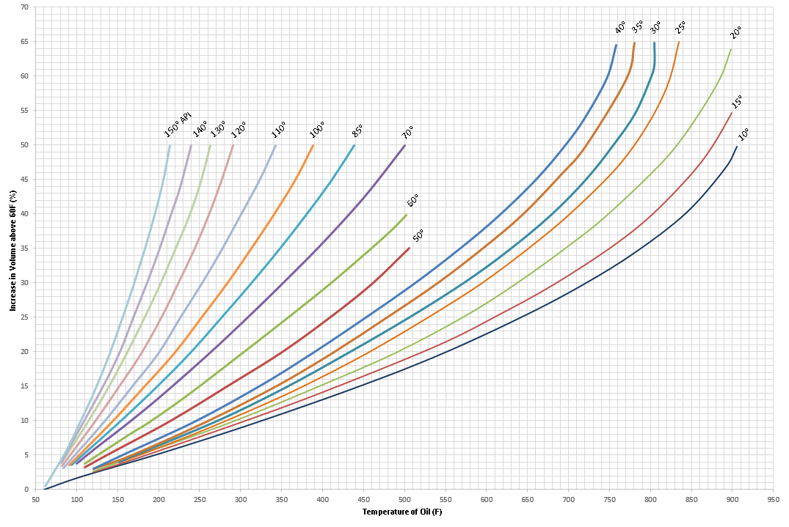

-----
title: C) Other Fluids
date: July 16th, 2019
description: Properties of other fluids.
hide_units: true
-----

## Properties of Other Fluids 

### Degrees A.P.I. vs. Specific Gravity for Oil          

The relation of Degrees A.P.I. to Specific Gravity (g) is expressed by the following formula:

=+=
(2.5)
$$ {Degrees\,A.P.I. = {141.5 \over g} - 131.5} $$
=+=

=+=
$$ {g = {141.5 \over {131.5 + Degrees\,A.P.I.}}} $$
=+=

The following tables are based on the weight of 1 gallon (U.S.) of oil with a volume of 231 cubic inches at 60°F in air at 760 mm pressure 
and 50% humidity. Assumed weight of 1 gallon of water at 60°F in air is 8.32828 pounds.

To determine the resulting specific gravity by mixing oils of different specific gravities:

=+=
(2.6)
$$ {D = {{md_{1} + nd_{2}} \over {m+n}}} $$
=+=

where:

- D = density or specific gravity of mixture
- m = proportion of oil of d1 density
- n = proportion of oil of d2 density
- d1 = specific gravity of m oil
- d2 = specific gravity of n oil

=|=
title: Degrees A.P.I. vs. Specific Gravity
data: IIB1-1.csv
=|=

=|=
data: IIB1-2.csv
=|=

### Temperature-Volume Relation for Oil

### Specific Gravities vs. Degrees Baumé

*Calculated from the formula, specific gravity 60°/60° F = 140 / (160 - Deg. Bé)*

=|=
title: Spec. Gravities at 60°/60° F. Corresp. to Deg. Bé for Liquids Lighter than Water
data: IIB2-1.csv
=|=

*Calculated from the formula, specific gravity 60°/60° F = 145 / (145 - Deg. Bé)*

=|=
title: Spec. Gravities at 60°/60° F. Corresp. to Deg. Bé for Liquids Heavier than Water
data: IIB2-2.csv
=|=

