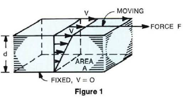
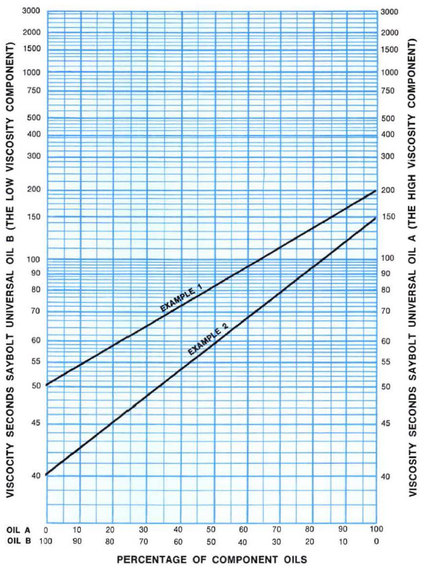

-----
title: C) Viscosity
date: May 12th, 2020
description: Overview of viscosity, and how it relates to shear force and velocity. Covers dynamic viscosity and kinematic viscosity.
-----

## Viscosity

### Definitions and Methods of Measurement

The **viscosity** of a fluid (liquid or gas) is that property
which tends to resist a shearing force. Since
motion or flow of a fluid is produced by shearing
forces, viscosity is associated with fluid motion.
There is no relation between the viscosity and the
specific gravity of most liquids. For instance, molasses
having the same specific gravity (1.48) and
the same Brix rating (90) may vary in viscosity
from 128,000 to 303,000 Seconds Saybolt Universal
(SSU). In rotodynamic pumps, fluid viscosity can have a significant impact on performance. 
<a href="https://www.pumps.org/product/ansi-hi-9-6-7-2021-rotodynamic-pumps-guideline-for-effects-of-liquid-viscosity-on-performance/" 
target="_blank">ANSI/HI 9.6.7</a> acts as a guideline that explains these effects.

There are two basic viscosity parameters:
**dynamic (*or absolute*) viscosity** and **kinematic viscosity**.
 (See the <a href="/tools/viscosity.html" target="_blank">Kinematic and Dynamic Viscosity Conversion Tool</a> to perform viscosity conversions.)
The dynamic viscosity may be defined with the aid of Fig. 1 which 
shows two parallel plane surfaces of area (A) separated a distance
(d) and the space between completely filled
with fluid. A force (F) is applied to and in the plane
of the upper surface, causing it to move with a
velocity (v) parallel to the lower fixed surface. The
velocity distribution will be linear over the distance
(d) and experiments show that the slope of the velocity line (v/d)
will be directly proportional to the unit shearing force (*τ* = F/A) 
for all "true" or "Newtonian" fluids. The proportionality factor (μ)
is the dynamic viscosity. The foregoing may be expressed
by the equations

=+=
(2.C.1)
$$ τ = {F \over A} = μ{v \over d} $$
=+=

=+=
(2.C.2)
$$ μ = {τ \over {v/d}} $$
=+=

Therefore, the dimensions of the dynamic viscosity
are

=+=
$$ force{time \over {length^2}} $$
=+=

<units us = "The unit of dynamic viscosity in English measure
is the pound-second per square foot which is numerically
identical with the slug per foot-second." metric = "The unit of dynamic 
viscosity in Metric measure is the dyne-second per square centimeter, 
called the poise, which is numerically identical with the
gram per centimeter-second. It usually is more
convenient to express numerical values in centipoise
such that 100 centipoise equal one poise."/>

The kinematic viscosity (𝜈) may be obtained by dividing
the dynamic viscosity (μ) by the mass density
(ρ). The mass density is the specific weight (w)
divided by the acceleration of gravity (g). These
relationships may be expressed by the equation

=+=
(2.C.3)
$$ ν = {μ \over {w/g}} = {μ \over ρ} $$
=+=

Therefore, the dimensions of kinematic viscosity
are

=+=
$$ {length^2} \over time $$
=+=

<units us = "The unit of kinematic viscosity in English measure
is the square foot per second." metric = "The unit of kinematic
viscosity in Metric measure is the square
centimeter per second called the stoke. It usually
is more convenient to express numerical values in
centistokes such that 100 centistokes equal
one stoke."/>

The distinction between the dynamic and the kinematic
viscosity should be carefully noted so that
the correct parameter will be used as required in
computations. Some useful relationships are as
follows:

**1 pound = 444,823 dynes**

**1 foot = 30.4800 centimeters**

**1 square foot = 929.034 square centimeters**

**1 dyne-second per sq cm = 1 poise = 100 centipoise**

**1 sq cm/sec = 1 stoke = 100 centistokes**

**1 lb-sec/sq ft = 478.801 poises = 47,880.1 centipoise**

**μ lb-sec/sq ft = (μ/47,880.1)centipoise = 0.0000208855 centipoise**

**𝜈 sq ft/sec =  𝜈 sq cm/sec / 929.034 = 0.00107639 stokes**

**𝜈 = μ/ρ = μ/(w/g)**

**𝜈 sq ft/sec = 0.000671970(μ/w)**  
    
where:

- w = <units us = "lbf/cu ft" metric = "N/m^3^"/>
- g = <units us = "32.17 ft/s^2^ at sea
level and approximately 45 degrees latitude" 
metric = "9.81 m/s^2^ at sea level and approximately 45 degrees latitude"/>

The viscosities of most fluids vary appreciably with
changes in temperature. The influence of change
in pressure usually is negligible.

The viscosities of fluids, such as mineral oil and
water, are unaffected by the magnitude and kind
of motion to which they may be subjected as long
as the temperature remains constant. Thus the
ratio of shear stress to shear rate is a constant for
all shear rates, is independent of time, and zero
shear rate exists only at zero shear stress; such a
fluid is said to be **Newtonian.**

When the ratio of shear stress to shear rate increases
as the shear rate increases, reversibly and
independent of time, a fluid is said to be **dilatent.**

When the shear stress to shear rate ratio is constant
for shear rates above zero, is independent of
time, but when shear occurs only for shear stress
above a fixed minimum greater than zero, a fluid
is said to be **plastic.**

When the ratio of shear stress to shear rate decreases
as shear rate increases, reversibly and
independent of time, and zero shear rate occurs
only at zero shear stress, a fluid is said to be
**pseudo-plastic.**

When the ratio of shear stress to shear rate decreases
as shear rate increases and is time dependent
in that this ratio increases back to its "rest"
value gradually with lapse of time at zero shear
rate and stress, and decreases to a limit value
gradually with lapse of time at constant shear rate,
a fluid is said to be **thixotropic.**

When the shear stress to shear ratio rate is constant
for all shear rates at any given instant of time,
but increases with time, a fluid is said to be
**rheopectic.**

Viscosity is measured by an instrument called a
**viscosimeter**. A definite volume of fluid is allowed
to flow through a capillary tube or orifice of specified
proportions and the time of efflux noted. Instruments
of the capillary type, such as the Ostwald,
Bingham, and Ubbelohde viscosimeters are
used primarily for fluids of low viscosity, such as
water. Instruments of the orifice type are used
commercially for more viscous fluids such as petroleum
products, and the time of efflux of the
sample is taken as a measure of the viscosity. The
Saybolt viscosimeter is commonly used in the
United States, the Saybolt Universal for fluids of
medium viscosity and the Saybolt Furol for those
of high viscosity. The viscosity is expressed in
Seconds Saybolt Universal (SSU) or Seconds Saybolt
Furol (SSF). The relationship between Saybolt
Universal viscosities and kinematic viscosities in
centistokes is given in <a href="https://www.astm.org/Standards/D2161.htm" target="_blank">"ASTM Conversion Tables
for Kinematic and Saybolt Universal Viscosities"</a>
or by the ASTM Standard, Designation: D446-85a*.
Similar information for Saybolt Furol viscosities
may be obtained from the ASTM Standard, Designation:
D2161-87. The respective British counterparts
of the Saybolt Universal and Saybolt Furol viscosimeters
are the Redwood and Redwood Admiralty
viscosimeters. The Engler viscosimeter is used extensively
on the continent of Europe. Viscosimeters
such as the Brookfield are particularly useful with
non-Newtonian fluids. There are many other viscosimeters
for special purposes, discussion of
which is beyond the scope of this Manual. Viscosity
conversion tables for use with the above described
viscosimeters are shown below. A
viscosity blending chart for use with oils is also shown
below. Let oil (A) have the higher viscosity and oil
(B) the lower viscosity. Mark the viscosity of (A) and
(B) on the right and left hand scales, respectively,
and draw a straight line connecting the marks as
shown. The viscosity of any blend of (A) and (B) will
be shown by the intersection of the vertical line
representing the percentage composition and the
line described above. 

*American Society for Testing Materials, 1916 Race St., Philadelphia.
Pa. 19103.

=^=
title: Rotary Pumps for Nomenclature, Definitions, Application, and Operation
description: This standard offers a basic educational overview on rotary pumps, design and application considerations related to the selection of the right rotary pump for a specific industry use as well as the installation, maintenance and operating procedures.
image: https://www.pumps.org/wp-content/uploads/2021/10/FINAL3135CoverFrontBlackBorder107.jpg
url: https://www.pumps.org/product/ansi-hi-3-1-3-5-2021-rotary-pumps-for-nomenclature-definitions-application-and-operation/
price: 166.00
hide_price: true
=^=

### Figure 1 – Viscosity Blending Chart [1]
   

### Viscosity Conversion Tables

The following tables will give an approximate comparison of various viscosity ratings so that if the viscosity
is given in terms other than Saybolt Universal, it can be translated quickly by following horizontally to the
Saybolt Universal column.

=|=
title: Conversions
data: visc-conv-1.csv
=|=

=|=
data: visc-conv-2.csv
=|=

=+=
*
$$ Kinematic\,Viscosity\,(in\,centistokes) = {{Absolute\,Viscosity\,(in\,centipoise)} \over Density\,(in\,g/cm^3)} $$
=+=

When the Metric System terms centistokes and
centipoise are used, the density is numerically
equal to the specific gravity. Therefore, the following
expression can be used which will be sufficiently
accurate for most calculations:

=+=
$$ Kinematic\,Viscosity\,(in\,centistokes) = {{Absolute\,Viscosity\,(in\,centipoise)} \over Specific\,Gravity} $$
=+=

When the English System units are used, the density
must be used rather than the specific gravity.

For values of 70 centistokes and above, use the
following conversion:

=+=
$$ SSU = centistokes * 4.635 $$
=+=

Above the range of this table and within the range
of the viscosimeter, multiply the particular value
by the following approximate factors to convert to
SSU:

=|=
title: Conversion Factors
data:SSU-conv.csv
=|=

### References
1. Hydraulic Institute, Engineering Data Book, Second Edition, 1990, Figure IIC-2.