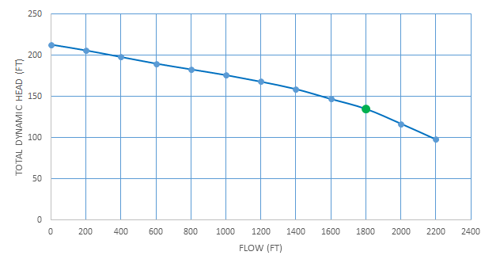
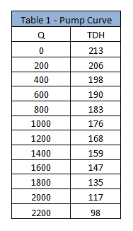
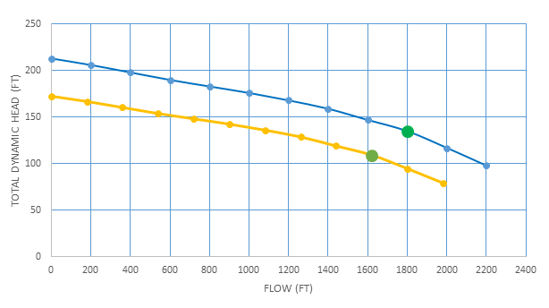

-----
title:   Worked Examples
date:  June 10th, 2019
-----

# Worked Examples

## Worked Example 1)

A booster pump is designed to operate at 1800 GPM and 135 ft., with a speed of 1740 RPM. Due to fluctuating flows the booster pump is equipped with a Variable 
Frequency Drive which reduces the pump speed by 10% during low flow conditions. Using the Pump Curve below and the Affinity Laws, generate the pump curve for low 
flow conditions and the new pumping conditions.

**Determine the Reduced Speed**

During low flow conditions the speed of the pump is reduced by 10%.
=+=
$$ n_2= n_1 (1-.10) $$
$$ n_2= 1740(1-.10) $$
$$ n_2= 1566 RPM $$
=+=

**Calculate New Flow Values**

Using affinity law equations, calculate the new values (repeat until you convert all points under the flow column):

=+= 
$$ {Q_2 \over Q_1} = {n_2 \over n_1} $$
$$ {Q_2 \over 0} = {1566 \over 1740} $$
$$ Q_2 = 0 GPM $$
=+=

=+= 
$$ {Q_2 \over 200} = {1566 \over 1740} $$
$$ Q_2 = 180 GPM $$
=+=

=+= 
$$ {Q_2 \over 400} = {1566 \over 1740} $$
$$ Q_2 = 360 GPM $$
=+=

**Calculate New TDH Values**

Using affinity law equations, calculate the new values (repeat until you convert all points under the TDH column):

=+=
$$ {h_2 \over h_1} = ({n_2 \over n_1})^2 $$
$$ {h_2 \over 173} = ({1566 \over 1740})^2 $$
$$ h_2 = 173 ft. $$
=+=

**Plot Pump Curve**

## Worked Example 2)

A pump designed with a 10-5/8” diameter impeller will be operating at 2000 RPM @ 80 ft. During installation it was found the TDH was 67 ft. 
Instead of designing a new pump the manufacturer recommends trimming the impeller. Using the affinity laws, determine the new impeller diameter and operating flow.

**Calculate the new impeller diameter**

During low flow conditions the speed of the pump is reduced by 10%.

=+=
$$ {h_2 \over h_1} = ({D_2 \over D_1})^2 $$
$$ {67 \over 80} = ({D_2 \over 10.625})^2 $$
$$ {\sqrt {67 \over 80}} = \sqrt(({D_2 \over 10.625})^2) $$
$$ 0.915 = {D_2 \over 10.625} $$
$$ D_2 = 9.72 in. \approx 9.75 in. $$
=+=

**Calculate the New Flow**

During low flow conditions the speed of the pump is reduced by 10%.

=+=
$$ {Q_2 \over Q_1} = {D_2 \over D_1} $$
$$ {Q_2 \over 2000} = {9.75 \over 10.625} $$
$$ Q_2 = 1835 GPM $$
=+=
