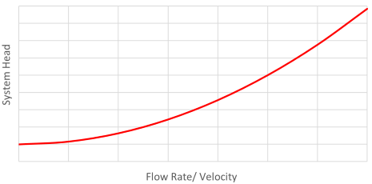
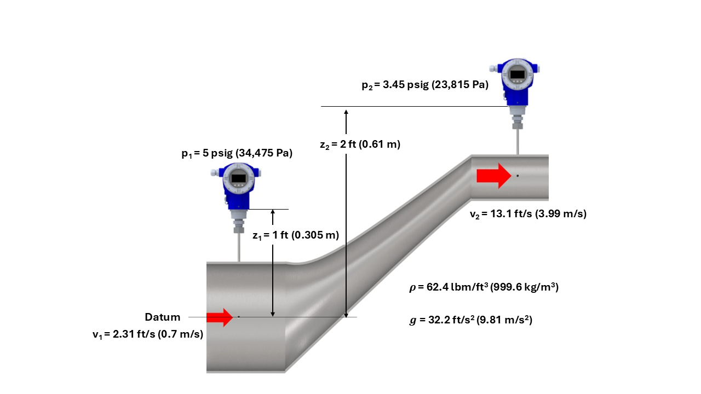
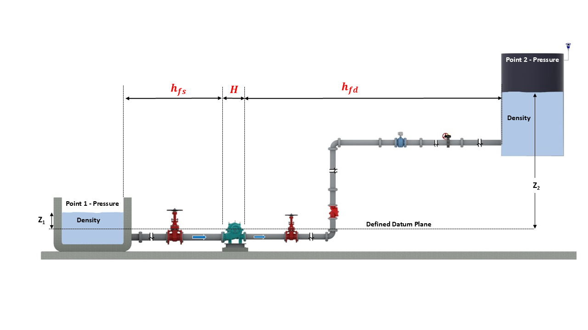
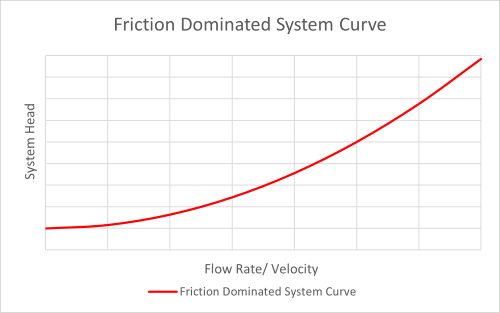
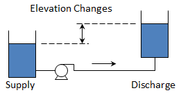
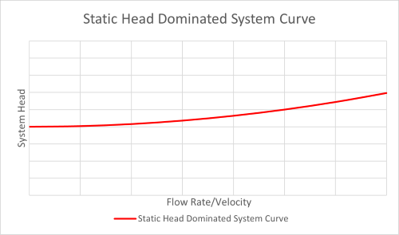
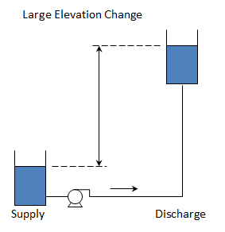

-----
title: B) System Curves
tabtitle: Pump System Curves | HI Data Tool 
date: August 31, 2026
description: Demonstrates how to calculate the pump system curve, which includes friction head, static head, pressure head, pipe losses, and control losses.
-----
# System Curves 
Pump system head requirements change with flow rate. This relationship is shown graphically by the system curve, which represents the total head required by a piping system at different flow rates. The total head can be split into static head (elevation or lift-dependent) and dynamic head (velocity or friction-dependent). A system curve will show how sensitive the operating point (the intersection of the system curve and pump curve) is to flow. If the system curve is wrong, the pump will likely be mis-sized — it will run at a flow and head that wasn’t the design point.

=atag=
System curve
=atag=
### What is a system curve?
A system curve shows the total differential system head (Δhsystem) or head required to be developed by the pump, referred to as pump total head (H). The system head varies as a function of flow rate as illustrated in [Fig. 1.B.1](#fig1b1). It is important to accurately characterize the system curve in order to select the correct pump for various operating conditions because the operating point of the system will be dependent on the intersection of the system curve and the pump curve as defined in [Eq. 1.B.2](#eq1b2) and discussed further in the [Operating Point](/pump-system-fundamentals/operating-point.html) section.

Fig. 1.B.1 System curve illustrating system head as a function of flow rate

### What is head and why is it used?
Head is the expression of the energy content of a liquid in reference to any arbitrary datum expressed in units of energy per unit weight of liquid. The measuring unit for head is <units us = "feet" metric = "meters"/> of liquid. Pressure and head of a liquid in a piping system have a physical relationship as described in the following subsection on the Bernoulli equation [Eq. 1.B.1](#eq1b1) and is also explained in the [Pump System Foundational Concepts](/pump-system-fundamentals/foundational-concepts.html) section with [Eq. 1.A.1a](#eq1a1a) and [Eq. 1.A.1b](#eq1a1b). Head may not be intuitive at first, but it is the most useful way of calculating and expressing the energy contained in pump piping systems independent of the fluid density. Refer to this section for additional information on pump total head, pressure and why head is commonly used for system curves.

=atag=
Bernoulli equation
=atag=
### Bernoulli Equation Expressed in Terms of Head
Based on the conservation of energy, the Bernoulli equation describes the relationship between three energy terms for a fluid that is both incompressible and has no frictional loss and no added energy, such as from heat transfer, chemical reactions or a pump. Defined in [Eq. 1.B.1](#eq1b1), the head in Bernoulli systems always remains constant (assuming no energy is added or removed at the boundaries), which is a simplification that is addressed in following sections. The components of the energy expressed in the Bernoulli equation are pressure head, velocity head, and elevation head.

Eq. 1.B.1 

=+=

[units us]

$$ h_{1} = h_{2} = ({32.2 \over {1}} · {144 \over 1} · {p_{1} \over {ρ·g}}) + ({v_{1}^2 \over {2·g}}) + ({Z_1}) = ({32.2 \over {1}} · {144 \over 1} · {p_{2} \over {ρ·g}}) + ({v_{2}^2 \over {2·g}}) + ({Z_2})$$

=+=

=+=

[units metric]

$$ h_{1} = h_{2} = ({p_{1} \over {ρ·g}}) + ({v_{1}^2 \over {2·g}}) + ({Z_1}) = ({p_{2} \over {ρ·g}}) + ({v_{2}^2 \over {2·g}}) + ({Z_2})$$

=+=

Where:
<!-- Had to do it this way because we had 2 us-only bullets -->
<ul>
<li>p is static pressure <units us = "(psi)" metric = "(Pa)"/></li>
<li>h is head <units us = "(ft)" metric = "(m)"/></li>
<li>ρ is density of the liquid <units us = "(lbm/ft^3)" metric = "(kg/m^3)"/></li>
<li>g is acceleration due to gravity <units us = "(ft/s^2)" metric = "(m/s^2)"/></li>
<li>Z is elevation head <units us = "(ft)" metric = "(m)"/></li>
<li v-if='unit_set=="us"'>144 is to convert between square inches (in2) and square feet (ft2)</li> 
<li v-if='unit_set=="us"'>32.2 is to convert mass to force</li>
</ul>

Applying the Bernoulli equation to an example system in [Fig. 1.B.2](#fig1b2), it illustrates that when evaluating the energy at two points in a piping system when frictional losses are ignored, the energy components are simply exchanged (i.e., pressure for potential, potential for velocity, velocity for pressure, etc.) with the total energy or head remaining constant. [Calc. 1.B.1a](#calc1b1a) and [Calc. 1.B.1b](#calc1b1b) show the total head relative to the datum is equivalent for points 1 and 2 <units us = "(12.6 ft)" metric = "(3.8 m)"/> even though the static pressures, elevation heads, and velocities are different. These calculations illustrate the Bernoulli energy transfer with point 2 having lower pressure head, greater elevation head, and greater velocity head than point 1, but having the same total head.

Fig. 1.B.2 Bernoulli illustration of static pressure difference at points 1 and 2 based on elevation head and velocity head difference (see Calcs. 1.B.1a and 1.B.1b for equivalent total head)

Calc. 1.B.1a Total head h1 with respect to datum per Fig. 1.B.2

=+=

[units us]

$$ h_{1} = ({32.2 \over {1}} · {144 \over 1} · {p_{1} \over {ρ·g}}) + ({v_{1}^2 \over {2·g}}) + ({Z_1}) = (11.5 ft) + (0.08 ft) + (1 ft)=12.6 ft $$

=+=

=+=

[units metric]
$$ h_{1} = ({p_{1} \over {ρ·g}}) + ({v_{1}^2 \over {2·g}}) + ({Z_1}) = (3.5 m) + (0.025 m) + (0.305 m) = 3.8 m $$

=+=

Calc. 1.B.1b Total head h2 with respect to datum per Fig. 1.B.2

=+=

[units us]
$$ h_{2} = ({32.2 \over {1}} · {144 \over 1} · {p_{2} \over {ρ·g}}) + ({v_{2}^2 \over {2·g}}) + ({Z_2}) = (7.95 ft) + (2.66 ft) + (2 ft)=12.6 ft $$

=+=

=+=

[units metric]
$$ h_{2} = ({p_{2} \over {ρ·g}}) + ({v_{2}^2 \over {2·g}}) + ({Z_2}) = (2.43 m) + (0.81 m) + (0.61 m) = 3.8 m $$
=+=

=atag=
System curve calculation
=atag=
### How is the system curve calculated?
The preceding discussion on the Bernoulli equation provides a foundation for determining the system’s total head as a function of velocity or flow rate ([Fig. 1.B.1](#fig1b1)); however, it needs to be expanded because friction losses due to fluid viscosity will exist and pumps will add energy to the system. [Fig. 1.B.3](#fig1b3) illustrates the pump total head (H) and the frictional head loss in the pump suction piping (hfs) and the pump discharge piping (hfd). The frictional head losses are the result of pipe friction and flow through tank entrances and exits, pipes, fittings, valves, and other end-use equipment in the system as discussed in the [Pipe Frictional Losses](/fluid-flow/pipe-frictional-losses.html) and [Losses in Valves, Fittings and Bends](/fluid-flow/losses-in-valves-fittings-and-bends.html) sections.

To determine the pump total head (H) or total differential system head (Δhsystem) we can consider the change in the Bernoulli head from point 1 to point 2 as defined in [Eq. 1.B.1](#eq1b1) and add the frictional head losses from point 1 to the pump suction flange and from the pump discharge flange to point 2.

Fig. 1.B.3 Pump system illustrating friction head losses and pump total head

Considering the addition of frictional head losses, we get [Eq. 1.B.2](#eq1b2) describing the pump total head (H), followed by substituting terms and rearranging the grouping of terms. This illustrates that the system head plotted on the system curve and the pump total head (H) will be identical during operation due to energy conservation and therefore, the system operating point will be the flow and head defined by the intersection of the pump and system curve. Refer to [Operating Point](/pump-system-fundamentals/operating-point.html) section for additional details.

Eq. 1.B.2 

=+=

$$ H = [Δh_Bernoulli]+[Σh_f] $$

$$ H = [({p_{2} \over {ρ·g}}+{v_{2}^2 \over {2·g}}+{Z_2})-({p_{1} \over {ρ·g}}+{v_{1}^2 \over {2·g}}+{Z_1})]+[h_fs+h_fd]$$

$$ H = [({{p_{2}-p_{1}} \over {ρ·g}})+({{v_{2}^2}-{v_{1}^2} \over {2·g}})+(Z_2-Z_1)]+[h_fs+h_fd]$$

=+=

Where:

- H is pump total head
- Δh_Bernoulli is the change in head as described by [Eq. 1.B.1](#eq1b1)
- Σh_f are frictional head losses between point 1 and the pump suction flange (hfs) and between the pump discharge flange and point 2 (hfd) respectively.
- See [Pipe Frictional Losses](/fluid-flow/pipe-frictional-losses.html) and [Losses in Valves, Fittings and Bends](/fluid-flow/losses-in-valves-fittings-and-bends.html) sections for details on frictional head loss calculations.
- Refer to [Eq. 1.B.1](#eq1b1) for definition of all variables and unit considerations.

### Pump Total Head - Static Head, Dynamic Head, Frictional Head Losses
As illustrated in [Eq. 1.B.2](#eq1b2), the total head (H) is dependent on the differential pressure head (item 1), velocity head (item 2), elevation head (item 3), and summation of frictional head losses (item 4) as summarized below.
- Item 1 - Differential pressure head 
$$ Δh_g=({{p_{2}-p_{1}} \over {ρ·g}}) $$
- Item 2 - Differential velocity head
$$ Δh_v=({{v_{2}^{2}-v_{1}^{2}} \over {2·g}}) $$
- Item 3 - Differential elevation head 
$$ ΔZ=Z_2-Z_1 $$
- Item 4 - Summation of frictional head losses
$$ Σh_f=h_{fd}+h_{fs} $$

It is common to group items 1–4 based on being dependent or independent of velocity. Items 1 and 3, pressure head and elevation head, are velocity independent and may be grouped together as differential static head (Δhstat) as illustrated in [Eq. 1.B.3](#eq1b3). Items 2 and 4 are velocity dependent and may be grouped together as dynamic head (Δhdyn) as illustrated in [Eq. 1.B.4](#eq1b4). The pump total head (H) can then be defined as shown in [Eq. 1.B.5](#eq1b5) based on static and dynamic groupings.

Eq. 1.B.3 

=+=

$$ Δh_{stat} = ({{p_{2}-p_{1}} \over {ρ·g}})+(Z_2-Z_1) $$
=+=

Eq. 1.B.4 

=+=

$$ Δh_{dyn} = ({{v_{2}^{2}-v_{1}^{2}} \over {2·g}})+(h_{fd}+h_{fs}) $$
=+=

Eq. 1.B.5 

=+=

$$ Δh_{system}=H = Δh_{stat}+ Δh_{dyn} $$
=+=

The dynamic head varies with flow rate and is grouped separately because it depends on velocity. The frictional head loss portion of the dynamic head can be calculated for the system components, such as piping, valves, elbows and bends, and end-use equipment. These losses typically vary proportional to the square of the velocity.

**Major losses** due to friction in pipes for incompressible Newtonian fluids can be calculated using the Darcy-Weisbach equation. The Darcy-Weisbach friction factor, *f*, can be determined using the Colebrook-White equation or using the <a href="/tools/frictional-losses.html" target="_blank">Pipe Frictional Loss Calculator</a>. The Hazen-Williams equation is another method used to determine pipe losses; however, are typically only valid for water at standard temperature. The Hazen-Williams C-factor is a function of pipe material only and is not dependent on Reynolds number. See the [Pipe Frictional Loss](/fluid-flow/pipe-frictional-losses.html) section for additional details. 

**Minor losses** due to head losses in fittings, valves, area changes, tank entrances and exits, and end-use equipment are typically calculated based on a resistance coefficient and the velocity head as defined in the <a href="/fluid-flow/losses-in-valves-fittings-and-bends.html" target="_blank">Losses in Valves, Fittings and Bends</a> section.

=^=
title: Introductory Pump & System Training
description: Providing a foundational introduction for early-career professionals and those seeking a structured refresher. Examines key pump and system components, fundamental hydraulic principles, pump classifications, and performance curves, while also offering an overview of pump drivers, instrumentation, market segments, manuals, and common industry drawings.
image: Need Image
url: https://training.pumps.org/IntroductoryTrainingCourse
price: 700
hide_price: true
=^=

=atag=
System curve shape
=atag=
### What is the effect of the system curve shape?

In some systems frictional losses will be the majority of overall head loss. These systems will have a steeper system curve because the frictional head loss is generally proportional to velocity squared.

Fig. 1.B.4 Friction-dominated system curve

In other systems the elevation change, or static head, will be the majority of the overall head loss. The system curve in this case will start at a higher value at zero flow and will tend to be flatter because the static head is not directly affected by velocity.

Fig. 1.B.5 Static-head-dominated system curve

Real-world applications tend to consider a range or family of system curves. This brackets the range of liquid levels, operating pressures, valve arrangements, and potential for the pipes fouling over time. The implications of selecting pumps based on a varying system curve are further discussed in the [Operating Point](/pump-system-fundamentals/operating-point.html) section and the educational demonstrator below can be used to get an idea of how changing system parameters will affect the system curve.

=^=
title: Vibration in Rotodynamic Pumps – Recorded Webinar  
description: Learn basic vibration analysis concepts for rotodynamic pumps, the typical vibration issues that occur, with case studies to reinforce the concepts.
image: /images/recordedwebinar.png
url: https://training.pumps.org/products/introduction-to-vibration-in-rotodynamic-pumps-recorded-webinar
price: 159.99
hide_price: true
=^=

=atag=
System curve demonstrator
=atag=
### Educational Demonstration System Curve
This demonstrator shows qualitatively how various parameters affect the system curve. You can slide the toggle to change system parameters for tank levels, frictional losses, and tank pressure to see how the system curve varies.

=d=
title:
kind: pump-curve
type: system
pumpCount: 0
lowerLevel: 5
upperLevel: 5
upperPressure: 10
totalResistance: 5
=d=

Demo. 1.B.1 System curve

=atag=
Calculation example
=atag=
### System Curve Calculation Worked Example (U.S. & Metric Units)

Consider the system in [Fig. 1.B.6](#fig1b6) and develop a system curve for the flows <units us = "from 0 to 300 GPM." metric = "from 0 to 68.14 m^3/h. **Note** metric values in the worked example are converted from US units in Fig. 1.B.6."/>

Fig. 1.B.6 Pump system for system curve calculation worked example

**Determine the Static Head**

Using the static head calculation in [Eq. 1.B.3](#eq1b3), and since both tanks have the same surface pressure, the static head is only dependent on the difference in surface elevation.

Calc. 1.B.2 Static head for system curve example

=+=

[units = us]
$$ Δh_{stat} = ({{p_{2}-p_{1}} \over {ρ·g}})+(Z_2-Z_1)=(0-0)+(289 \,ft - 24 \,ft)=265\, ft $$

=+=

=+=
[units = metric]

$$ Δh_{stat} = ({{p_{2}-p_{1}} \over {ρ·g}})+(Z_2-Z_1)=(0-0)+(88.09 \,m -7.315\,m)= 80.77\,{m} $$

=+=

**Determine the Dynamic Head Including Frictional Losses**

To simplify the pipe frictional head losses (major losses), we will consider the friction factor to be constant at 0.02. In general, the friction factor would vary as the flow rate (velocity) varies. Additionally, the flow would be laminar for low velocities. These considerations should be taken into account when calculating the pipe losses.

<units us = "A 4-inch, schedule 40 steel pipe has an inner diameter of 4.026 inches (0.3355 feet). The overall pipe length in this example is 1255 feet." metric = "A 4-inch, schedule 40 steel pipe has an inner diameter of 102.26 mm (0.10226 m). The overall pipe length in this example is 382.5 meters."/>

For component losses, refer to the  <a href="/fluid-flow/losses-in-valves-fittings-and-bends.html" target="_blank">Losses in Valves, Fittings and Bends</a> seciton. The minor loss resistance coefficients (K) for [Fig. 1.B.6](#fig1b6) are as follows:

- Two (2) Regular flanged elbow, K = 0.31 each
- One (1) Swing check valve, K = 2.0
- One (1) Wedge-disc gate valve, K = 0.17
- One (1) Sudden enlargement, K = 1.0

This gives a total resistance coefficient (ΣK) equal to 3.79

Using the dynamic head equation [Eq. 1.B.4](#eq1b4), [Calc. 1.B.3](#calc1b3) combines the major and minor losses in the first term (see the <a href="/fluid-flow/losses-in-valves-fittings-and-bends.html#eq3b2" target="_blank">Losses in Valves, Fittings and Bends</a> section Eq. 3.B.2) and results in the dynamic head as a function of velocity.

Calc. 1.B.3 Dynamic head for system curve example

=+=
[units = us]

$$ \Delta h_{dyn} = {({fL \over D} + ΣK) · ({v^2 \over 2·g})} +({v_{2}^2-v_{1}^2 \over 2·g})= {({0.02 × 1255\,ft \over 0.3355\,ft} + 3.79)· ({v^2 \over 2 × 32.2 \,{ft/s^2}})} + (0)  = 1.22·v^2$$

=+=

=+=
[units = metric]
$$ \Delta h_{dyn} = {({fL \over D} + ΣK) · ({v^2 \over 2·g})} +({v_{2}^2-v_{1}^2 \over 2·g})= {({0.02 × 382.5\,m \over 0.10226\,m} + 3.79)· ({v^2 \over 2 × 9.81 \,{m/s^2}})} + (0)  = 4.01·v^2$$

=+=

**Determine the System Curve**

Per [Eq. 1.B.5](#eq1b5), [Calc. 1.B.4](#calc1b4a) illustrates the system curve can be calculated as a function of flow rate by adding the differential static head ([Calc. 1.B.2](#calc1b2)) and the dynamic head ([Calc. 1.B.3](#calc1b3)).

Calc. 1.B.4a System curve as a function of velocity

=+=
[units = us]

$$ Δh_{system}=H = Δh_{stat}+ Δh_{dyn} = 265\,{ft} + 1.22·v^2$$
=+=
=+=
[units = metric]
$$Δh_{system}=H = Δh_{stat}+ Δh_{dyn} = 80.77\,{m} + 4.01·v^2$$
=+=

[Calc. 1.B.4b](#calc1b4b) can be used to convert a flow rate (Q) in <units us = "gpm to a velocity in ft/s with the pipe diameter D in inches" metric = "m^3/h to a velocity in m/s with the pipe diameter (D) in meters."/>

Calc. 1.B.4b Flow-rate-to-velocity conversion

=+=
[units us]

$$ v = 0.320833·Q·({4 \over \pi ·D^2}) $$
=+=
=+=
[units metric]
$$ v = 0.000278·Q·({4 \over \pi ·D^2}) $$
=+=

Substituting [Calc. 1.B.4b](#calc1b4b) in for velocity in [Calc. 1.B.4a](#calc1b4a) using the 4-inch pipe <units us = "(ID = 4.026 inches)" metric = "(ID = 0.10226 m)"/> we get [Calc. 1.B.4c](#calc1b4c) as the system curve equation as a function of flow rate in <units us = "gpm" metric = "m^3/h"/>.

Calc. 1.B.4c System curve as a function of flow rate

=+=

[units us]
$$ \Delta h_{system} = 265\,{ft} + {{{7.75e^{-4}}}·{Q^2}} $$
=+=
=+=
[units metric]
$$ \Delta h_{system} = 80.77\,{m} + 4.59e^{-3}·Q^2 $$
=+=

[Calc. 1.B.4c](#calc1b4c) is used to generate the velocity data in [Fig. 1.B.7](#fig1b7) and the system head data in [Fig. 1.B.8](#fig1b8), each as a function of flow rate with the data table following. This system is dominated by the static head. The static head is <units us = "265 ft" metric = "80.77 m"/> compared with approximately <units us = "70 ft" metric = "21.33 m"/> at the maximum flow rate.

=/=
title: Velocity 
data-us: datapoints_us.csv
data-metric: datapoints_metric.csv
x: 1
series: 2
series_title_index: 0
=/=

Fig. 1.B.7 Velocity as a function of flow rate for system curve example

=/=
title: System Curve 
data-us: datapoints_us.csv
data-metric: datapoints_metric.csv
x: 1
series: 3
series_title_index: 0
=/=

Fig. 1.B.8 System head as a function of flow rate for system curve example

=|=
title: System Curve Data 
data-us: datapoints_us.csv
data-metric: datapoints_metric.csv
=|=

