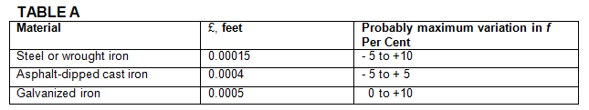

-----
title:  IIIA. General
date: June 28th, 2019
description: General overview of fluid flow. Friction factors, Reynolds number, resistance.
-----

# General

## IIIA-1 – Fluid Flow – General

### Pipe Friction (Major Losses)

The resistance to the incompressible flow of any fluid (head loss) in any pipe may be computed from the equation:

=+=
(1)
$$ \Delta h_{LOSS} = h_f = f * {L \over D} * {V^2 \over 2g} $$ 
=+=

where:

- hf = Frictional resistance (head loss) in <units us = "feet of fluid" metric = "meters of fluid"/>
- L = Length of pipe in <units us = "feet" metric = "meters"/>
- D = Average internal diameter of pipe in <units us = "feet" metric = "meters"/>
- V = Average velocity in pipe in <units us = "feet/second" metric = "meters/second"/>
- g = Acceleration due to gravity <units us = "in feet/second/second. Hereafter, the value 32.17 ft/s^2^ for sea level and 45 degrees latitude will be used." metric = "in meters/second/second. Hereafter, the value 9.81 m/s^2^ for sea level and 45 degrees latitude will be used."/>
- f = Friction factor

### Construction of Charts and Tables

The Colebrook Equation (portrayed below) offers a reliable means for computing the **Darcy-Weisbach friction factor friction factor (*f*)** to be used in Equation (1).

=+=
(2)
$$ {1 \over \sqrt f} = -2 \log_{10}({\epsilon \over (3.7*D)} + [{2.51 \over Re \sqrt f}]) $$
=+=

Another common form, which can be solved without iteration, is shown below.

=+=
$$ {1 \over \sqrt f} = -2 \log({\epsilon/D \over 3.7} + {5.74 \over Re^{0.9}}) $$
=+=

The Reynolds Number (Re) is given by the equation:

=+=
(3)
$$ Re = {VD \over v}  $$
=+=

where:

- V = Average velocity in <units us = "feet/second" metric = "meters/second"/>
- D = Average internal diameter in <units us = "feet" metric = "meters"/>
- *v* = Kinematic viscosity of the fluid in <units us = "square feet/second" metric = "square meters/second"/>

References 1, 2, 3, 4, 5, 6 and 7 in Section VJ were studied to obtain the best value of the roughness parameter (ε) and the probable variations in the friction factors for new pipes. The probable variations
in (*f*) for some classes of new clean pipe are given in Table A.

Equation (2) was combined with Equation (1) and solutions carried out for each kind and size of pipe. These were used to construct large-scale logarithmic plots from which
the values of (hf) shown in Section IIIB, Tables 1–31 incl., were obtained.

### Old Pipes

A study of References 8, 9, 10, 11 in Section VI showed that the problem of estimating the friction
factors for old pipes or allowing for the deterioration of new pipes is beyond the scope of this Handbook.
The deterioration of pipes with age depends on the particular chemical properties of the fluid and the
metal with which it is in contact. It is recommended that prior experience be considered and local water
supply officials be consulted where it is necessary to estimate the friction losses in old pipes or to
allow for the aging of new pipes. References 8, 9. 10, 11 of Section VI may be consulted for general
information on the subject. For commercial installations, it is recommended that 15 percent be
added to the values shown in Tables 1–31.

### Tables of Friction Loss for Water, Explanation

Frictional resistances for water flowing in new, clean steel pipe (Schedule 40)* or in asphalt-dipped
cast iron pipe are given in Section IIIB, Tables 1–31 incl., herein.*

The tables show the discharge in cubic feet per second, the average velocity in feet per second,
and the velocity head in feet for any fluid in a circular pipe of the same diameter as that specified in each table for rates of flow in gallons per minute. 
The values of the friction head (hf) in feet of fluid per 100 feet of pipe apply to any fluid having a kinematic viscosity, v  = 0.00001216 square feet per second
(1.130 centistokes) which is the value for pure fresh water at 60° F. The friction heads are average values for pipes having the ε/D values given in the tables, 
where (ε) is a linear measure of the absolute roughness of the pipe walls and (D) is the internal diameter of the pipe. Further information on the roughness parameter
is given in Section IV.

The tabulated values of (hf) are in feet of pure fresh water (60° F) per 100 feet of new clean steel
pipe (Schedule 40)* or of new clean asphalt-dipped cast iron pipe as specified.

No allowance has been made for age, differences in diameter resulting from manufacturing
tolerances, or any abnormal conditions of interior surface. Any factor of safety must be estimated
from the local conditions and the requirements of each particular installation. An example illustrating
the use of the tables will be found in Section IIIB.

### Valves and Fittings (Minor Losses)

The resistance to flow (head loss) caused by a valve or fitting may be computed from the equation:

=+=
(4)
$$ \Delta h_{LOSS} = \Delta h_f = K*{v^2 \over 2g} $$
=+=

where:

- hf = Frictional resistance (head loss) in <units us = "feet" metric = "meters"/> of fluid 
- V = Average velocity in <units us = "feet/second" metric = "meters/second"/> in a pipe of corresponding diameter 
- g = <units us = "32.17 ft/s^2" metric = "9.81 m/s^2"/>
- K = Resistance coefficient for valve or fitting
 

Values of (K) for valves and fittings may be found
in <a href="/fluid-properties-II/other-fluids.html" target="_blank">Section IIIB</a>.  Reference to the literature will reveal wide differences in the published values of
(K) for all types of valves and fittings. The available data are inconclusive. As indicated in Section 
IIIB, flanged valves and fittings usually exhibit lower resistance coefficients than screwed valves and 
fittings. The resistance coefficients decrease with the increasing size of most valves and fittings.

Component (minor) losses can be summed together with the pipe losses to determine an overall frictional loss for the system.

=+=
$$ \Delta h_{LOSS} = \Delta h_f = {({fL \over D} + ΣK) * {v^2 \over 2g}} $$
=+=

Cast iron flanged elbows and drainage-type elbows may be expected to approximate pipe bends.
Values of the resistance coefficient (k) may be taken from Section IIIB. The solid line curves in Fig. IIIB-SA 
are given by Reference 12a of Section VI with the range of scatter of the test points as indicated.
The broken line curves may be used as a guide to probable resistance coefficients for intermediate
values of the relative roughness factor ε/D. A value of ε = 0.00085 feet will be satisfactory for uncoated
cast iron and cast steel elbows. Resistance coefficients for pipe bends with less than 90 degree deflection angles as reported by Wasielewski(g) 13 are
shown in Fig. IIIB-5B. The curves shown are for smooth surfaces but may be used as a guide to approximating the resistance 
coefficients for surfaces of moderate roughness such as clean steel and cast iron. Figs. IIIB-5A and IIIB-5B in Section
IIIB are not reliable below R/D = 1, where R is the radius of the elbow in feet. The approximate radius
of a flanged elbow may be obtained by subtracting the flange thickness from the center-to-face dimension. The center-to-face dimension for a reducing
elbow is usually identical with that of an elbow of the same straight size as the larger end. 

The resistance coefficients for miter bends as reported by Shubert(g) 12b are shown in Section IIIB,
Table 33. The rough pipe used in the Shubert investigation had a relative roughness factor, ε/D of about 0.0022. Reference 12b of Section VI.
should be consulted for information on the variation of the resistance coefficients with variation in the Reynolds Number.

The resistance to flow caused by a sudden enlargement may be computed from the equation:

=+=
(5)
$$h = K{{(V_1 - V_2)^2} \over {2g}}$$
=+=
=+=
$$ = K(1 - {A_1 \over A_2})^2 {V_1^2 \over 2g}$$
=+=
=+=
$$ = K[1 - ({D_1 \over D_2})^2]^2{V_1^2 \over 2g}$$
=+=
=+=
$$ = K[{({D_2 \over D_1})^2 - 1 }]^2{V_2^2 \over 2g}$$
=+=

where:

- h = Frictional resistance (head loss) in <units us = "feet of fluid" metric = "meters of fluid"/> 
- V1 = Average velocity in <units us = "feet/second" metric = "meters/second"/> in the smaller (upstream) pipe 
- A1 = Internal cross-sectional area of the smaller pipe in <units us = "square feet" metric = "square meters"/>
- D1 = Internal diameter of the smaller pipe in <units us = "feet" metric = "meters"/>
- V2, A2, D2 = Corresponding values for the larger (downstream pipe)
- g = <units us = "32.17 ft/s^2" metric = "9.81 m/s^2"/>
- K = Resistance coefficient, usually taken as unity since the variation is almost always less than ±3 per cent.

Equation (5) is useful for computing the resistance to flow caused by conical increasers and diffusers.
Values of (k) for conical increasers based on data reported by Gibson(g) 14 are given in Section IIIB,
Fig. IIB-6 or may be computed by the equation:

=+=
$$k = 3.50{(\tan(\theta/2)})^{1.22}$$
=+=

where:

-  θ = total conical angle of the increaser in degrees

Equation (6) applies only to values of θ between 7.5 and 35 degrees. Noteworthy is the fact that above
50 degrees a sudden enlargement will be as good or better than a conical increaser. Values of (k) for
conical diffusers as reported by Reference 11 of Section VI are shown in Section IIIB, Fig. IIIB-6.
The values shown include the entrance mouthpiece which accounts in part for the increase over Gibson's
values for conical increasers. Resistance coefficients for reducers, as reported by Russell are
given in Section IIIB, Fig. IIIB-7.

### Friction Factor Diagrams

As previously stated, the resistance to the incompressible flow of any fluid (head loss) in any pipe may be computed from the equation (1)

=+=
$$h_f = f * {L \over D} * {V^2 \over 2g}$$ 
=+=

Values of (*f*) may be obtained directly from Fig. IIIA-1 where the pipe is new clean asphalt-dipped
cast iron, from Fig. IIIA-2 where the pipe is new clean steel of Schedule 40 wall thickness, or from
Fig. IIIA-3 which applies to any size and type of surface. The probable variations in (*f*) for some
classes of new clean pipe are given in Table A. It will be necessary to know the approximate value of
the relative roughness factor, ε/D to enter Fig. IIIA-3 and this can be obtained, for several kinds of
pipes, from Fig. llIA-4. If the fluid is fresh water at = 60° F or atmospheric
air at 60° F the scales at the top of Figs. IIIA-1-3 incl., may be used. For convenience in air and
water computations only, the scale reading is the product of the average velocity in feet/second and
the internal diameter in inches, (VD"). 

For other fluids or temperatures the scales at the
bottom of Figs. IIIA-1-3 incl., must be used. The
scale reading is the Reynolds Number, R, given
by equation (3).

The data for Figs. IIIA-1-3 incl., were obtained directly
from solutions of Equation (2). Figs. IIIA-4
and IIIA-5 were taken from Reference 2 with minor
changes.

Values of the kinematic viscosity (*v*) at various
temperatures are given in Fig. IIIA-5 for a number
of different fluids. The Reynolds Number also may
be obtained directly from Fig. IIIA-5 with the aid of
the quantity (VD) mentioned above. The tracer
line shows that for kerosene at 175° F flowing with
an average velocity of 12.5 ft/sec in a pipe of 4
inches internal diameter, the Reynolds Number
would be 3.5 x 10^5^. In cases where viscosities are
obtained from sources other than Fig. IIIA-5, it is
*absolutely essential* that they be expressed in sq
ft/sec in order that they may be used with Fig.
IIIA-5 or Equation (3). Kinematic viscosities measured
in stokes or centistokes may be converted
to *v* in sq ft/sec by the formula:

=+=
(7)
$$v = 0.00107639 * stokes$$
$$= 0.0000107639 * centistokes$$
=+=

For further information on viscosity, see <a href="/fluid-properties-II/viscosity.html" target="_blank">section IIC</a>.

If the Reynolds Number is less than 2000, the
flow is laminar and the friction factor for any fluid
in any pipe is given by the equation:

=+=
(8)
$$ f = {64 \over R}$$
=+=

If the Reynolds Number is above 4000, the flow will
usually be turbulent and the curves in Figs. IIIA 1-3 incl., 
apply. The range R = 2000–4000 is calledthe critical zone in 
which the flow may be highly unstable and the friction factor indeterminate.

