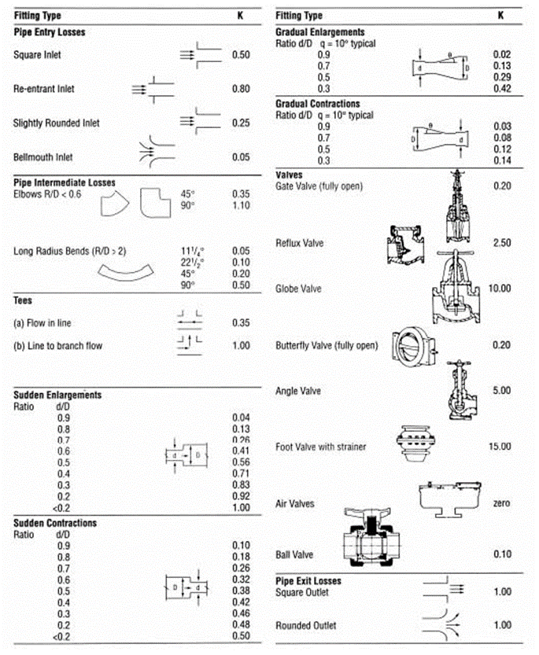
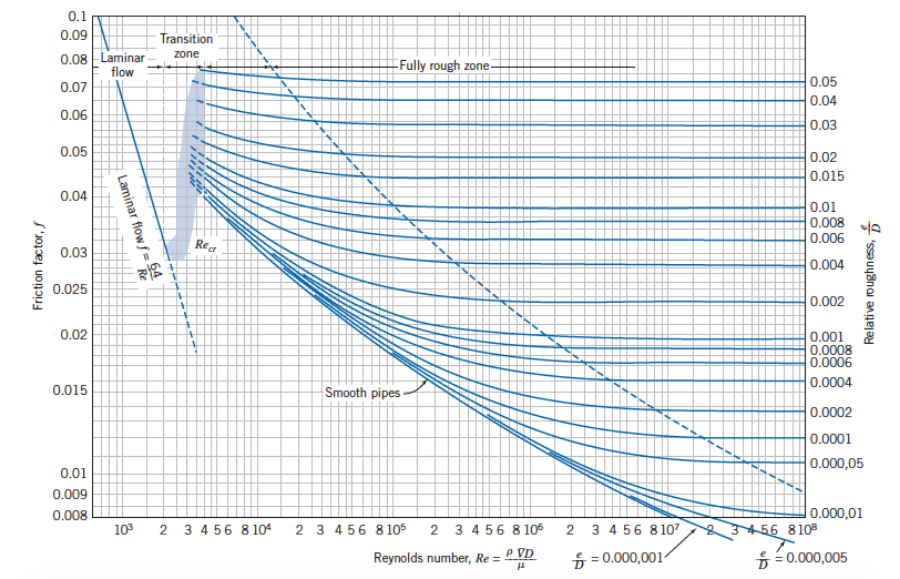

-----
title:  A) General
date: May 12th, 2020
description: General overview of fluid flow. Pipe roughness, friction factors, Reynolds number, resistance.
-----

## Fluid Flow – General

### Pipe Friction (Major Losses)

The resistance to the incompressible flow of any fluid (head loss) in any pipe may be computed from the equation:

=+=
(Eq. 3.A.1)
$$ h_f = f · {L \over D} · {v^2 \over 2·g} $$ 
=+=

where:

- hf = Frictional resistance (head loss) in <units us = "feet of fluid" metric = "meters of fluid"/>
- L = Length of pipe in <units us = "feet" metric = "meters"/>
- D = Average internal diameter of pipe in <units us = "feet" metric = "meters"/>
- v = Average velocity in pipe in <units us = "feet/second" metric = "meters/second"/>
- g = Acceleration due to gravity <units us = "in feet/second/second. Hereafter, the value 32.2 ft/s^2^ for sea level and 45 degrees latitude will be used." metric = "in meters/second/second. Hereafter, the value 9.81 m/s^2^ for sea level and 45 degrees latitude will be used."/>
- *f* = Friction factor

The Colebrook Equation (portrayed below) offers a reliable means for computing the **Darcy-Weisbach friction factor friction factor (*f*)** to be used in Equation (3.1).

=+=
(Eq. 3.A.2)
$$ {1 \over \sqrt f} = -2 × \log_{10}({\epsilon \over {3.7·D}} + {2.51 \over Re · \sqrt f}) $$
=+=

where:

- ε = absolute roughness, <units us = "ft" metric = "mm"/>
- Re = Reynolds number for fluid flow

Another common form, which can be solved without iteration, is shown below.

=+=
(Eq. 3.A.3)
$$ {1 \over \sqrt f} = -2 × \log_{10}({\epsilon/D \over 3.7} + {5.74 \over Re^{0.9}}) $$
=+=

The **Reynolds number** (Re) is a non-dimensional ratio of inertial forces to viscous forces and is used to help scale data over a range of pipe sizes,
fluid properties, and flow conditions. It is used as the basis for the Moody Diagram to determine friction factors and pressure/head losses.

The Reynolds number is defined as: 

=+=
(Eq. 3.A.4)
$$ Re = {ρ·v·D \over μ} = {v·D \over 𝜈} = {Q·D \over {𝜈·A}} $$
=+=

where, for cylindrical pipes:

- ρ is fluid density in <units us = "lbm/ft^3 " metric = "kg/m^3"/>
- v is fluid velocity in <units us = "ft/s" metric = "m/s"/>
- D is pipe inner diameter in <units us = "feet" metric = "meters"/>
- μ is dynamic viscosity in <units us = "lbf·s/ft^2" metric = "kg/(m·s)"/>
- 𝜈 is kinematic viscosity in <units us = "ft^2^/s" metric = "m^2^/s"/>
- Q is volumetric flow rate in <units us = "ft^3^/s" metric = "m^3^/s"/>
- A is pipe cross-sectional area in <units us = "ft^2 " metric = "m^2"/>

At Reynolds numbers less than about 2000, the flow tends to be laminar where it is traveling in a smooth, orderly manner with little mixing. 
At Reynolds numbers higher than about 4000, the flow is considered turbulent, with eddies forming and irregular motion.

### Pipe Roughness

**Pipe roughness** varies with pipe material, age, usage, fluid transport and lining. This table gives example values for some clean materials.

=|=
title: Roughness Values
data-us: pipe-roughness-ft.csv
data-metric: pipe-roughness-mm.csv
scrolling: false
=|=

Tbl. 3.A.1

Determining the frictional roughness for old pipe is beyond this tutorial. Deterioration of pipes with age depends on the particular chemical properties of the fluid
and the metal with which it is in contact. It is recommended that prior experience or testing be used to determine an accurate value. For commercial installations, 
it is recommended that 15 percent be added to the values shown above.

### Valves and Fittings (Minor Losses)

The resistance to flow (head loss) caused by a valve or fitting may be computed from the equation:

=+=
(Eq. 3.A.5)
$$ h_f = K·{v^2 \over 2·g} $$
=+=

where:

- hf = Frictional resistance (head loss) in <units us = "feet" metric = "meters"/> of fluid 
- v = Average velocity in <units us = "feet/second" metric = "meters/second"/> in a pipe of corresponding diameter 
- g = Acceleration due to gravity, <units us = "32.17 ft/s^2" metric = "9.81 m/s^2"/>
- K = Resistance coefficient for valve or fitting
 

Values of (K) for valves and fittings may be referenced
below, and in <a href="/fluid-flow-III/fr-loss-water.html">Losses in Valves, Fittings, and Bends</a>.  Wide differences are found in the published values of (K) for all types of valves
and fittings. The available data are inconclusive. As indicated in the above references section, flanged valves and fittings usually exhibit lower resistance coefficients than screwed valves and fittings.
The resistance coefficients decrease with the increasing size of most valves and fittings.

(Fig. 3.A.1)

Component (minor) losses can be summed together with the pipe losses to determine an overall frictional loss for the system, producing the equation

=+=
(Eq. 3.A.6)
$$ h_f = {({f·L \over D} + ΣK) · {v^2 \over 2·g}} $$
=+=

where:

- *f* = pipe friction factor
- L = pipe length in <units us = "feet" metric = "meters"/>
- D = pipe inside diameter in <units us = "feet" metric = "meters"/>
- ΣK = sum of the minor losses, which includes losses across valves

<units us = "Cast iron flanged elbows and drainage-type elbows may be expected to approximate pipe bends.
Values of the resistance coefficient (K) may be taken from Section IIIB. The solid line curves in Section IIIB, Fig. 3
are given by Reference 12a of Section VI with the range of scatter of the test points as indicated.
The broken line curves may be used as a guide to probable resistance coefficients for intermediate
values of the relative roughness factor ε/D. A value of ε = 0.00085 feet will be satisfactory for uncoated
cast iron and cast steel elbows." metric = "Cast iron flanged elbows and drainage-type elbows may be expected to approximate pipe bends.
Values of the resistance coefficient (K) may be taken from Section IIIB. The solid line curves in Section IIIB, Fig. 3
are given by Reference 12a of Section VI with the range of scatter of the test points as indicated.
The broken line curves may be used as a guide to probable resistance coefficients for intermediate
values of the relative roughness factor ε/D. A value of ε = 0.259 mm will be satisfactory for uncoated
cast iron and cast steel elbows."/>

Resistance coefficients for pipe bends with less than 90 degree deflection angles as reported by Wasielewski(g) 13 are
shown in Section IIIB, Fig. 4. The curves shown are for smooth surfaces but may be used as a guide to approximating the resistance 
coefficients for surfaces of moderate roughness such as clean steel and cast iron. Figs. 3 and 4 in Section
IIIB are not reliable below R/D = 1, where R is the radius of the elbow in feet. The approximate radius
of a flanged elbow may be obtained by subtracting the flange thickness from the center-to-face dimension. The center-to-face dimension for a reducing
elbow is usually identical with that of an elbow of the same straight size as the larger end. 

The resistance to flow (head loss) caused by a sudden enlargement may be computed from the equation:

=+=
(Eq. 3.A.7)
$$h_{f} = K·{{(v_1 - v_2)^2} \over {2·g}}$$
=+=
=+=
$$ = K·(1 - {A_1 \over A_2})^2 · {v_1^2 \over 2·g}$$
=+=
=+=
$$ = K·[1 - ({D_1 \over D_2})^2]^2 · {v_1^2 \over 2·g}$$
=+=
=+=
$$ = K·[{({D_2 \over D_1})^2 - 1 }]^2 · {v_2^2 \over 2·g}$$
=+=

where:

- h = Frictional resistance (head loss) in <units us = "feet of fluid" metric = "meters of fluid"/> 
- v1 = Average velocity in <units us = "feet/second" metric = "meters/second"/> in the smaller (upstream) pipe 
- A1 = Internal cross-sectional area of the smaller pipe in <units us = "square feet" metric = "square meters"/>
- D1 = Internal diameter of the smaller pipe in <units us = "feet" metric = "meters"/>
- v2, A2, D2 = Corresponding values for the larger (downstream pipe)
- g = Acceleration due to gravity, <units us = "32.17 ft/s^2" metric = "9.81 m/s^2"/>
- K = Resistance coefficient, usually taken as unity since the variation is almost always less than ±3 per cent.

Equation (3.A.7) is useful for computing the resistance to flow caused by conical increasers and diffusers.
Values of (K) for conical increasers based on data reported by Gibson(g) 14 are given in Section IIIB,
Fig. 5 or may be computed by the equation:

=+=
(Eq. 3.A.8)
$$K = 3.50·({\tan({\theta \over 2})})^{1.22}$$
=+=

where:

-  θ = total conical angle of the increaser in degrees

Equation (3.8) applies only to values of θ between 7.5 and 35 degrees. Noteworthy is the fact that above
50 degrees a sudden enlargement will be as good or better than a conical increaser. Values of (k) for
conical diffusers as reported by Reference 11 of Section VI are shown in Section IIIB, Fig. 5.
The values shown include the entrance mouthpiece which accounts in part for the increase over Gibson's
values for conical increasers. 

### Friction Factor Diagrams

As previously stated, the resistance to the incompressible flow of any fluid (head loss) in any pipe may be computed from equation (3.1)

=+=
$$h_f = f · {L \over D} · {v^2 \over 2·g}$$ 
=+=

Values of (*f*) may be obtained directly from Fig. 3.A.2 based on Reynolds Number (Re) and Relative Roughness (ε/D) of the pipe.
Values of (ε) may be obtained from the Roughness Values table in Section 3.A where the pipe is new clean asphalt-dipped cast iron, 
new clean commercial steel or wrought iron, or other materials shown. There will be probable variations in (ε) for these materials.

Values of the kinematic viscosity (*v*) at various
temperatures are given in Fig. IIIA-5 for a number
of different fluids. The Reynolds Number assistanceis calculated using Equation 3.4. It is absolutely essential that viscosities
obtained from sources be expressed in the correct units, typically sq ft/sec or stokes or centistokes. Kinematic viscosities  measured 
in stokes or centistokes may be converted to v in sq ft/sec by the formula:

=+=
(Eq. 3.A.9)
$$v = 0.00107639 · stokes$$
$$= 0.0000107639 · centistokes$$
=+=

Further information on viscosity can be found <a href="/fluid-properties-II/viscosity.html">here</a>.

If the Reynolds Number is less than 2000, the
flow is laminar and the friction factor for any fluid
in any pipe is given by the equation:

=+=
(Eq. 3.A.10)
$$ f = {64 \over Re}$$
=+=

If the Reynolds Number is above 4000, the flow will
usually be turbulent and the **Moody Diagram** pictured below can be used to determine the friction factor.
The range Re = 2000–4000 is called the critical zone in which the flow may be highly unstable and the friction factor indeterminate.

### Moody Diagram [1]

(Fig. 3.A.2)

=^=
title: Pump System Optimization Guidebook (PSO)
description: This guidebook is intended to assist those who need to understand details of pump system optimization coupled with important capital equipment decisions. It presents practical information for those who have not had broad exposure to pumping systems and for those who wish to improve the systems for which they are responsible.
image: https://www.pumps.org/wp-content/uploads/2021/10/PSOHalf.png
url: https://www.pumps.org/product/pump-system-optimization-a-guide-for-improved-energy-efficiency-reliability-and-profitability/
price: 205.00
hide_price: true
=^=

A <a href="/tools/frictional-losses.html">Frictional Loss Calculator</a> is available to determine the pipe friction according to this methodology.

### References
1. L.F. Moody, "Friction factors for Pipe Flow", Trans. A.S.M.E., Vol 66, 1944