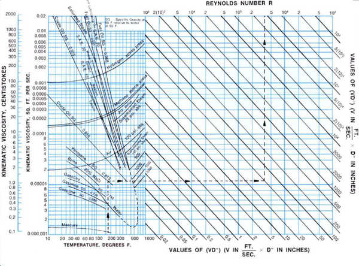

-----
title:  A) Pipe Frictional Losses
date: April, 19, 2024
description: General overview of fluid flow. Pipe roughness, friction factors, Reynolds number, resistance, head loss in piping systems.
-----

## Fluid Flow – Pipe Frictional Losses 

A <a href="/tools/frictional-losses.html" target="_blank">Frictional Loss Calculator</a> is available to determine the pipe frictional losses according to the methodology outlined in this section.

### Pipe Friction (Major Losses)

The resistance to the incompressible flow of any fluid (head loss) in any pipe may be computed from Equation 3.A.1:

=+=
(Eq. 3.A.1)
$$ h_f = f · {L \over D} · {v^2 \over 2·g} $$ 
=+=

where:

- hf = Frictional resistance (head loss) in <units us = "feet of fluid" metric = "meters of fluid"/>
- L = Length of pipe in <units us = "feet" metric = "meters"/>
- D = Average internal diameter of pipe in <units us = "feet" metric = "meters"/>
- v = Average velocity in pipe in <units us = "feet/second" metric = "meters/second"/>
- g = Acceleration due to gravity <units us = "in feet/second/second. Hereafter, the value 32.2 ft/s^2^ for sea level and 45 degrees latitude will be used." metric = "in meters/second/second. Hereafter, the value 9.81 m/s^2^ for sea level and 45 degrees latitude will be used."/>
- *f* = Friction factor

The Colebrook Equation (Eq. 3.A.2) offers a reliable means for computing the **Darcy-Weisbach friction factor friction factor (*f*)** to be used in Equation 3.A.1.

=+=
(Eq. 3.A.2)
$$ {1 \over \sqrt f} = -2 × \log_{10}({\epsilon \over {3.7·D}} + {2.51 \over Re · \sqrt f}) $$
=+=

where:

- ε = absolute roughness, <units us = "ft" metric = "mm"/>
- Re = Reynolds number for fluid flow

Another common form, which can be solved without iteration, is shown in Equation 3.A.3.

=+=
(Eq. 3.A.3)
$$ {1 \over \sqrt f} = -2 × \log_{10}({\epsilon/D \over 3.7} + {5.74 \over Re^{0.9}}) $$
=+=

###Reynolds Number

The **Reynolds number** (Re) is a non-dimensional ratio of inertial forces to viscous forces and is used to help scale data over a range of pipe sizes,
fluid properties, and flow conditions. It is used as the basis for the Moody Diagram to determine friction factors and pressure/head losses.

The Reynolds number is defined as: 

=+=
(Eq. 3.A.4)
$$ Re = {ρ·v·D \over μ} = {v·D \over 𝜈} = {Q·D \over {𝜈·A}} $$
=+=

where, for cylindrical pipes:

- ρ is fluid density in <units us = "lbm/ft^3 " metric = "kg/m^3"/>
- v is fluid velocity in <units us = "ft/s" metric = "m/s"/>
- D is pipe inner diameter in <units us = "feet" metric = "meters"/>
- μ is dynamic viscosity in <units us = "lbf·s/ft^2" metric = "kg/(m·s)"/>
- 𝜈 is kinematic viscosity in <units us = "ft^2^/s" metric = "m^2^/s"/>
- Q is volumetric flow rate in <units us = "ft^3^/s" metric = "m^3^/s"/>
- A is pipe cross-sectional area in <units us = "ft^2 " metric = "m^2"/>

At Reynolds numbers less than about 2000, the flow tends to be laminar where it is traveling in a smooth, orderly manner with little mixing. At Reynolds numbers higher than about 4000, the flow is considered turbulent, with eddies forming and irregular motion.

### Pipe Roughness

**Pipe roughness** (ε) varies with pipe material, age, usage, fluid transport and lining. Table 3.A.1 gives example values for some clean materials.

=|=
title: Roughness Values
data-us: pipe-roughness-ft.csv
data-metric: pipe-roughness-mm.csv
scrolling: false
=|=

Tbl. 3.A.1

Determining the frictional roughness of old pipes is beyond this tutorial. Increases in roughness with age depend on the particular chemical properties of the fluid and the metal with which they are in contact. Prior experience or testing should be used to determine an accurate value. For commercial installations, 15 percent should be added to the values shown above.

### Friction Factor Diagrams

As previously stated, the resistance to the incompressible flow of any fluid (head loss) in any pipe may be computed from equation (3.A.1)

Values of (*f*) may be obtained directly from Fig. 3.A.1 based on the Reynolds Number (Re) and Relative Roughness (ε/D) of the pipe. Values of (ε) may be obtained from the Roughness Values in Table 3.A.1 where the pipe is new clean asphalt-dipped cast iron, new clean commercial steel or wrought iron, or other materials as shown. There will be probable variations in (ε) for these materials.

If the Reynolds Number is less than 2000, the flow is laminar and the friction factor for any fluid in any pipe is given by the equation 3.A.5.

=+=
(Eq. 3.A.5)
$$ f = {64 \over Re}$$
=+=

### Moody Diagram [1]
If the Reynolds Number is above 4000, the flow will usually be turbulent and the **Moody Diagram** pictured below can be used to determine the friction factor. The range Re = 2000–4000 is called the critical zone in which the flow may be highly unstable and the friction factor indeterminate.

(Fig. 3.A.1)

### Kinematic Viscosity

Values of the kinematic viscosity (*v*) at various temperatures are given in Fig. 3.A.2 for a number of different fluids. The Reynolds Number is calculated using Equation 3.A.4. It is absolutely essential that viscosities obtained from sources be expressed in the correct units, typically cm^2/s (Stokes) or ft^2/s. Kinematic viscosities measured in stokes or centistokes may be converted to viscosity in ft^2/s by equations 3.A.6.

=+=
(Eq. 3.A.6)
$$v(ft^2/s) = 0.00107639 · stokes = 0.0000107639 · centistokes$$
=+=

Additional information on viscosity can be found <a href="/fluid-properties-II/viscosity.html" target="_blank">here</a>.

(Fig. 3.A.2)

=^=
title: Pump System Optimization Guidebook (PSO)
description: This guidebook is intended to assist those who need to understand details of pump system optimization coupled with important capital equipment decisions. It presents practical information for those who have not had broad exposure to pumping systems and for those who wish to improve the systems for which they are responsible.
image: https://www.pumps.org/wp-content/uploads/2021/10/PSOHalf.png
url: https://www.pumps.org/product/pump-system-optimization-a-guide-for-improved-energy-efficiency-reliability-and-profitability/
price: 205.00
hide_price: true
=^=

### References
1. L.F. Moody, "Friction factors for Pipe Flow", Trans. A.S.M.E., Vol 66, 1944