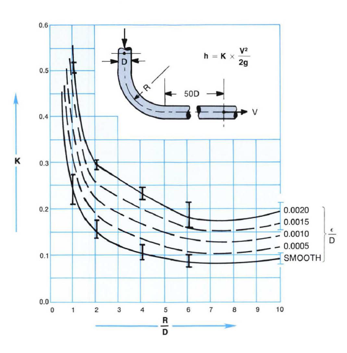
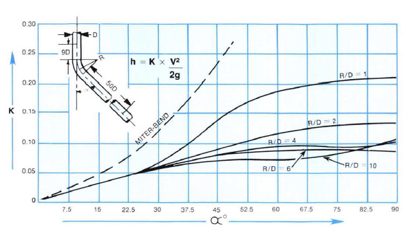

-----
title:  IIIB. Friction Loss – Water
date: June 11th, 2019
description: Friction loss information for water. Resistance coefficients.
-----

# Friction Loss – Water

## IIIB-4 – Friction Loss for Water in Feet Per 100 <units us = "Feet of Pipe" metric = "Meters of Pipe"/>

=|=
title: Table 1 – 1/8 Inch Nominal, Steel Schedule 40 (ID = 0.269 in, ε/D = 0.00669)
data-us: flw1-us.csv
data-metric: flw1-metric.csv
=|=

(Transition to turbulent flow occurs between <units us = "0.2 and 0.3 GPM flowrate in the above chart)" metric = "0.000446 and 0.000668 CFS flowrate in the above chart)"/>

=|=
title: Table 2 – 1/4 Inch Nominal, Steel Schedule 40 (ID = 0.364 in, ε/D = 0.00495)
data-us: flw2-us.csv
data-metric: flw2-metric.csv
=|=

## IIIB-5A – Resistance Coefficients for 90 Degree Bends of Uniform Diameter

## IIIB-5B – Resistance Coefficients for 90 Degree Bends of Uniform Diameter and Smooth Surface at Reynolds Number ≈ 2.25 x 105

