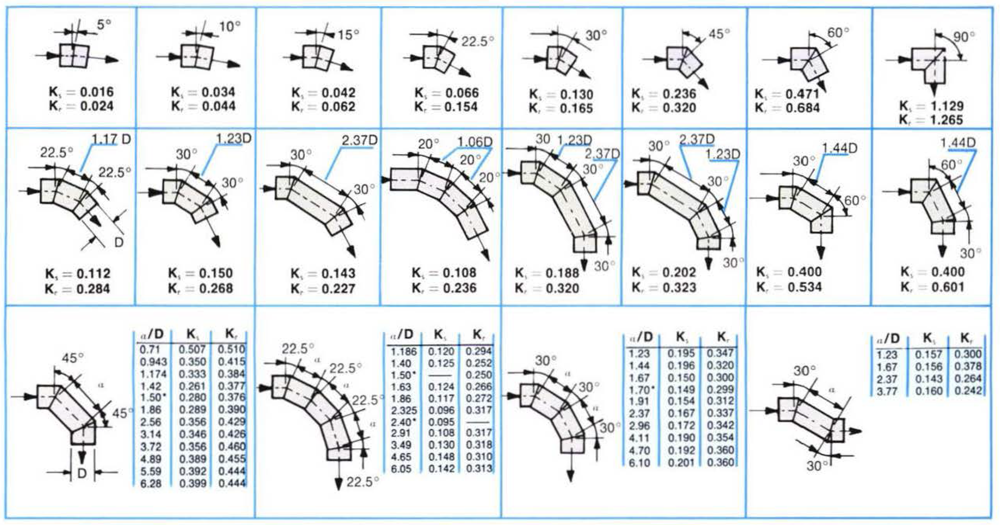

-----
title:  B) Losses in Valves, Fittings, and Bends
date: May 12th, 2020
description: Frictional loss information for water. Resistance coefficients.
-----

## Losses in Valves, Fittings, and Bends

### Figure 1 – Typical Resistance Coefficients for Valves and Fittings [1],[2]

=^=
title: Rotodynamic Pumps for Pump Piping
description: ANSI/HI 9.6.6 details pump piping requirements for rotodynamic pumps and effects of inlet/outlet piping on pump performance. This standard is applicable to all piping downstream and upstream from the pump but not when entering tank, vessel or intake structure. This document is intended to complement ANSI/HI 9.8 Intake Design for Rotodynamic Pumps.
image: https://estore.pumps.org/GetImage.ashx?&maintainAspectRatio=true&maxHeight=300&maxWidth=300&Path=%7e%2fAssets%2fProductImages%2f9_6_6_2016.png
url: https://www.pumps.org/product/ansi-hi-9-6-6-2016-rotodynamic-pumps-for-pump-piping/
price: 130.00 
hide_price: true
=^=

=|=
title: Approximate Range of Variation for K
data: K-variation.csv
=|=

1. The value of D given in the charts is nominal IPS (Iron Pipe Size).
2. <units us = "For velocities below 15 feet per second, check valves and foot valves will be only partially open and will exhibit higher values of K than that shown in the charts." metric = "For velocities below 4.6 meters per second, check valves and foot valves will be only partially open and will exhibit higher values of K than that shown in the charts."/>

### Figure 2 – Resistance Coefficients for Miter Bends at Reynolds Number ≈ 2.25 x 105 [3]

Ks = RESISTANCE COEFFICIENT FOR SMOOTH SURFACE

Kr = RESISTANCE COEFFICIENT FOR ROUGH SURFACE, ε/D = 0.0022

### Figure 3 – Resistance Coefficients for 90 Degree Bends of Uniform Diameter [4]

### Figure 4 – Resistance Coefficients for 90 Degree Bends of Uniform Diameter and Smooth Surface at Reynolds Number ≈ 2.25 x 105 [5]

### References
1. Hydraulic Institute, Engineering Data Book, Second Edition, 1990, Table 32a.
2. Hydraulic Institute, Engineering Data Book, Second Edition, 1990, Table 32b.
3. Hydraulic Institute, Engineering Data Book, Second Edition, 1990, Table 33. 
4. Hydraulic Institute, Engineering Data Book, Second Edition, 1990, Figure IIB-5A.
5. Hydraulic Institute, Engineering Data Book, Second Edition, 1990, Figure IIB-5B.