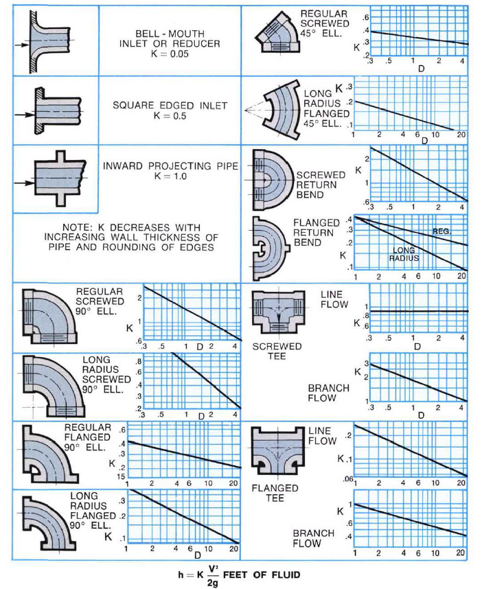
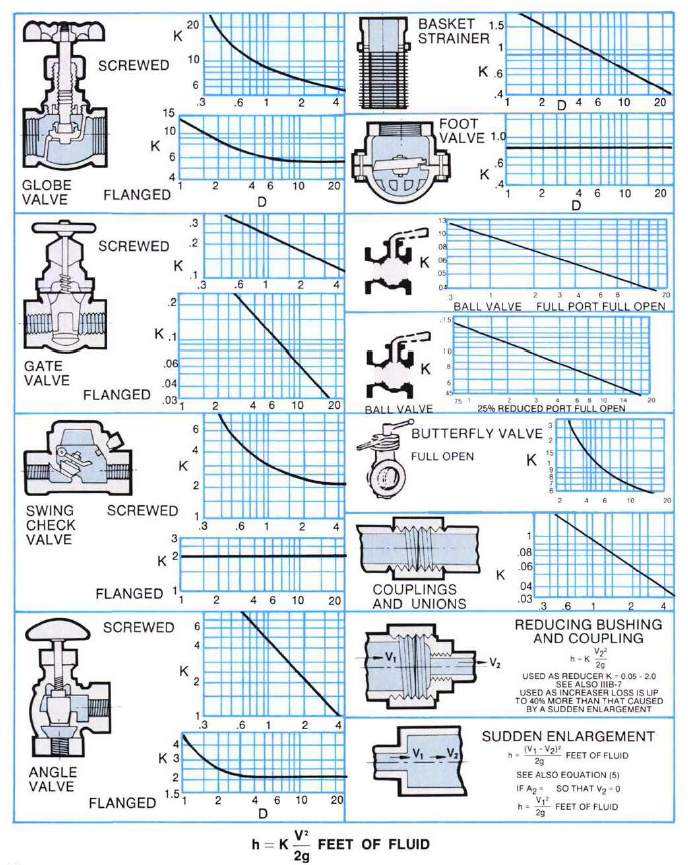
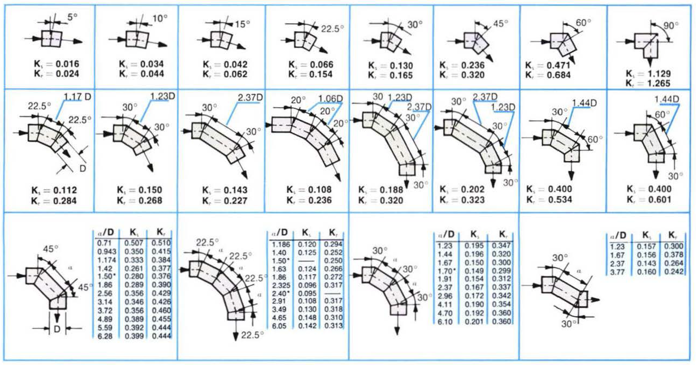
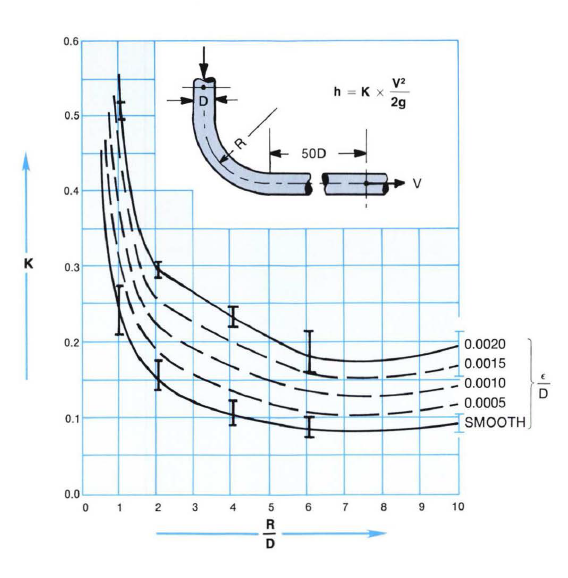
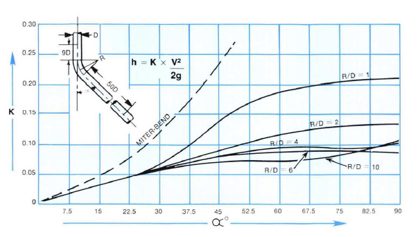
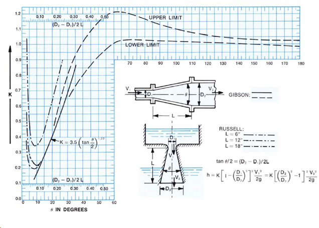

-----
title:  B) Losses in Valves, Fittings, and Bends
date: April 19th, 2024
description: Frictional loss information for water. Resistance coefficients for valves, Fittings, sudden increases, sudden contractions, and bends.
-----

## Frictional Losses in Valves, Fittings, and Bends (Minor Losses)

### Valves and Fittings (Minor Losses)

The resistance to flow (head loss) caused by a valve or fitting may be computed from equation 3.B.1.

=+=
(Eq. 3.B.1)
$$ h_f = K·{v^2 \over 2·g} $$
=+=

where:

- hf = Frictional resistance (head loss) in <units us = "feet" metric = "meters"/> of fluid 
- v = Average velocity in <units us = "feet/second" metric = "meters/second"/> in a pipe of corresponding diameter 
- g = Acceleration due to gravity, <units us = "32.2 ft/s^2" metric = "9.81 m/s^2"/>
- K = Resistance coefficient for valve or fitting

Values of (K) for valves, fittings and bends may be referenced in Figures. 3.B.1a, 3.B.1b, and 3.B.1c. As indicated in Figures. 3.B.1a and 3.B.1b, flanged valves and fittings usually exhibit lower resistance coefficients than screwed valves and fittings. The resistance coefficients decrease with the increasing size of most valves and fittings.

### Typical Resistance Coefficients for Fittings [2]

(Fig. 3.B.1a)

### Typical Resistance Coefficients for Fittings [3]

(Fig. 3.B.1b)

1. The value of D given in the Figures 3.B.1a and 3.B.1b is nominal IPS (Iron Pipe Size).
2. <units us = "For velocities below 15 feet per second, check valves and foot valves will be only partially open and will exhibit higher values of K than that shown in the charts." metric = "For velocities below 4.6 meters per second, check valves and foot valves will be only partially open and will exhibit higher values of K than that shown in the charts."/>
### Resistance Coefficients for Miter Bends at Reynolds Number ≈ 2.25 x 105 [4]

(Fig. 3.B.3)

Ks = Resistance coefficient for smooth surface

Kr = Resistance coefficient for rough surface, ε/D = 0.0022
=^=
title: Rotodynamic Pumps for Pump Piping
description: ANSI/HI 9.6.6 details pump piping requirements for rotodynamic pumps and effects of inlet/outlet piping on pump performance. This standard is applicable to all piping downstream and upstream from the pump but not when entering tank, vessel or intake structure. This document is intended to complement ANSI/HI 9.8 Intake Design for Rotodynamic Pumps.
image: https://www.pumps.org/wp-content/uploads/2022/12/9.6.6_small.jpg
url: https://www.pumps.org/product/ansi-hi-9-6-6-rotodynamic-pumps-for-pump-piping/
price: 130.00 
hide_price: true
=^=

Wide differences are found in the published values of (K) for all types of valves and fittings as noted in the following table 3.B.1

=|=
title: Approximate Range of Variation for K [5]
data: K-variation.csv
=|=

Tbl. 3.B.1

Component (minor) losses can be summed together with the pipe losses to determine an overall frictional loss for the system, producing the equation

=+=
(Eq. 3.A.6)
$$ h_f = {({f·L \over D} + ΣK) · {v^2 \over 2·g}} $$
=+=

where:

- *f* = pipe friction factor
- L = pipe length in <units us = "feet" metric = "meters"/>
- D = pipe inside diameter in <units us = "feet" metric = "meters"/>
- ΣK = sum of the minor losses, which includes losses across valves

Cast iron flanged elbows and drainage-type elbows may be expected to approximate pipe bends. Values of the resistance coefficient (K) may be taken from Fig. 3.B.2. The solid line curves Fig. 3.B.2 are given by Reference 6 with the range of scatter of the test points as indicated. The broken line curves may be used as a guide to probable resistance coefficients for intermediate values of the relative roughness factor ε/D. A value of <units us = "ε = 0.00085 feet" metric = "ε = 0.259 mm"/>  will be satisfactory for uncoated cast iron and cast steel elbows.

### Resistance Coefficients for 90 Degree Bends of Uniform Diameter [6]

(Fig. 3.B.2)

Resistance coefficients for pipe bends with less than 90-degree deflection angles as reported by Wasielewski [5] are shown Fig. 3.B.3. The curves shown are for smooth surfaces but may be used as a guide to approximate the resistance coefficients for surfaces of moderate roughness such as clean steel and cast iron. Figs. 3.B.2 and 3.B.3 are not reliable below R/D = 1, where R is the radius of the elbow in feet. The approximate radius of a flanged elbow may be obtained by subtracting the flange thickness from the center-to-face dimension. The center-to-face dimension for a reducing elbow is usually identical to that of an elbow of the same straight size as the larger end.

### Resistance Coefficients for 90 Degree Bends of Uniform Diameter and Smooth Surface at Reynolds Number ≈ 2.25 x 105 [7]

(Fig. 3.B.3)

The resistance to flow (head loss) caused by a sudden enlargement may be computed from eauation 3.B.3a when velocities are known, equation 3.B.3b when areas are known, 3.B.3c when diameters are known, and 3.B.3d when downstream velocity is known.
=+=
(Eq. 3.B.3a)
$$h_{f} = K·{{(v_1 - v_2)^2} \over {2·g}}$$
=+=
=+=
(Eq. 3.B.3b)
$$ h_{f} = K·(1 - {A_1 \over A_2})^2 · {v_1^2 \over 2·g}$$
=+=
=+=
(Eq. 3.B.3c)
$$ h_{f} = K·[1 - ({D_1 \over D_2})^2]^2 · {v_1^2 \over 2·g}$$
=+=
=+=
(Eq. 3.B.3d)
$$ h_{f} = K·[{({D_2 \over D_1})^2 - 1 }]^2 · {v_2^2 \over 2·g}$$
=+=

where:

- h = Frictional resistance (head loss) in <units us = "feet of fluid" metric = "meters of fluid"/> 
- v1 = Average velocity in <units us = "feet/second" metric = "meters/second"/> in the smaller (upstream) pipe 
- A1 = Internal cross-sectional area of the smaller pipe in <units us = "square feet" metric = "square meters"/>
- D1 = Internal diameter of the smaller pipe in <units us = "feet" metric = "meters"/>
- v2, A2, D2 = Corresponding values for the larger (downstream pipe)
- g = Acceleration due to gravity, <units us = "32.2 ft/s^2" metric = "9.81 m/s^2"/>
- K = Resistance coefficient, usually taken as unity since the variation is almost always less than ±3 percent.

Equation 3.B.3 is useful for computing the resistance to flow caused by conical increasers and diffusers. Values of (K) for conical increasers based on data reported by Gibson [8] are given in Fig. 3.B.4 or may be computed by equation 3.B.4.

=+=
(Eq. 3.B.4)
$$K = 3.50·({\tan({\theta \over 2})})^{1.22}$$
=+=

where:

-  θ = total conical angle of the increaser in degrees

Equation (3.B.4) applies only to values of θ between 7.5 and 35 degrees. Noteworthy is the fact that above 50 degrees a sudden enlargement will be as good or better than a conical increaser. Values of (K) for conical diffusers as reported by Russell [9] are shown in Fig. 3.B.4. The values shown include the entrance mouthpiece which accounts in part for the increase over Gibson's values for conical increasers.

### Resistance Coefficients for Increasers and Diffusers [8][9]

(Fig. 3.B.4)

### References
2.	Hydraulic Institute, Engineering Data Book, Second Edition, 1990, Table 32a.
3.	Hydraulic Institute, Engineering Data Book, Second Edition, 1990, Table 32b.
4.	Hydraulic Institute, Engineering Data Book, Second Edition, 1990, Table 33.
5.	Hydraulic Institute, Engineering Data Book, Second Edition, 1990, Table 32c.
6.	Transactions of the Munich Hydraulic Institute, Bulletin 3, Authorized Translation, ASME 1945 - “Loss in 90-Degree  Pipe Bends of Constant Circular Cross-Section,” by A. Hoffman, pp 29-41.
7.	Transactions of the Munich Hydraulic Institute, Bulletin 5, R. Oldenbourg, 1932, “Losses in Smooth Pipe Bends of Circular Cross Section with less than 90-degree Change in Direction, by Rudolf Wasielewski”. 
8.	“Hydraulics and its Applications” by A. H. Gibson, 3rd Edition, Cortable and Company, London, England.1976; p.p. 92-95
9.	“Hydraulics,” by George E. Russell, 5th edition, Henry Holt and Company, p 187, also p 149.
