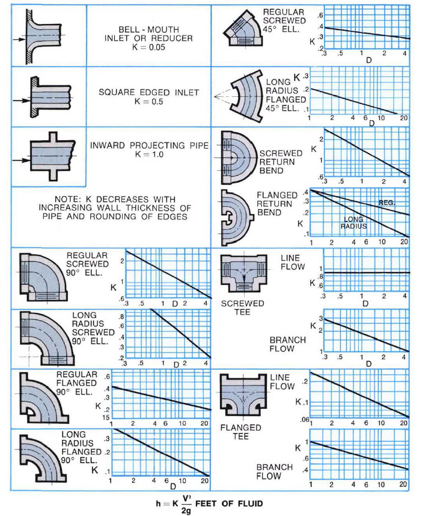
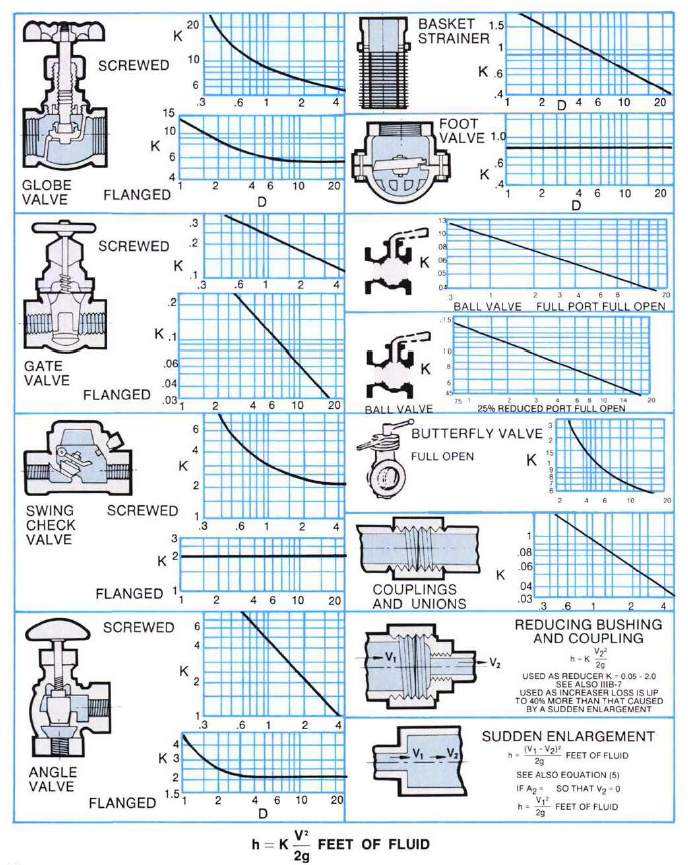
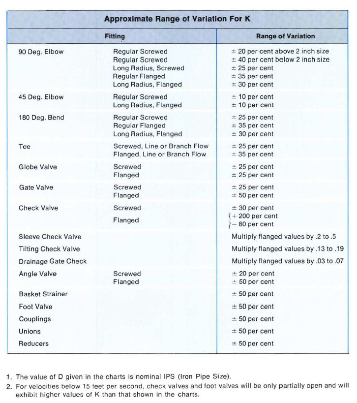
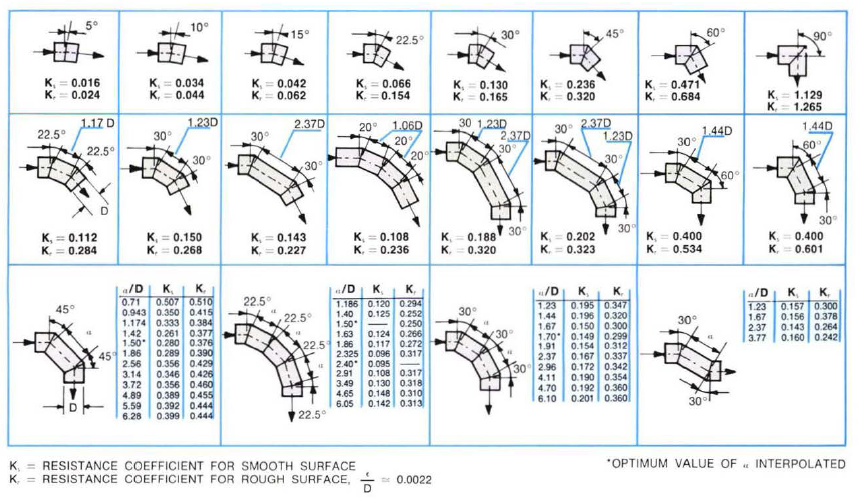

-----
title:  B) Frictional Losses – Water
date: July 9th, 2019
description: Frictional losses information for water. Resistance coefficients.
-----

# Frictional Losses – Water

**(Tables 1-31 will be replaced by calculator)**

## IIIB-4 – Frictional Losses for Water in <units us = "Feet / 100 Feet of Pipe" metric = "Meters / 100 Meters of Pipe"/>

=|=
title: Table 1 – 1/8 Inch Nominal, Steel Schedule 40 (ID = 0.269 in, ε/D = 0.00669)
data-us: flw1-us.csv
data-metric: flw1-metric.csv
=|=

(Transition to turbulent flow occurs between the <units us = "0.2 GPM and 0.3 GPM flowrate in the above chart)" metric = "0.0455 m^3^/h and 0.0681 m^3^/h flowrate in the above chart)"/>

=|=
title: Table 2 – 1/4 Inch Nominal, Steel Schedule 40 (ID = 0.364 in, ε/D = 0.00495)
data-us: flw2-us.csv
data-metric: flw2-metric.csv
=|=

(Transition to turbulent flow occurs between the <units us = "0.25 GPM and 0.4 GPM flowrate in the above chart)" metric = "0.0568 m^3^/h and 0.0908 m^3^/h flowrate in the above chart)"/>

## IIIB-5 – Typical Resistance Coefficients for Valves and Fittings

### Table 32(a)

### Table 32(b)

### Table 32(c)

### Table 33 – Resistance Coefficients for Miter Bends at Reynolds Number ≈ 2.25 x 105

## IIIB-5A – Resistance Coefficients for 90 Degree Bends of Uniform Diameter

## IIIB-5B – Resistance Coefficients for 90 Degree Bends of Uniform Diameter and Smooth Surface at Reynolds Number ≈ 2.25 x 105

