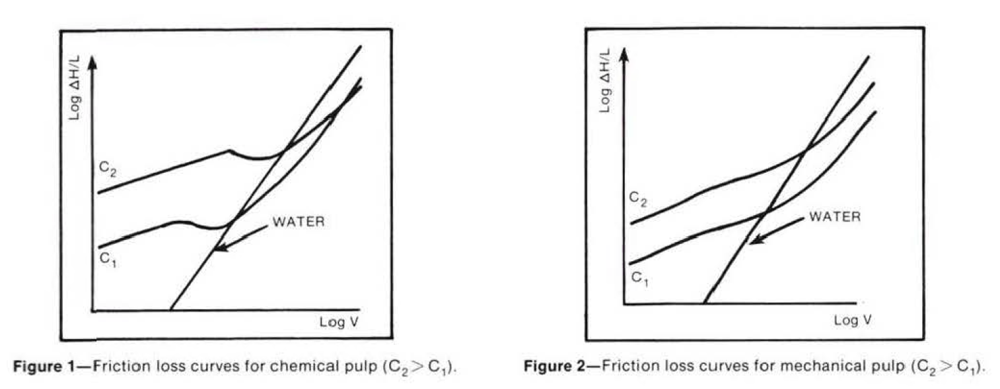
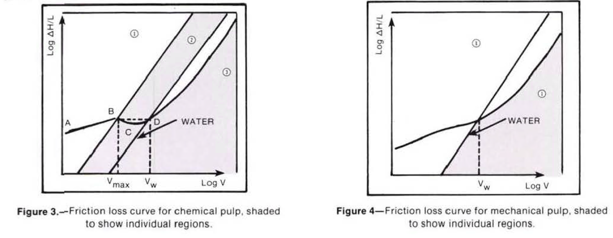

-----
title:  IIIE. Friction Loss of Paper Stock
date: June 28th, 2019
description: Friction loss of paper stock, pulp suspensions. Different consistencies.
-----

# Friction Loss of Paper Stock

### I. Introduction

In any stock piping system, the pump provides flow
and develops hydraulic pressure (head) to overcome
the differential in head between two points. This
total head differential consists of pressure head,
static head, velocity head and total friction head
produced by friction between the pulp suspension
and the pipe, bends, and fittings. The total friction
head is the most difficult to determine because of the
complex, non-linear nature of the friction loss curve.
This curve can be affected by many factors.

The following analytical method for determining
pipe friction loss is based on the recently published
TAPPI Technical Information Sheet (TIS) 408-4 (Reference I), 
and is applicable to stock consistencies
(oven-dried) from 2 to 6 percent. Normally,
stock consistencies of less than 2% (oven-dried)
are considered to have the same friction loss
characteristic as water. This paper only applies to
systems using centrifugal pumps which is normal
for these consistencies. The method for determining
the friction loss of pulp suspensions in pipe, as presented
here, is intended to supersede the various
methods previously issued.

### II. Background

Figure 1 and Figure 2 show typical friction loss curves for two different 
consistencies (C2 < C1) of chemical pulp and mechanical
pulp, respectively.

The friction loss curve for chemical pulp can be conveniently divided
into three regions, as illustrated by the shaded areas of Figure 3.

Regions shown in Fig. 3 may be described as follows:

**Region 1**:
(Curve AB) is a linear region where friction
loss for a given pulp is a function of
consistency, velocity, and pipe diameter.
The velocity at the upper limit of this
linear region (Point B) is designated
Vmax.

**Region 2**:
(Curve BCD) shows an initial decrease
in friction loss (to Point C) after which
the friction loss again increases. The
intersection of the pulp friction loss
curve and the water friction loss curve
(Point D) is termed the onset of drag
reduction. The velocity at this point is
designated Vw.

**Region 3**:
(Curve DE) shows the friction loss curve
for pulp fiber suspensions below the
water curve. This is due to a phenomenon
called drag reduction. Reference 2
describes the mechanisms which occur
in this region.

Regions 2 and 3 are separated by the friction loss
curve for water, which is a straight line with a slope
approximately equal to 2.

The friction loss curve for mechanical pulp, as illustrated
in Figure 4, is divided into only two regions:
Regions 1 and 3. For this pulp type, the friction loss
curve crosses the water curve Vw and there is no true
Vmax·

### III. Design Parameters

To determine the pipe friction loss component for a specified design basis (usually daily mass flow rate),
the following parameters must be defined:

a) **Pulp Type** — Chemical or mechanical
pulp, long or short fibered, never
dried or dried and reslurred, etc.
This is required to choose the proper
coefficients which define the pulp
friction curve.

b) **Consistency, C (oven-dried)** — Often
a design constraint in an existing
system. NOTE: If air-dried consistency
is known, multiply by 0.9 to
convert to oven-dried consistency.

c) **Internal pipe diameter, D** — Lowering
D reduces initial capital investment,
reduces initial capital investment,
but increases pump operating costs.
Once the pipe diameter is selected, it
fixes the velocity for a prespecified
mass flow rate.

d) **Bulk velocity, V** — Usually based on
a prespecified daily mass flow rate.
Note that both V and D are interdependent
for a constant mass flow
rate.

e) **Stock temperature, T** — Required to
adjust for the effect of changes in
viscosity of water (the suspending
medium) on pipe friction loss.

f) **Freeness** — Used to indicate the
degree of refining or to define the
pulp for comparison purposes.

g) **Pipe material** — Important to specify
design correlations and compare design
values.

### IV. Pipe Friction Estimation Procedure

The bulk velocity (V) will depend on the daily mass
flow rate and the pipe diameter (D) selected. The
final value of V can be optimized to give the lowest
capital investment and operating cost with due consideration
of future demands or possible system
expansion.

The bulk velocity will fall into one of the regions
previously discussed. Once it has been determined
in which region the design velocity will occur, the
appropriate correlations for determining pipe friction
loss value(s) may be selected. The following
describes the procedure to be used for estimating
pipe friction loss in each of the regions.

**Region 1**: The upper limit of Region 1 in Figure 3
(Point B) is designated Vmax. The value
of Vmax is determined using Equation
(1) and data given in Table I.

=+=
(1)
[units = us]
$$ V_{max} = {K'C^{σ}} (ft/s) $$
=+=

=+=
(1)
[units = metric]
$$ V_{max} = 0.3048{K'C^{σ}} (m/s) $$
=+=

where:

- K' = numerical coefficient (constant for a given pulp), obtained from Table I
- C = consistency (oven-dried, expressed as a percentage, *not* decimally), 2-6% limit.
- σ = exponent (constant for a given pulp), obtained from Table I

Data for use with Equation (1) to determine velocity limit, Vmax·

=|=
title: Table I
data: Table1CSV.csv
=|=

NOTES:

1. Estimates for pulps based on published literature.
2. Original data obtained in stainless steel and PVC pipe.
3. Stainless steel may be hydraulically smooth although some manufacturing processes may destroy the surface and hydraulic smoothness is lost. PVC is taken to be hydraulically smooth pipe.
4. For cast iron and galvanized pipe, the K9 values will be reduced. No systematic data are available for the effects of surface roughness.
5. If pulps are not identical to those shown, some engineering judgement is required.
6. Wood is New Zealand Kraft pulp.

If the proposed design velocity (V) is less than Vmax,
the value of flow resistance (ΔH/L) may be calculated
using Equation (2) and data given in Table II
and the appendices.

=+=
(2)
[units = us]
$$ ΔH/L = FKV^{α}C^{β}D^{γ}\, (ft/100\, ft) $$
=+=

=+=
(2)
[units = metric]
$$ ΔH/L = 0.3048FKV^{α}C^{β}D^{γ}\, (m/100\, m) $$
=+=

where:

- F = factor to correct for temperature, pipe roughness, pulp type, freeness, or safety factor (refer to Appendix A)
- K = numerical coefficient (constant for a given pulp), obtained from Table II
- V = bulk velocity (ft/s)
- C = consistency (oven-dried, expressed as a percentage, *not* decimally), 2-6% limit
- D = pipe inside diameter (in), and
- α,β,γ = exponents (constant for a given pulp), obtained from Table II

For mechancial pulps, there is no true Vmax· The
upper limit of the correlation equation (Equation (2))
is also given by Equation (1) in this case, the upper
velocity is actually Vw·

**Region 2**: The lower limit of Region 2 in Figure 3
(Point B) is Vmax and the upper limit
(Point 0) is Vw. The velocity of the stock
at the onset of drag reduction is determined
using Equation (3).

=+=
(3)
[units = us]
$$ V_{w} = 4.00C^{1.40} (ft/s) $$
=+=

=+=
(3)
[units = metric]
$$ V_{w} = 1.2192C^{1.40} (m/s) $$
=+=

where:

- C = consistency (oven-dried,expressed as a percentage, not decimally).

If V is between Vmax and Vw, Equation (2) may be
used to determine ΔH/L at the maximum point
(Vmax)· Because the system must cope with the
worst flow condition, ΔH/L at the maximum point
(V max) can be used for all design velocities between
Vmax and Vw·

**Region 3**: A conservative estimate of friction loss is
obtained by using the water curve.
(ΔH/ L)w can be obtained from a Friction
Factor vs. Reynolds Number plot (Reference
3, for example), or approximated
from the following equation (based on
the Blasius equation).

=+=
(4)
[units = us]
$$ (ΔH/ L)_{w} = 0.58V^{1.75}D^{-1.2}\,(ft/100\, ft) $$
=+=

=+=
(4)
[units = metric]
$$ (ΔH/ L)_{w} = 0.58V^{1.75}D^{-1.2}\,(m/100\, m) $$
=+=

where:

- V = bulk velocity (ft/s), and
- D = pipe diameter (in.)

Previously published methods for calculating pipe
friction loss of pulp suspensions gave a very conservative
estimate of head loss. The method just described
gives a more accurate estimate of head loss
due to friction, and has been used successfully in
systems in North America and world-wide.

Pertinent equations, in addition to those herein
presented, are located in Appendix A. Example
problems are located in Appendix B.

### V. Head Losses in Bends and Fittings

The friction head loss of pulp suspensions in bends
and fittings may be determined from the basic equation
for head loss, Equation (5).

=+=
(5)
[units = us]
$$ \Delta h_{LOSS} = \Delta h_f = K*{v^2 \over 2g}\,(ft) $$
=+=

=+=
(5)
[units = metric]
$$ \Delta h_{LOSS} = \Delta h_f = K*{v^2 \over 2g}\,(m) $$
=+=

(For definitions of paramters, see the <a href="/fluid-flow-III/general.html" target="_blank">fluid flow section</a>.)

Values of K for the flow of water through various
types of bends and fittings are tabulated in numerous
reference sources (Reference 3, for example).
The loss coefficient for valves may be obtained from
the valve manufacturer.

The loss coefficient for pulp suspensions in a given
bend or fitting generally exceeds the loss coefficient
for water in the same bend or fitting. As an approximate
rule, the loss coefficient (K) increases 20 percent
for each 1 percent increase in oven-dried stock
consistency. Please note that this is an approximation
; actual values of K may differ, depending on the
type of bend or fitting under consideration (4).

Data for use with Equation (2) to determine head loss. ΔH/L.

=|=
title: Table II
data: Table2CSV.csv
=|=

NOTES:

1. Estimates for pulps based on published literature.
2. Original data obtained in stainless steel and PVC pipe (7, 8, 9).
3. No safety factors are included in the above correlations.
4. The friction loss depends considerably on the condition of the inside of the pipe surface (10).
5. Wood is New Zealand Kraft pulp.

## Appendix A

The following gives supplemental information to that provided in the main text.

**1) Capacity (flow), Q —**

=+=
[units = us]
(i)
$$ Q = {{16.65(T.P.D.)}\over C} \, (U.S. GPM) $$
=+=

=+=
[units = metric]
(i)
$$ (conversion) $$
=+=

where:

- <units us = "T.P.D. = mill capacity (short tons per day)," metric = "(conversion)"/>

and

- C = consistency (oven-dried, expressed as a percentage, *not* decimally).

**2) Bulk velocity, V —**

=+=
[units = us]
(ii)
$$ V = {{0.321Q}\over A}\, (ft/s),\, or $$
=+=

=+=
[units = metric]
(ii)
$$ (conversion) $$
=+=

=+=
[units = us]
(iii)
$$ V = {{0.4085Q}\over D^2}\, (ft/s) $$
=+=

=+=
[units = metric]
(iii)
$$ (conversion) $$
=+=

where:

- Q = capacity <units us = "(U.S. GPM)," metric = "(conversion)"/>
- A = inside area of pipe <units us = "(in^2^), and" metric = "(conversion)"/>
- D = inside diameter of pipe <units us = "(in)." metric = "(conversion)"/>

**3) Multiplication Factor, F (included in Equation (2)) —**

=+=
(iv)
$$ F = {F_1}*{F_2}*{F_3}*{F_4}*{F_5,} $$
=+=

where:

- F1 = correction factor for temperature. Friction loss calculations are normally based on a reference pulp temperature of 95°F. The flow resistance may be increased or
decreased by 1 percent for each 1.8°F below or above 95°F, respectively. This may be expressed as follows (where T = pulp temperature <units us = "(°F)):" metric = "(°C)):"/>:

=+=
[units = us]
(v)
$$ F_1 = 1.526 - 0.00556T $$
=+=

=+=
[units = metric]
(v)
$$ (conversion) $$
=+=

- F2 = correction factor for pipe roughness. This
factor may vary due to manufacturing processes
of the piping, surface roughness, age, etc. Typical values for PVC and stainless
steel piping are listed below (please note that these are typical values; experience and/or additional data may modify the above factors):

=+=
$$ F_2 = 1.0\,for\,PVC\,piping $$
$$ F_2 = 1.25\,for\,stainless\,steel\,piping $$
=+=

- F3 = correction factor for pulp type. Typical values are listed below (Note: This factor has been incorporated in
the numerical coefficient, K, for the pulps listed in Table II. When using Table II, F3 should not be used.):

=+=
$$ F_3 = 1.0\,for\,pulps\,that\,have\,never\,been\,dried\,and\,resulurried $$
$$ F_3 = 0.8\,for\,pulps\,that\,have\,been\,dried\,and\,resulurried $$
=+=

- F4 = correction factor for beating. Data have shown
that progressive beating causes, initially, a
small decrease in friction loss, followed by a
substantial increase. For a kraft pine pulp
initially at 725 CSF and F4 = 1.0, beating
caused the freeness to decrease to 636 CSF
and F4 to decrease to 0.96. Progressive beating
decreased the freeness to 300 CSF and
increased F4 to 1.37 (see K values in Table
II). Some engineering judgement may be
required.
- F5 = design safety factor. This is usually specified
by company policy with consideration
given to future requirements.

## References

(1) TAPPI Technical Information Sheet (TIS) 408-4. Technical
Association of the Pulp and Paper Industry, Atlanta. Georgia
(1981).

(2) K. Molier and G. G. Duffy. TAPPI 61 , 1, 63 (1978).

(3) Hydraulic Insti tute Engineering Data Book, First Edition.
Hydraulic Insti tute. Cleveland. Ohio (1979).

(4) K. Molier and G. Elmquist. TAPPI 63, 3, 101 (1980).

(5) W. Brecht and H. Heller. TAPPI 33, 9, 14A (1950).

(6) R. E. Durst and L. C. Jenness. TAPPI 39, 5, 277 (1956).

(7) K. Molier. G. G. Duffy and A. L. Titchener. APPITA 26, 4, 278
(1973).

(8) G. G. Duffy and A. L. Tichener. TAPPI 57, 5, 162 (1974).

(9) G. G. Duffy, K. Molier, P. F. W. Lee and S. W. A. Mine,
APPITA 27, 5, 327 (1974).

(10) G. G. Duffy, TAPPI 59, 8, 124 (1976).

(11) G. G. Duffy. Company Communications Goulds Pumps.
Inc. (1980-1981).
    

