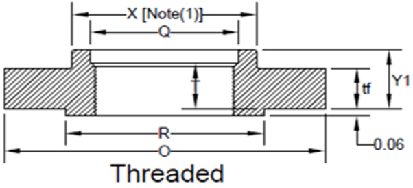
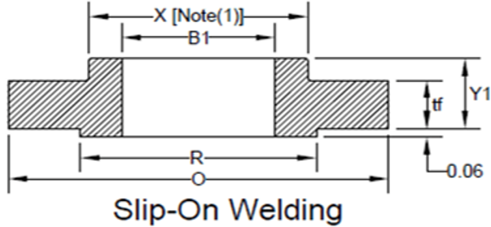
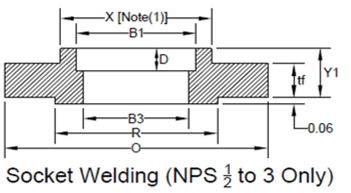
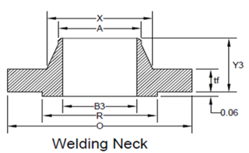
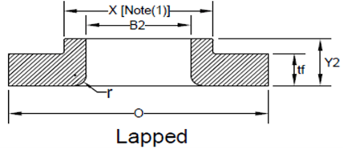
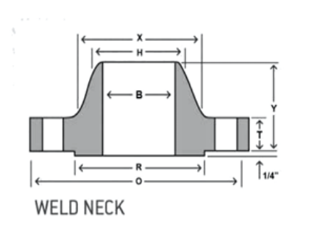

-----
title: F) Flange Dimensions
date: April 19th, 2024
description: Dimensions of flanges.
hide_units: true
-----

=^=
title: Fundamentals of Water Hammer and Surge Suppression - 1 Part Webinar
description: This webinar has been created to provide an overview of water hammer, pulsation dampeners, effects of water hammer on pumps and valves, transient cavitation, surge supression and case studies.
image: /images/pumpsystemsmatter.png
url: https://training.pumps.org/products/fundamentals-of-waterhammer-and-surge-suppression-1-part-recorded-webinar
price: 59.00
hide_price: true
=^=

## Steel Pipe Flange Dimensions

    

        <h2 class="accordion-header" id="headingOne" style="margin-bottom:0">
        <button class="accordion-button collapsed" type="button" data-bs-toggle="collapse"
            data-bs-target="#panelsStayOpen-collapseOne" aria-expanded="false">
            Flanges per AWWA C207 (Class B, D, E, F)
        </button>
        </h2>
        

            

                

                    

                

                

                    =|=
                    title: Flanges per AWWA C207 (Class B, D, E, F)
                    data: flange-c207.csv
                    fixed-columns: 2
                    =|=
                    
Tbl. 4.F.1

                    <h4>Notes:</h4>
                    <ol type="1">
                    <li>Refer to ANSI/AWWA C207 for notes, design pressures, and additional minimum design requirements. </li>
                    <li>Any column with "-" could relate to a note in the Standard or not be covered in the standard.</li>
                    <li>Data columns from the reference standard may have been omitted</li>
                    <li>All units are inches</li>
                    </ol>
                

            

        
 
    
 
    

        <h2 class="accordion-header" id="headingOne-2" style="margin-bottom:0">
        <button class="accordion-button collapsed" type="button" data-bs-toggle="collapse"
            data-bs-target="#panelsStayOpen-collapseOne-2" aria-expanded="false">
            Flanges per ASME B16.1 (Class 25, 125, 250)
        </button>
        </h2>
        

            

                

                    

                    

                

                

                    

                    

                

                

                    =|=
                    title: Flanges per ASME B16.1 (Class 25, 125, 250)
                    data-us: flange-16.1-25-250-us.csv
                    data-metric: flange-16.1-25-250-metric.csv
                    fixed-columns: 2
                    =|=
                    
Tbl. 4.F.2

                    <h4>Notes:</h4>
                    <ol type="1">
                    <li>Refer to ANSI/ASME B16.1 for notes, pressures, and minimum design requirements. </li>
                    <li>Any column with "-" relate to a note in the standard or may not be covered in the standard.</li>
                    <li>Data columns from the reference standard may have been omitted.</li>
                    <li>US units are inches, Metric Units are millimeters.</li>
                    <li>Studs are measured parallel to the axis (L) from the first to the thread without the chamfers (points). </li>
                    <li>Hex bolts are measured from under the head to the top of the bolt.</li>
                    </ol>
                

            

        
 
    
  
    

        <h2 class="accordion-header" id="headingOne-3" style="margin-bottom:0">
        <button class="accordion-button collapsed" type="button" data-bs-toggle="collapse"
            data-bs-target="#panelsStayOpen-collapseOne-3" aria-expanded="false">
            Flanges per ASME B16.5 (Class 150, 300)
        </button>
        </h2>
        

            

                

                    

                        <h2 class="accordion-header" id="flanges-threaded-header" style="margin-bottom:0">
                        <button class="accordion-button collapsed" type="button" data-bs-toggle="collapse"
                            data-bs-target="#flanges-threaded" aria-expanded="false">
                            Threaded
                        </button>
                        </h2>
                        

                            

                                

                                    

                                

                                

                                    

                                    

                                

                                

                                    =|=
                                    title: Threaded Steel Pipe Flanges per ASME B16.5 (Class 150, 300)
                                    data-us: flange-16.5-150-300-us.csv
                                    data-metric: flange-16.5-150-300-metric.csv
                                    fixed-columns: 2
                                    column_tags: Th
                                    =|=
                                    
Tbl. 4.F.3

                                

                            

                        

                    

                    

                        <h2 class="accordion-header" id="flanges-slipon-header" style="margin-bottom:0">
                        <button class="accordion-button collapsed" type="button" data-bs-toggle="collapse"
                            data-bs-target="#flanges-slipon" aria-expanded="false">
                            Slip-On Welding
                        </button>
                        </h2>
                        

                            

                                

                                    

                                

                                

                                    

                                    

                                

                                

                                    =|=
                                    title: Slip-On Welding Steel Pipe Flanges per ASME B16.5 (Class 150, 300)
                                    data-us: flange-16.5-150-300-us.csv
                                    data-metric: flange-16.5-150-300-metric.csv
                                    fixed-columns: 2
                                    column_tags: SO
                                    =|=
                                    
Tbl. 4.F.4

                                

                            

                        

                    

                    

                        <h2 class="accordion-header" id="flanges-socket-weld-header" style="margin-bottom:0">
                        <button class="accordion-button collapsed" type="button" data-bs-toggle="collapse"
                            data-bs-target="#flanges-socket-weld" aria-expanded="false">
                            Socket Welding (NPS 1/2 to 3 Only)
                        </button>
                        </h2>
                        

                            

                                

                                    

                                

                                

                                    

                                    

                                

                                

                                    =|=
                                    title: Socket Welding (NPS 1/2 to 3 Only) Steel Pipe Flanges per ASME B16.5 (Class 150, 300)
                                    data-us: flange-16.5-150-300-us.csv
                                    data-metric: flange-16.5-150-300-metric.csv
                                    fixed-columns: 2
                                    column_tags: SW
                                    =|=
                                    
Tbl. 4.F.5

                                

                            

                        

                    

                    

                        <h2 class="accordion-header" id="flanges-welding-neck-header" style="margin-bottom:0">
                        <button class="accordion-button collapsed" type="button" data-bs-toggle="collapse"
                            data-bs-target="#flanges-welding-neck" aria-expanded="false">
                            Welding Neck
                        </button>
                        </h2>
                        

                            

                                

                                    

                                

                                

                                    

                                    

                                

                                

                                    =|=
                                    title: Welding Neck Steel Pipe Flanges per ASME B16.5 (Class 150, 300)
                                    data-us: flange-16.5-150-300-us.csv
                                    data-metric: flange-16.5-150-300-metric.csv
                                    fixed-columns: 2
                                    column_tags: WN
                                    =|=
                                    
Tbl. 4.F.6

                                

                            

                        

                    

                    

                        <h2 class="accordion-header" id="flanges-lapped-header" style="margin-bottom:0">
                        <button class="accordion-button collapsed" type="button" data-bs-toggle="collapse"
                            data-bs-target="#flanges-lapped" aria-expanded="false">
                            Lapped
                        </button>
                        </h2>
                        

                            

                                

                                    

                                

                                

                                    

                                    

                                

                                

                                    =|=
                                    title: Lapped Steel Pipe Flanges per ASME B16.5 (Class 150, 300)
                                    data-us: flange-16.5-150-300-us.csv
                                    data-metric: flange-16.5-150-300-metric.csv
                                    fixed-columns: 2
                                    column_tags: La
                                    =|=
                                    
Tbl. 4.F.7

                                

                            

                        

                    

                    

                        <h4>Notes:</h4>
                        <ol type="1">
                            <li>Refer to ANSI/ASME B16.5 for notes, pressures, and minimum design requirements. </li>
                            <li>Any column with "-" relate to a note in the standard or is not be covered in the standard.</li>
                            <li>Data columns from the reference standard may have been omitted.</li>
                            <li>US units are inches, Metric Units are millimeters.</li>
                            <li>Studs are measured parallel to the axis (L) from the first to the thread without the chamfers (points).</li>
                            <li>Hex bolts are measured from under the head to the top of the bolt.</li>
                        </ol>
                    

                

            

        
 
    
  
    

        <h2 class="accordion-header" id="headingOne-4" style="margin-bottom:0">
        <button class="accordion-button collapsed" type="button" data-bs-toggle="collapse"
            data-bs-target="#panelsStayOpen-collapseOne-4" aria-expanded="false">
            Flanges per ASME B16.5 (Class 400, 600, 900, 1500, 2500)
        </button>
        </h2>
        

            

                

                    

                        <h2 class="accordion-header" id="flanges-400-threaded-header" style="margin-bottom:0">
                        <button class="accordion-button collapsed" type="button" data-bs-toggle="collapse"
                            data-bs-target="#flanges-400-threaded" aria-expanded="false">
                            Threaded
                        </button>
                        </h2>
                        

                            

                                

                                    

                                

                                

                                    

                                    

                                

                                

                                    =|=
                                    title: Threaded Steel Pipe Flanges per ASME B16.5 (Class 400-2500)
                                    data-us: flange-16.5-400-2500-us.csv
                                    data-metric: flange-16.5-400-2500-metric.csv
                                    fixed-columns: 2
                                    column_tags: Th
                                    =|=
                                    
Tbl. 4.F.8

                                

                            

                        

                    

                    

                        <h2 class="accordion-header" id="flanges-400-slipon-header" style="margin-bottom:0">
                        <button class="accordion-button collapsed" type="button" data-bs-toggle="collapse"
                            data-bs-target="#flanges-400-slipon" aria-expanded="false">
                            Slip-On Welding
                        </button>
                        </h2>
                        

                            

                                

                                    

                                

                                

                                    

                                    

                                

                                

                                    =|=
                                    title: Slip-On Welding Steel Pipe Flanges per ASME B16.5 (Class 400-2500)
                                    data-us: flange-16.5-400-2500-us.csv
                                    data-metric: flange-16.5-400-2500-metric.csv
                                    fixed-columns: 2
                                    column_tags: SO
                                    =|=
                                    
Tbl. 4.F.9

                                

                            

                        

                    

                    

                        <h2 class="accordion-header" id="flanges-400-socket-weld-header" style="margin-bottom:0">
                        <button class="accordion-button collapsed" type="button" data-bs-toggle="collapse"
                            data-bs-target="#flanges-400-socket-weld" aria-expanded="false">
                            Socket Welding (NPS 1/2 to 3 Only)
                        </button>
                        </h2>
                        

                            

                                

                                    

                                

                                

                                    

                                    

                                

                                

                                    =|=
                                    title: Socket Welding (NPS 1/2 to 3 Only) Steel Pipe Flanges per ASME B16.5 (Class 400-2500)
                                    data-us: flange-16.5-400-2500-us.csv
                                    data-metric: flange-16.5-400-2500-metric.csv
                                    fixed-columns: 2
                                    column_tags: SW
                                    =|=
                                    
Tbl. 4.F.10

                                

                            

                        

                    

                    

                        <h2 class="accordion-header" id="flanges-400-welding-neck-header" style="margin-bottom:0">
                        <button class="accordion-button collapsed" type="button" data-bs-toggle="collapse"
                            data-bs-target="#flanges-400-welding-neck" aria-expanded="false">
                            Welding Neck
                        </button>
                        </h2>
                        

                            

                                

                                    

                                

                                

                                    

                                    

                                

                                

                                    =|=
                                    title: Welding Neck Steel Pipe Flanges per ASME B16.5 (Class 400-2500)
                                    data-us: flange-16.5-400-2500-us.csv
                                    data-metric: flange-16.5-400-2500-metric.csv
                                    fixed-columns: 2
                                    column_tags: WN
                                    =|=
                                    
Tbl. 4.F.11

                                

                            

                        

                    

                    

                        <h2 class="accordion-header" id="flanges-400-lapped-header" style="margin-bottom:0">
                        <button class="accordion-button collapsed" type="button" data-bs-toggle="collapse"
                            data-bs-target="#flanges-400-lapped" aria-expanded="false">
                            Lapped
                        </button>
                        </h2>
                        

                            

                                

                                    

                                

                                

                                    

                                    

                                

                                

                                    =|=
                                    title: Lapped Steel Pipe Flanges per ASME B16.5 (Class 400-2500)
                                    data-us: flange-16.5-400-2500-us.csv
                                    data-metric: flange-16.5-400-2500-metric.csv
                                    fixed-columns: 2
                                    column_tags: La
                                    =|=
                                    
Tbl. 4.F.12

                                

                            

                        

                    

                    

                        <h4>Notes:</h4>
                        <ol type="1">
                            <li>Refer to ANSI/ASME B16.5 for notes, pressures, and minimum design requirements. </li>
                            <li>Any column with "-" relate to a note in the standard or is not be covered in the standard.</li>
                            <li>Data columns from the reference standard may have been omitted.</li>
                            <li>US units are inches, Metric Units are millimeters.</li>
                            <li>Studs are measured parallel to the axis (L) from the first to the thread without the chamfers (points).</li>
                            <li>Hex bolts are measured from under the head to the top of the bolt.</li>
                        </ol>
                    

                

            

        

    
  
    

        <h2 class="accordion-header" id="headingOne-5" style="margin-bottom:0">
        <button class="accordion-button collapsed" type="button" data-bs-toggle="collapse"
            data-bs-target="#panelsStayOpen-collapseOne-5" aria-expanded="false">
            Flanges per ASME B16.47 Series A Class 150-300
        </button>
        </h2>
        

            

                

                    

                

                

                    

                    

                

                

                    =|=
                    title: Flanges per ASME B16.47 Series A Class 150-300
                    data-us: flange-16.47-A-150-300-us.csv
                    data-metric: flange-16.47-A-150-300-metric.csv
                    fixed-columns: 2
                    =|=
                    
Tbl. 4.F.13

                    <h4>Notes:</h4>
                    <ol type="1">
                        <li>Refer to ANSI/ASME B16.47 for notes, pressures, and minimum design requirements. </li>
                        <li>Any column with "-" is relateto a note in the reference standard or may not be covered in the standard.</li>
                        <li>Data columns from the reference standard may have been omitted.</li>
                        <li>US units are inches, Metric Units are milimeters.</li>
                        <li>Studs are measured parallel to the axis (L) from the first to the thread without the chamfers (points). </li>
                        <li>Hex bolts are measured from under the head to the top of the bolt.</li>
                    </ol>
                

            

        
 
    
 
    

        <h2 class="accordion-header" id="headingOne-6" style="margin-bottom:0">
        <button class="accordion-button collapsed" type="button" data-bs-toggle="collapse"
            data-bs-target="#panelsStayOpen-collapseOne-6" aria-expanded="false">
            Flanges per ASME B16.47 Series A Class 400-900
        </button>
        </h2>
        

            

                

                    

                

                

                    

                    

                

                

                    =|=
                    title: Flanges per ASME B16.47 Series A Class 400-900
                    data-us: flange-16.47-A-400-900-us.csv
                    data-metric: flange-16.47-A-400-900-metric.csv
                    fixed-columns: 2
                    =|=
                    
Tbl. 4.F.14

                    <h4>Notes:</h4>
                    <ol type="1">
                        <li>Refer to ANSI/ASME B16.47 for notes, pressures, and minimum design requirements. </li>
                        <li>Any column with "-" is relateto a note in the reference standard or may not be covered in the standard.</li>
                        <li>Data columns from the reference standard may have been omitted.</li>
                        <li>US units are inches, Metric Units are milimeters.</li>
                        <li>Studs are measured parallel to the axis (L) from the first to the thread without the chamfers (points). </li>
                        <li>Hex bolts are measured from under the head to the top of the bolt.</li>
                    </ol>
                

            

        
 
    

    

        <h2 class="accordion-header" id="headingOne-7" style="margin-bottom:0">
        <button class="accordion-button collapsed" type="button" data-bs-toggle="collapse"
            data-bs-target="#panelsStayOpen-collapseOne-7" aria-expanded="false">
            Flanges per ASME B16.47 Series B Class 75-300
        </button>
        </h2>
        

            

                

                    

                

                

                    

                    

                

                

                    =|=
                    title: Flanges per ASME B16.47 Series B Class 75-300
                    data-us: flange-16.47-B-75-300-us.csv
                    data-metric: flange-16.47-B-75-300-metric.csv
                    fixed-columns: 2
                    =|=
                    
Tbl. 4.F.15

                    <h4>Notes:</h4>
                    <ol type="1">
                        <li>Refer to ANSI/ASME B16.47 for notes, pressures, and minimum design requirements. </li>
                        <li>Any column with "-" is relateto a note in the reference standard or may not be covered in the standard.</li>
                        <li>Data columns from the reference standard may have been omitted.</li>
                        <li>US units are inches, Metric Units are milimeters.</li>
                        <li>Studs are measured parallel to the axis (L) from the first to the thread without the chamfers (points). </li>
                        <li>Hex bolts are measured from under the head to the top of the bolt.</li>
                    </ol>
                

            

        
 
    
 
    

        <h2 class="accordion-header" id="headingOne-8" style="margin-bottom:0">
        <button class="accordion-button collapsed" type="button" data-bs-toggle="collapse"
            data-bs-target="#panelsStayOpen-collapseOne-8" aria-expanded="false">
            Flanges per ASME B16.47 Series B Class 400-900
        </button>
        </h2>
        

            

                

                    

                

                

                    

                    

                

                

                    =|=
                    title: Flanges per ASME B16.47 Series B Class 400-900
                    data-us: flange-16.47-B-400-900-us.csv
                    data-metric: flange-16.47-B-400-900-metric.csv
                    fixed-columns: 2
                    =|=
                    
Tbl. 4.F.16

                    <h4>Notes:</h4>
                    <ol type="1">
                        <li>Refer to ANSI/ASME B16.47 for notes, pressures, and minimum design requirements. </li>
                        <li>Any column with "-" is relateto a note in the reference standard or may not be covered in the standard.</li>
                        <li>Data columns from the reference standard may have been omitted.</li>
                        <li>US units are inches, Metric Units are milimeters.</li>
                        <li>Studs are measured parallel to the axis (L) from the first to the thread without the chamfers (points). </li>
                        <li>Hex bolts are measured from under the head to the top of the bolt.</li>
                    </ol>
                

            

        
 
    
 

