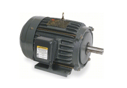
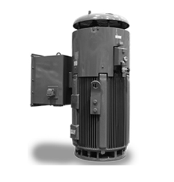
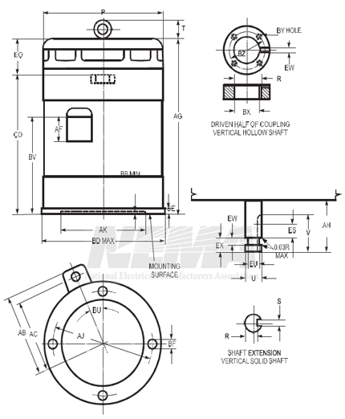

-----
title: I) Motor Dimensions
date: December 4th, 2023
description: Frame Size Tool
hide_units: true
-----

<h3>Motor Frame Size and Dimension Reference Tool</h3>

    

    

    
<h5>Horizontal Electric Motor</h5>

    
<h5>Vertical Electric Motor</h5>

    

    

        <h2 class="accordion-header" id="headingOne" style="margin-bottom:0">
        <button class="accordion-button collapsed" type="button" data-bs-toggle="collapse"
            data-bs-target="#panelsStayOpen-collapseOne" aria-expanded="false">
            Horizontal Electric Motor Frame Size Dimensions
        </button>
        </h2>
        

            

                

                    

                        <h2 class="accordion-header" id="headingOne-1" style="margin-bottom:0">
                        <button class="accordion-button collapsed" type="button" data-bs-toggle="collapse"
                            data-bs-target="#panelsStayOpen-collapseOne-1" aria-expanded="false">
                            4.4.1 Dimensions for Alternating-Current Foot-Mounted Machines with Single Straight Shaft Extension
                        </button>
                        </h2>
                        

                            

                                

                                    

                                    

                                

                                

                                    Drawings represent standard TEFC general purpose motors and are for example or reference only
                                    =|=
                                    data: motor-horizontal-4.4.1.csv
                                    fixed-columns: 1
                                    =|=
                                    
Tbl. 5.E.1

                                    *The tolerances on the D dimension for rigid base motors shall be +0.00 inch, −0.06 inch. No tolerance has been established for the D dimension of resilient mounted motors. 
                                     
                                    †Frames 42 to 56H, inclusive—The tolerance for the 2F dimension shall be ±0.03 inch and for the H dimension (width of slot) shall be +0.02 inch, −0.00 inch. 
                                     
                                    Frames 143T to 500, inclusive—The tolerance for the 2E and 2F dimensions shall be ±0.03 inch and for the H dimension shall be +0.05 inch, −0.00 inch. 
                                     
                                    The values of the H dimension represent standard bolt sizes plus dimensional clearances. 
                                     
                                    H dimension:  Frames 143T to 365T, inclusive—The clearance of the std. bolt to hole size is 0.03 inch. The tolerance is +0.05, −0.00 inch.  Frames 404T to 449T, inclusive—The clearance of the std. bolt to hole size is 0.06 inch. The tolerance is +0.020 inch, −0.00 inch. 
                                     
                                    ††For dimensions of clearance holes, see 4.8. 
                                     
                                    **For the 2F dimension and corresponding third (and when required, the fourth) digit in the frame series, see 4.2.1 and Table 4-2. 
                                     
                                    ***BA tolerance: ±0.09 inch. 
                                     
                                    <h4>Notes:</h4>
                                    <ol type="1">
                                        <li>For the meaning of the letter dimensions, see 4.1 and Figures 4-1 and 4-2.</li>
                                        <li>For tolerances on shaft extension diameters and keyseats, see 4.9.</li>
                                        <li>Frames 42 to 56H, inclusive—if the shaft extension length of the motor is not suitable for the application, it is recommended that deviations from this length be in 0.25 inch increments.</li>
                                        <li>For cast-iron products, bottom of feet coplanar: 0.015 inch.</li>
                                        <li>For cast-iron products, foot top parallel to foot bottom: 1.5 degree.</li>
                                        <li>For cast-iron products, shaft parallel to foot plan: 0.015 inch.</li>
                                    </ol>
                                

                            

                        

                    

                    

                        <h2 class="accordion-header" id="headingTwo-1" style="margin-bottom:0">
                        <button class="accordion-button collapsed" type="button" data-bs-toggle="collapse"
                            data-bs-target="#panelsStayOpen-collapseTwo-1" aria-expanded="false"
                            aria-controls="panelsStayOpen-collapseTwo-1">
                            4.4.4 Dimensions for Type C Face Mounting Foot or Footless Alternating-Current Motors
                        </button>
                        </h2>
                        

                            

                                

                                

                                    Drawings represent standard TEFC general purpose motors and are for example or reference only
                                    =|=
                                    data: motor-c-face-4.4.4.csv
                                    fixed-columns: 1
                                    =|=
                                    
Tbl. 5.E.2

                                    All dimensions in inches. 
                                     
                                    *For frames 42C to 445TSC, see 4.4.1, for dimensions A, D, E, 2F, and H. 
                                     
                                    **For frames 182TC, 184TC, and 213TC through 500TC, the centerline of the bolt holes shall be within 0.025 inch of true location. True location is defined as angular and diametrical location with reference to the centerline of the AK dimension. 
                                     
                                    †The tolerance on this BB dimension shall be +0.00 inch, −0.06 inch. 
                                     
                                    ††These BD dimensions are nominal dimensions. 
                                     
                                    †††For dimensions of clearance holes, see 4.8. 
                                     
                                    <h4>Notes:</h4>
                                    <ol type="1">
                                        <li>For the meaning of the letter dimensions, see 4.1 and Figure 4-3.</li>
                                        <li>For tolerances on shaft extension diameters and keyseats, see 4.9.</li>
                                        <li>For tolerances on AK dimensions, face runout, and permissible eccentricity of mounting rabbet, see 4.12.</li>
                                        <li>If the shaft extension length of the motor is not suitable for the application, it is recommended that deviations from this length be in 0.25 inch increments.</li>
                                    <ol>
                                

                            

                        

                    

                    

                        <h2 class="accordion-header" id="headingThree-2" style="margin-bottom:0">
                        <button class="accordion-button collapsed" type="button" data-bs-toggle="collapse"
                            data-bs-target="#panelsStayOpen-collapseThree-2" aria-expanded="false"
                            aria-controls="panelsStayOpen-collapseThree-2">
                            4.4.5 Dimensions for Type FC Face Mounting for Accessories on End Opposite Drive End of Alternating-Current Motors</button>
                        </h2>
                        

                            

                                

                                

                                    =|=
                                    data: motor-c-face-4.4.5.csv
                                    fixed-columns: 1
                                    =|=
                                    
Tbl. 5.E.3

                                    *The tolerance on this FBB dimension shall be +0.00, −0.06 inch. 
                                     
                                    †This BD dimension is a nominal dimension. 
                                     
                                    ††When a hole is required in the Type C face for accessory leads, the hole shall be located relative to one of the FBF holes in accordance with the following figure and the table. 
                                

                            

                        

                    

                

            

        
 
    
 
    

        <h2 class="accordion-header" id="headingOne-2" style="margin-bottom:0">
            <button class="accordion-button collapsed" type="button" data-bs-toggle="collapse"
                data-bs-target="#panelsStayOpen-collapseOne-2" aria-expanded="false">
                Vertical Electric Motor Frame Size Dimensions
            </button>
        </h2>
        

            

                

                    

                        <h2 class="accordion-header" id="headingFive-2" style="margin-bottom:0">
                        <button class="accordion-button collapsed" type="button" data-bs-toggle="collapse"
                            data-bs-target="#panelsStayOpen-collapseFive-2" aria-expanded="false"
                            aria-controls="panelsStayOpen-collapseFive-2">
                            Table 18-28 - Dimensions for Type VP Vertical Solid Shaft, Single-Phase and Polyphase, Direct-Connected Squirrel-Cage Induction Motors for Vertical Turbine Pump Applications
                        </button>
                        </h2>
                        

                            

                                

                                

                                    =|=
                                    data: motor-vertical-18-28.csv
                                    fixed-columns: 1
                                    =|=
                                    
Tbl. 5.E.4

                                    The tolerance for the permissible shaft runout shall be 0.002 inch indicator reading (see 4.11). 
                                     
                                    For the meaning of the letter dimensions, see 4.1 and Figure 18-22. 
                                     
                                    For tolerance on AK dimension, face runout, and permissible eccentricity of mounting rabbet, see 4.12. 
                                     
                                    For tolerance on shaft extension diameters and keyseats, see 4.9 and 4.10. 
                                     
                                    *The assignment of horsepower and speed ratings to these frames shall be in accordance with Part 13, except for the inclusion of the suffix letter VP in place of the suffix letters T and TS. 
                                     
                                    **AJ dimension—centerline of bolt holes shall be within 0.025 inch of true location. True location is defined as angular and diametrical location with reference to the centerline of the AK dimension. 
                                     
                                    †The tolerance on the AH dimension shall be ±0.06 inch. Dimension AH shall be measured with motor in vertical position, shaft down. 
                                

                            

                        

                    

                    

                        <h2 class="accordion-header" id="headingFour-2" style="margin-bottom:0">
                        <button class="accordion-button collapsed" type="button" data-bs-toggle="collapse"
                            data-bs-target="#panelsStayOpen-collapseFour-2" aria-expanded="false"
                            aria-controls="panelsStayOpen-collapseFour-2">
                            Table 18-30 - Base Dimensions of Type P and PH Alternating-Current Squirrel-Cage Vertical Hollow Shaft Motors for Vertical Turbine Pump Applications</button>
                        </h2>
                        

                            

                                

                                

                                    =|=
                                    data: motor-vertical-hollow-shaft-18-30.csv
                                    fixed-columns: 1
                                    =|=
                                    
Tbl. 5.E.5

                                    All dimensions in inches. 
                                     
                                    *See Table 18-31 for the coupling dimensions of the motors covered in items 1 through 16. 
                                     
                                    †These frames have the following alternative base dimensions, the coupling dimensions given in Table 18-31 remaining unchanged. 
                                     
                                    ††Either clearance hole or up size shall be specified. 
                                     
                                    **AJ dimension—centerline of bolt holes shall be within 0.025 inch of true location. True location is defined as angular and diametrical location with reference to the centerline of the AK dimension. 
                                

                            

                        

                    

                

            

        

    

    

        <h2 class="accordion-header" id="headingOne-3" style="margin-bottom:0">
            <button class="accordion-button collapsed" type="button" data-bs-toggle="collapse"
                data-bs-target="#panelsStayOpen-collapseOne-3" aria-expanded="false">
                JM and JP Face Mounting Close-Coupled Pump Motors
            </button>
        </h2>
        

            

                

                    

                        <h2 class="accordion-header" id="headingTwo-3" style="margin-bottom:0">
                        <button class="accordion-button collapsed" type="button" data-bs-toggle="collapse"
                            data-bs-target="#panelsStayOpen-collapseTwo-3" aria-expanded="false"
                            aria-controls="panelsStayOpen-collapseTwo-3">
                            Tables 18-33 and 18-34 Combined Dimensions for JM and JP Face Mounting Close-Coupled Pump Motors
                        </button>
                        </h2>
                        

                            

                                

                                

                                

                                    =|=
                                    data: motor-table-1-JM-JP-18.33-18.34.csv
                                    fixed-columns: 1
                                    =|=
                                    
Tbl. 5.E.6

                                     
                                    =|=
                                    data: motor-table-2-JM-JP-18.33-18.34.csv
                                    fixed-columns: 1
                                    =|=
                                    
Tbl. 5.E.7

                                    All dimensions in inches. 
                                     
                                    For the meaning of the letter dimensions, see Figures 
                                     
                                    *AH, EQ, and ET dimensions measured with the shaft pulled by hand away from the motor to the limit of endplay. 
                                     
                                    **AJ dimension—centerline of bolt holes is within 0.015 inch of true location for frames 154 to 256 JM and JP, inclusive, and within 0.025 inch of true location for frames 284 to 365 JM and JP, inclusive. True location is determined as angular and diametrical location with reference to the centerline of the AK dimension. 
                                     
                                    Face runout— 
                                    143JM/JP to 256JM/JP frames, inclusive, 0.004 inch indicator reading 
                                    284JM/JP to 326JM/JP frames, inclusive, 0.006 inch indicator reading 
                                     
                                    Permissible eccentricity of mounting rabbet— 
                                    143JM/JP to 256JM/JP frames, inclusive, 0.004 inch indicator reading 
                                    284JM/JP to 326JM/JP frames, inclusive, 0.006 inch indicator reading 
                                     
                                    Permissible shaft runout— 
                                    143JM/JP to 256JM/JP frames, inclusive, 0.002 inch indicator reading 
                                    284JM/JP to 326JM/JP frames, inclusive, 0.003 inch indicator reading 
                                

                            

                        

                    

                

            

        

    

    

    

        <h2 class="accordion-header" id="headingOne-iec" style="margin-bottom:0">
        <button class="accordion-button collapsed" type="button" data-bs-toggle="collapse"
            data-bs-target="#panelsStayOpen-collapseOne-iec" aria-expanded="false">
            Horizontal Electric Motor Frame Size Dimensions
        </button>
        </h2>
        

            

                

                    

                        <h2 class="accordion-header" id="headingOne-iec-1" style="margin-bottom:0">
                        <button class="accordion-button collapsed" type="button" data-bs-toggle="collapse"
                            data-bs-target="#panelsStayOpen-collapseOne-iec-1" aria-expanded="false">
                            TBD
                        </button>
                        </h2>
                        

                            

                                

                                    

                                    

                                

                                

                                    Put Content here
                                

                            

                        

                    

                    

                        <h2 class="accordion-header" id="headingTwo-iec-1" style="margin-bottom:0">
                        <button class="accordion-button collapsed" type="button" data-bs-toggle="collapse"
                            data-bs-target="#panelsStayOpen-collapseTwo-iec-1" aria-expanded="false"
                            aria-controls="panelsStayOpen-collapseTwo-iec-1">
                            TBD
                        </button>
                        </h2>
                        

                            

                                

                                

                                    Put Content Here
                                

                            

                        

                    

                    

                        <h2 class="accordion-header" id="headingThree-iec-2" style="margin-bottom:0">
                        <button class="accordion-button collapsed" type="button" data-bs-toggle="collapse"
                            data-bs-target="#panelsStayOpen-collapseThree-iec-2" aria-expanded="false"
                            aria-controls="panelsStayOpen-collapseThree-iec-2">
                            TBD
                        </button>
                        </h2>
                        

                            

                                

                                

                                    Put Content Here
                                

                            

                        

                    

                

            

        
 
    
 
    

        <h2 class="accordion-header" id="headingOne-iec-2" style="margin-bottom:0">
            <button class="accordion-button collapsed" type="button" data-bs-toggle="collapse"
                data-bs-target="#panelsStayOpen-collapseOne-iec-2" aria-expanded="false">
                Vertical Electric Motor Frame Size Dimensions
            </button>
        </h2>
        

            

                

                    

                        <h2 class="accordion-header" id="headingFive-iec-2" style="margin-bottom:0">
                        <button class="accordion-button collapsed" type="button" data-bs-toggle="collapse"
                            data-bs-target="#panelsStayOpen-collapseFive-iec-2" aria-expanded="false"
                            aria-controls="panelsStayOpen-collapseFive-iec-2">
                            TBD
                        </button>
                        </h2>
                        

                            

                                

                                

                                    Put Content Here
                                

                            

                        

                    

                    

                        <h2 class="accordion-header" id="headingFour-iec-2" style="margin-bottom:0">
                        <button class="accordion-button collapsed" type="button" data-bs-toggle="collapse"
                            data-bs-target="#panelsStayOpen-collapseFour-iec-2" aria-expanded="false"
                            aria-controls="panelsStayOpen-collapseFour-iec-2">
                            TBD
                        </button>
                        </h2>
                        

                            

                                

<!--img src="./motor-vert-18-28-18-30.png "-->

                                

                                    Put Content Here
                                

                            

                        

                    

                

            

        

    

