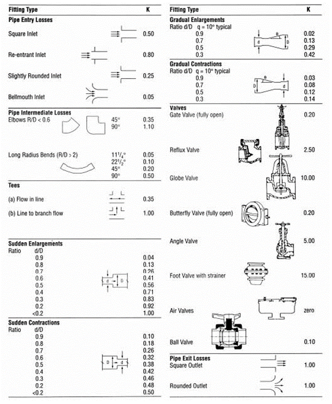

-----
title:   System Curves 
date:  June 13, 2019
description: Contains a system curves tutorial, demonstration, and worked examples.
-----

# System Curves 

## Tutorial

A **system curve** represents the relationship between flow through a system and the hydraulic losses at that flow. The system curve consists of two parts: friction and static head. A system curve is generated by varying the flow rate through the system from zero flow to some maximum value. 

### Static Head
**Static head** consists of both the elevation and pressure difference between the supply and destination of the system. This, typically, does not depend on velocity and is therefore constant for the system curve. This can be calculated using the following equation:

=+=
$$ x = \Delta (z_{destination} - z_{supply}) + {(P_{destination} - P_{supply}) \over \rho g} $$
=+=

where:

- z is elevation
- P is pressure
- ρ is fluid density
- g is gravitational acceleration

Note that if the supply and destination are at the same pressure, as is often the case when they are open tanks, then the static head is simply the difference in the liquid elevation.

### Frictional Head (Major Losses)

The **head loss due to friction** (defined in the <a href="/fluid-flow-III/general.html" target="_blank">fluid flow section</a>) will vary based on flow rate (velocity) and can be calculated for the system components, such as piping, valves, elbows and bends, and end-use equipment, etc. These losses typically vary proportional to the square of the velocity.

Frictional head losses in pipes can be calculated using the Darcy-Weisbach equation shown below.

=+=
$$ \Delta h_{LOSS} = \Delta h_f = { {fL \over D} * {v^2  \over 2g}} $$
=+=

Where:

- *f* is the friction factor
- L is pipe length
- D is pipe diameter
- *v* is fluid velocity
- g is gravitational acceleration

The **Darcy-Weisbach friction factor**, *f*, can be determined using the Colebrook-White equation as shown.

=+=
$$ {1 \over \sqrt f} = -2\log({\epsilon \over 3.7D_h} + {2.51 \over Re \sqrt f}) $$
=+=

Another common form, which can be solved without iteration, is shown below.

=+=
$$ {1 \over \sqrt f} = -2 \log({\epsilon/D \over 3.7} + {5.74 \over Re^{0.9}}) $$
=+=

These equations will approximate the Moody diagram. The friction factor is based on the Reynolds Number (Re), the 
pipe diameter (Dh), and the pipe roughness (ε). The pipe roughness is dependent on the type of pipe being used. Other aspects,
such as age, fouling, and coatings will also affect the pipe roughness.

The Hazen-Williams equation is another method to 
determine pipe losses. These values are only valid for water and do not account for temperature or viscosity. 
These values are a function of pipe material only and are not dependent on Reynolds Number. A table of typical values 
for various pipe materials can be found here (**add link**).

### Minor Losses
**Minor losses** (defined in the <a href="/fluid-flow-III/general.html" target="_blank">fluid flow section</a>) in a piping system can consist of valves, bends, elbows, area changes, entrances from and exits to equipment, tees and branches, etc. Anything that will
obstruct or change the flow and pressure can be considered a minor loss. These are categorized differently than the pipe frictional loss (or major loss).

The loss created by the component is often characterized by a constant, K. The K values for some types of components are tabulated below. The head loss is usually
proportional to the square of the fluid velocity and can be determined by the equation below.

=+=
$$ \Delta h_{LOSS} = \Delta h_f = K*{v^2 \over 2g} $$
=+=

Where:

- K is the component loss
- *v* is fluid velocity
- g is gravitational acceleration

Component (minor) losses can be summed together with the pipe losses to determine an overall frictional loss for the system.

=+=
$$ \Delta h_{LOSS} = \Delta h_f = {({fL \over D} + ΣK) * {v^2 \over 2g}} $$
=+=

### System Curve

The system curve represents the sum of the static, piping and minor head losses over a range of flow rates and can be represented using the following equation:

=+=
$$ \Delta h_{system} = (z_{destination}-z_{supply}) + {(P_{destination}-P_{supply}) \over \rho g} + {({fL \over D} + ΣK) * {v^2 \over 2g}} $$
=+=

### Shape of the System Curve

In some systems the frictional losses will be dominate part of the overall head loss. These systems will have a steeper system curve.

In other systems the elevation change, or static head, will be dominate part of the overall head loss. The system curve in this case will start at a higher
value at zero flow and will tend to be flatter.

It is important to accurately characterize the system curve to select the correct pump for various operating conditions as the operating point of your system will be dependent
on the intersection between the system curve and the pump curve.

### System Curve Application

Real-world applications tend to consider a range or family of system curves. This would bracket the range of liquid levels,
operating pressures, valve arrangements, etc. 

## Educational Demonstration

*(Demonstrator will be placed here)*

This education demonstrator will show how changing the static and frictional losses changes the system curve.

The static head can be varied by changing the supply and destination levels. The overall frictional loss (piping and minor) can be varied by moving the slider. 
This is a representative demonstration and does not have actual values.

## Worked Example
<units us = "Consider the system below and develop a system curve for the flows from 0 to 300 GPM." metric = "Consider the system below and develop a system curve for the flows from 0 to 0.0189 m3/s"/>

**Determine the Static Head**

Since both tanks have the same surface pressure, the static head is only dependent on the difference in surface elevation.

=+=
$$\Delta h_{static} = (z_{destination}-z_{supply})$$
=+=

=+=
[units = us]
$$ \Delta h_{static} = (289{ft}-24{ft}) = 265{ft} $$
=+=

=+=
[units = metric]
$$ \Delta h_{static} = (88.09{m}-7.315{m}) = 80.77{m} $$
=+=

**Determine the Pipe Friction and Properties**

To simplify this example, we will consider the friction factor to be constant at 0.02. In general, the friction factor would vary as the flow rate (velocity) varies. Additionally, the flow would be laminar for low velocities. These considerations should be taken into account when calculating the pipe losses.

<units us = "A 4-inch, schedule 40 steel pipe has an inner diameter of 4.026 inches (0.3355 feet). The overall pipe length in this example is 1255 feet." metric = "A 4-inch, schedule 40 steel pipe has an inner diameter of 102.26 mm (0.10226 m). The overall pipe length in this example is 77.72 meters."/>

**Determine the Minor or Component Loss**

The losses for the components can be found in tables. In this example we have the following:

- Regular flanged elbow (2), k = 0.31 each
- Swing check valve, k = 2.0
- Wedge-disc gate valve, k = 0.17
- Sudden enlargement, k = 1.0

This gives a total K factor equal to 3.79

Using the combined frictional loss equation above, we can determine the head loss (in feet) as a function of velocity <units us = "(in ft/s2)" metric = "(in m/s2)"/>

=+=
$$ \Delta h_f = {({fL \over D} + ΣK) * {v^2 \over 2g}}$$
=+=

=+=
[units = us]
$$ \Delta h_f = {({0.02 * 1255ft \over 0.3355ft} + 3.79) * {v^2 \over 2 * 32.174 {ft/sec^2}}} $$
=+=

=+=
[units = metric]
$$ \Delta h_f = {({0.02 * 382.52m \over 0.10226m} + 3.79) * {v^2 \over 2 * 9.81 {ft/sec^2}}} $$
=+=

=+=
[units = us]
$$ \Delta h_f = 1.22v^2 $$
=+=

=+=
[units = metric]
$$ \Delta h_f = 4.01v^2 $$
=+=

**Determine the System Curve**

The system curve can be calculated by varying the flow rate (velocity) using the above values. Combining the static and dynamic (pipe friction and minor losses)
we have the following as a function of velocity.

=+=
$$ \Delta h_{system} = \Delta h_{static} + \Delta h_{f} $$
=+=

=+=
[units = us]
$$\Delta h_{system} = 265{ft} + 1.22v^2$$
=+=

=+=
[units = metric]
$$\Delta h_{system} = 80.77{m} + 4.01v^2$$
=+=

<units us = "The following can be used to convert a flow rate in gpm (gallons per minute) to a velocity in ft/sec (with the pipe diameter D in inches)."
metric = "The following can be used to convert a flow rate in m3/s (cubic meters per second) to a velocity in m/sec (with the pipe diameter D in meters)."/>

=+=
[units us]
$$ v = 0.002228*Q*({4 \over \pi D^2}) $$
=+=

=+=
[units metric]
$$ v = Q*({4 \over \pi D^2}) $$
=+=

Substituting this in for velocity and using the 4-inch pipe <units us ="(ID = 4.026 inches)" metric ="(ID = 0.10226 m)"/> we can get the following as the system curve equation as a function
of flow rate in gpm.

=+=
[units us]
$$ \Delta h_{system} = 265{ft} + {{(7.75E{-04})}{Q^2}} $$
=+=

=+=
[units metric]
$$ \Delta h_{system} = 80.77{m} + {{(5.95E{+04})}{Q^2}} $$
=+=

This, then, gives the following system curve data. This is a system that is dominated by the static head (there is a lift of <units us = "(there is a lift of 265 feet compared to little loss in piping and components)." metric = "there is a lift of 77.724 meters compared to little loss in piping and components)."/> 

=/=
title: Data Points
data-us: datapoints_us.csv
data-metric: datapoints_metric.csv
x: 1
series: 3, 2
series_title_index: 0
=/=

=|=
title: Data Points
data-us: datapoints_us.csv
data-metric: datapoints_metric.csv
=|=

## Moody Diagram

(From L.F. Moody, "Friction factors for Pipe Flow", Trans. A.S.M.E., Vol 66, 1944)

## Reynolds Number

### Tutorial

The Reynolds number is a non-dimensional ratio of inertial forces to viscous forces and is used to help scale data over a range of pipe sizes,
fluid properties, and flow conditions. It is used as the basis for the Moody Diagram to determine friction factors and pressure/head losses.

The Reynolds number is defined as: 

=+=
$$ Re = {ρVD \over μ} = {VD \over ν} = {QD \over {νA}} $$
=+=

Where, for cylindrical pipes:

- ρ is fluid density
- V is fluid velocity
- D is pipe inner diameter
- μ is dynamic viscosity
- ν is kinematic viscosity
- Q is volumetric flow rate
- A is pipe cross-sectional area

At Reynolds numbers less than about 2300, the flow tends to be laminar where it is traveling in a smooth, orderly manner with little mixing. 
At Reynolds numbers higher than about 4000, the flow is considered turbulent, with eddies forming and irregular motion.

## Pipe Roughness

### Tutorial

Pipe roughness varies on pipe material, age, usage, fluid transport and lining. This table gives example values for some clean materials.

=|=
title: Roughness Values
data-us: pipe-roughness-ft.csv
data-metric: pipe-roughness-mm.csv
=|=

Determining the frictional roughness for old pipe is beyond this tutorial. Deterioration of pipes with age depends on the particular chemical properties of the fluid
and the metal with which it is in contact. It is recommended that prior experience or testing be used to determine an accurate value. For commercial installations, 
it is recommended that 15 percent be added to the values shown above.

**(interactive calculators will be added)**
