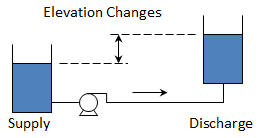
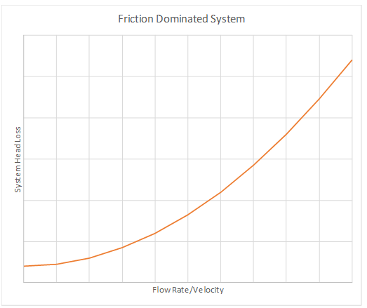
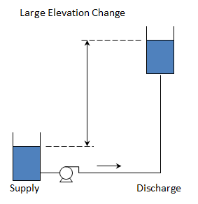
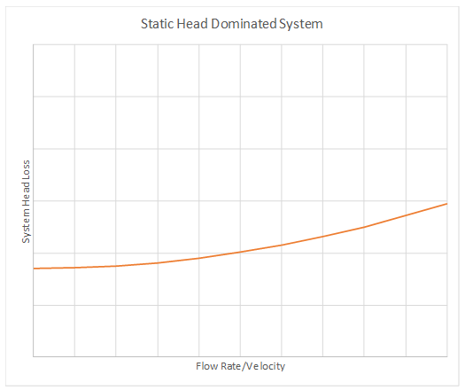
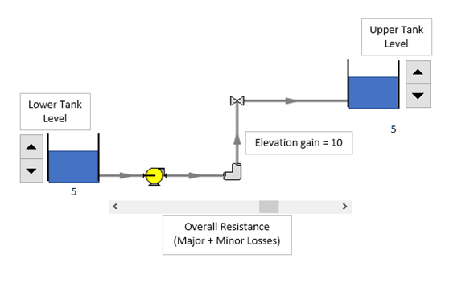
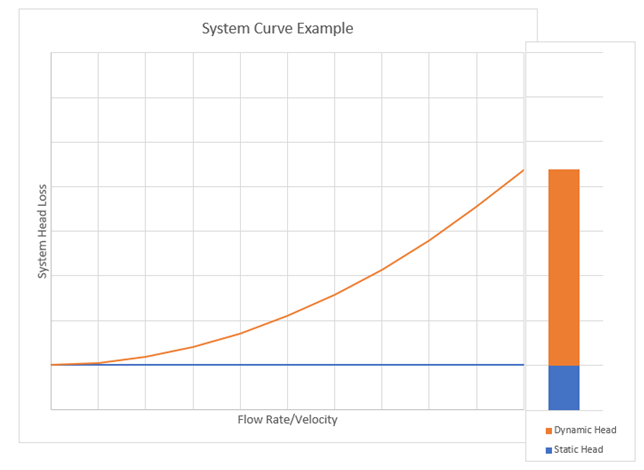

-----
title:   System Curves 
date:  June 13, 2019
-----

# Tutorial
A system curve represents the relationship between flow through a system and the hydraulic losses at that flow. The system curve consists of two parts: friction and static head. A system curve is generated by varying the flow rate through the system from zero flow to some maximum value. 
            
## Static Head
Static head consists of both the elevation and pressure difference between the supply and destination of the system. This, typically, does not depend on velocity and is therefore constant for the system curve. This can be calculated using the following equation,
where:

- z is elevation
- P is pressure
- ρ is fluid density
- g is gravitational acceleration

=+=
$$x = \Delta (z_{destination} - z_{supply}) + {(P_{destination} - P_{supply}) \over \rho g} $$
=+=

Note that if the supply and destination are at the same pressure, as is often the case when they are open tanks, then the static head is simply the difference in the liquid elevation.

## Frictional Head

The **head loss due to friction** will vary based on flow rate (velocity) and can be calculated for the system components, such as piping, valves, elbows and bends, and end-use equipment, etc. These losses typically vary proportional to the square of the velocity.

Frictional head losses in pipes can be calculated using the Darcy-Weisbach equation shown below.

=+=
$$ \Delta h_f = { {fL \over D} * v^2  \over 2g}$$
=+=

Where:

- *f* is the friction factor
- L is pipe length
- D is pipe diameter
- *v* is fluid velocity
- g is gravitational acceleration

The **Darcy-Weisbach friction factor**, *f*, can be determined using the Colebrook-White equation as shown.

=+=
$$ {1 \over \sqrt f} = -2 \log({\epsilon \over 2.7D_h} + {2.51 \over Re \sqrt f}) $$
=+=

Another common form, which can be solved without iteration, is shown below.

=+=
$$ {1 \over \sqrt f} = -2 \log({\epsilon/D \over 3.7} + {5.74 \over Re^{0.9}}) $$
=+=

These equations will approximate the Moody diagram. The friction factor is based on the Reynolds Number, Re, the 
pipe diameter, Dh, and the pipe roughness, ε. The pipe roughness is dependent on the type of pipe being used. Other aspects,
such as age, fouling, and coatings will also affect the pipe roughness.

The Hazen-Williams equation is another method to 
determine pipe losses. These values are only valid for water and do not account for temperature or viscosity. 
These values are a function of pipe material only and are not dependent on Reynolds Number. A table of typical values 
for various pipe materials can be found here.

## Minor Losses
The frictional head losses for the various components (valves, elbows, orifices, etc.) in the piping system are called "minor losses" the even though these can be the dominate system loss. The loss for the component is often characterized by a constant K and tabulated for several types of components. The head loss is determined by the equation below.

=+=
$$\Delta h_f = {K*v^2 \over 2g} $$
=+=

Component (minor) losses can be summed together with the pipe losses to determine an overall frictional loss for the system.

=+=
$$\Delta h_f = {({fL \over D} + K) * v^2 \over 2g}$$
=+=

## Shape of the System Curve

In some systems the frictional losses will be dominate part of the overall head loss. These systems will have a steeper system curve.

In other systems the elevation change, or static head, will be dominate part of the overall head loss. The system curve in this case will start at a higher
value at zero flow and will tend to be flatter.

It is important to accurately characterize the system curve to select the correct pump for various operating conditions as the operating point of your system will be dependent
on the intersection between the system curve and the pump curve.

## System Curve

The system curve represents the sum of the static, piping and minor head losses over a range of flow rates and can be represented using the following equation:

=+=
$$\Delta h_{system} = (z_{destination}-z_{supply}) + {(P_{destination}-P_{supply}) \over \rho g} + {({fL \over D} + K) * {v^2 \over 2g}}$$
=+=

## System Curve Application

Real-world applications tend to consider a range or family of system curves. This would bracket the range of liquid levels,
operating pressures, valve arrangements, etc. 

# Educational Demonstration

*(Demonstrator will be placed here)*

This education demonstrator will show how changing the static and frictional losses changes the system curve.

The static head can be varied by changing the supply and destination levels. The overall frictional loss (piping and minor) can be varied by moving the slider. 
This is a representative demonstration and does not have actual values.

# Worked Example
<units us = "Consider the system below and develop a system curve for the flows from 0 to 300 GPM." metric = "Consider the system below and develop a system curve for the flows from 0 to 68.14 m3/h."/>

**Determine the Static Head**

Since both tanks have the same surface pressure, the static head is only dependent on the difference in surface elevation.

=+=
$$\Delta h_{static} = (z_{destination}-z_{supply}) $$
=+=

=+=
$$\Delta h_{static} = (289{feet}-24{feet}) = 265{feet} $$
=+=

**Determine the Pipe Friction and Properties**

To simplify this example, we will consider the friction factor to be constant at 0.02. In general, the friction factor would vary as the flow rate (velocity) varies. Additionally, the flow would be laminar for low velocities. These considerations should be taken into account when calculating the pipe losses.

<units us = "A 4-inch, schedule 40 steel pipe has an inner diameter of 4.026 inches (0.3355 feet). The overall pipe length in this example is 1255 feet." 
metric = "A 4-inch, schedule 40 steel pipe has an inner diameter of 102.2604 mm. The overall pipe length in this example is 77.724 meters."/>

**Determine the Minor or Component Loss**

The losses for the components can be found in tables. In this example we have the following:

- Regular flanged elbow (2), k = 0.31 each
- Swing check valve, k = 2.0
- Wedge-disc gate valve, k = 0.17
- Sudden enlargement, k = 1.0

This gives a total K factor equal to 3.79

Using the combined frictional loss equation above, we can determine the head loss (in feet) as a function of velocity (in ft/sec2)

=+=
$$\Delta h_f = {({fL \over D} + K) * v^2 \over 2g}$$
=+=

=+=
$$\Delta h_f = {({0.02 * 155_{ft} \over 03355_{ft}} + 3.59) * v^2 \over 2 * 32.174 {ft/sec^2}}$$
=+=

=+=
$$\Delta h_f = 1.22v^2$$
=+=

**Determine the System Curve**

The system curve can be calculated by varying the flow rate (velocity) using the above values. Combining the static and dynamic (pipe friction and minor losses)
we have the following as a function of velocity.

=+=
$$\Delta h_{system} = \Delta h_{static} + \Delta h_{f}$$
=+=
=+=
$$\Delta h_{system} = 265{feet} + 1.22v^2$$
=+=

The following can be used to convert a flow rate in gpm (gallons per minute) to a velocity in ft/sec (with the pipe diameter D in inches).

=+=
$$v = 0.002228*Q*({4 \over \pi D^2})$$
=+=

Substituting this in for velocity and using the 4-inch pipe <units us ="(ID = 4.026 inches)" metric ="(ID = 102.2604 mm)"/> we can get the following as the system curve equation as a function
of flow rate in gpm.
=+=
$$\Delta h_{system} = 265{feet} + {{7.75e^{-4}}{Q^2}}$$
=+=

This, then, give the following system curve data. This is a system that is dominated by the static head (there is a lift of <units us = "(there is a lift of 265 feet compared to 
little loss in piping and components)." metric = "there is a lift of 77.724 meters compared to little loss in piping and components)."/> 

 

=/=
title: Data Points
data-us: datapoints_us.csv
data-metric: datapoints_metric.csv
x: 1
series: 3, 2
series_title_index: 0
=/=

=|=
title: Data Points
data-us: datapoints_us.csv
data-metric: datapoints_metric.csv
=|=

