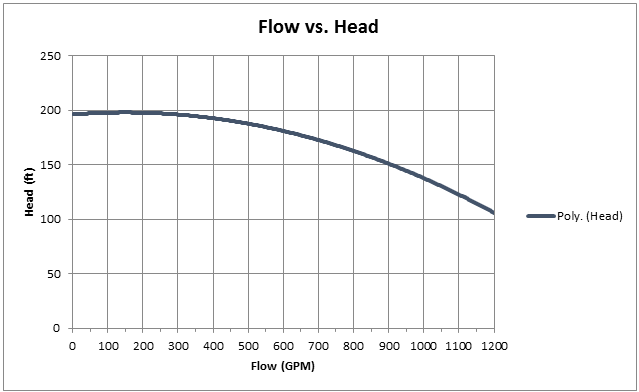
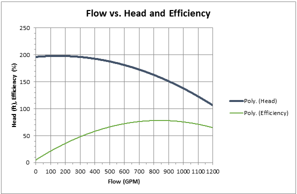
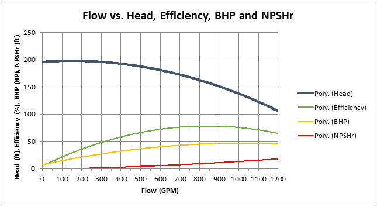
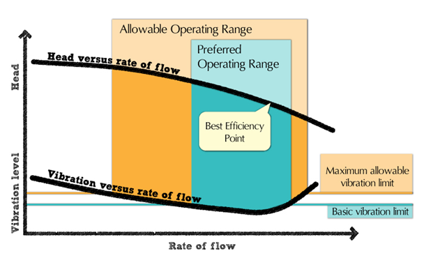
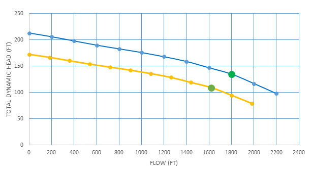
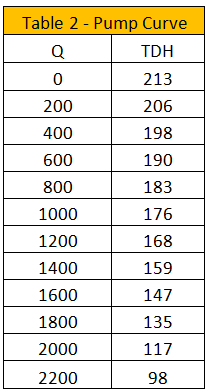

-----
title:   Pump Curves 
date:  June 13th, 2019
-----

# Tutorial

A pump performance curve is a graphical representation of the head generated by a specific pump model at rates of flow from zero to maximum at a given operating speed.

## Head and Flow Curve

The head and flow curve is the most commonly used curve to describe pump performance. It shows the amount of pressure developed 
across a range of flow rates. On the y-axis is the pressure developed, typically converted to head in units of feet (ft). On the
x-axis is the flow rate, typically in units of gallons per minute (GPM). Head can be determined from the following equation, where 
h is head in ft, P is pressure in psi and SG is specific gravity (unitless):

=+=
$$ h =  {{2.31 * P} \over SG} $$
=+=

Specific gravity can be found by using the following equation, where ρ is density:

=+=
$$ SG = {ρ_{pumped fluid} \over ρ_{water}}  $$
=+=

Using head, the performance of the pump can be shown independent of the density of the fluid pumped. 

## Efficiency Curve

Pump efficiency is shown as a percentage on most pump curves. Pump efficiency is defined by the equation below:

=+=
$$ η = {HP_{fluid} \over HP_{shaft}}  $$
=+=

The efficiency curve shows how efficient a pump is at various flow rates. The flow rate where efficiency is at a maximum
is called the pump’s best efficiency point (BEP). BEP is an important operating point that is further described later in this section.

## Horsepower Curve

The horsepower curve shows the amount of brake, or shaft, horsepower required for different flow rates. BHP can be determined by the following equation where Q is flow in GPM:

=+=
$$ BHP = {{Q * h * SG} \over {3960 * η}} $$
=+=

BHP can also be determined if the amount of power absorbed by the fluid and efficiency are known by rearranging the equation shown for the efficiency curve:

=+=
$$ BHP = {HP_{fluid} \over η}  $$
=+=

The horsepower curve is important, as it allows proper selection of a driver for the pump. 

## Net Positive Suction Head Required (NPSHr) Curve

The final curve typically shown on a pump performance chart is the NPSHr for different flow rates. NPSHr is the minimum NPSH needed to achieve the specified performance 
at the specified flow rate. NPSH is further defined in the pump principles section.

## Operating Regions and Points

- **Best efficiency point (BEP):**

A pump’s best efficiency point is defined as the flow rate at which the hydraulic efficiency of a pump is at its maximum. Typically, a pump is specified to have
its duty point, or designed operating point, at BEP. At BEP, a pump will have low vibration and noise when compared to other operating points. Also, there
is minimum recirculation within the impeller and shockless entry into the impeller. Shockless entry is when the flow entering the impeller matches the angle 
of the impeller vanes at entry.

- **Preferred Operating Region (POR):**

The POR is where the pump is designed to run with high efficiency and reliability. Flow induced vibrations and internal hydraulic loading is low in this region. 
Depending on the specific speed of the pump, which is further defined in the pump principles section,the POR can be anywhere from 90-110% of BEP flow to 70-120% of BEP flow.

- **Allowable Operating Region (AOR):**

The AOR is the flow range at which the pump can be run with acceptable service life. The pump manufacturer should be consulted to define this region. Typically, operating 
intermittently within this region does not cause issues over the life of the pump. The graph above shows the various operating regions, and the graph below shows the types of 
issues that can occur when operating outside of the POR and AOR.

- **Shut Off and Runout:**

These points are important during manufacturer testing to fully define the shape of the pump curve. They are the furthest points to the left and right on the curve.
Shut off is the point at which flow is zero. Operating at this point for more than a few seconds can cause serious mechanical issues. Runout is the point at which
flow is at a maximum. Operating at this flow can cause cavitation, vibration and, in some pumps, overloading of the driver. These points are to be avoided when
operating pumps.

## Affinity Laws

Under the assumption that both pumps maintain the same efficiencies, the Affinity Laws show the relationships between pump parameters (flow, pressure/head, power) and pump 
characteristics (speed and impeller size). There are two parts to the Affinity Laws which vary by application; a change in speed while maintaining
a constant impeller size or a change in impeller size while maintaining a constant speed.

**1. Changing Speed / Constant Impeller Size**

As seen below Flow (Q), Pressure (h), and Power (P) are all proportional to the Speed (n):

=+=
(1.1)
$$ {Q_2 \over Q_1} = {n_2 \over n_1} $$
=+=
=+=
(1.2)
$$ {h_2 \over h_1} = ({n_2 \over n_1})^2 = ({Q_2 \over Q_1})^2 $$
=+=
=+=
(1.3)
$$ {P_2 \over P_1} = ({n_2 \over n_1})^3 = ({Q_2 \over Q_1})^3  $$
=+=

**2. Changing Impeller Size / Constant Speed**

As seen below Flow (Q), Pressure (h), and Power (P) are all proportional to the Impeller Size (D):

=+=
(2.1)
$$ {Q_2 \over Q_1} = {D_2 \over D_1} $$
=+=
=+=
(2.2)
$$ {h_2 \over h_1} = ({D_2 \over D_1})^2 = ({Q_2 \over Q_1})^2  $$
=+=
=+=
(2.3)
$$ {P_2 \over P_1} = ({D_2 \over D_1})^3 = ({Q_2 \over Q_1})^3  $$
=+=

**Speed Reduction and Impeller Trimming**

Part 1 of the affinity laws is ideal for instances where you have a Variable Frequency Drive attached to a pump motor. The VFD will reduce or increase the pump speed
therefore allowing it to operate at a multitude of operating conditions. Part 2 is essential in calculating the new pumpcharacteristics after impeller trimming 
which is the reduction of the impeller diameter.

## Pump Fundamentals: Parallel and Series Pump Implications

Two or more pumps in a system can be placed either in parallel or series.  In parallel, a system consists of two or more pumps that are configured such that each 
draw from the same suction reservoir, wet well, or header, and each discharge to the same discharge reservoir or header.  In series, a system consists of two or more 
pumps that are configured such that the discharge of one pump feeds the suction of a subsequent pump.

**Pumps in Parallel**

Pumps operating in parallel allow the pumping system to deliver greater flows than is possible with just one such pump.  To determine the composite pump curve
of two or more pumps operating in parallel, at each head value, the flowrate of each pump must be added together to obtain the composite flowrate.

The amount of increased flow that occurs within the system depends on both the shape of the system curve and shape of the pump curves.  The composite pump curve intersects the 
system curve at different operating points yielding different flowrates. As more pumps are called to operate, the flow will increase accordingly:

It should be noted, however, that unless the system curve is completely flat (which means friction and other dynamic losses are negligible), bringing a second 
pump on-line does not double the flow rate. The increased flow will be something less than double. How much less depends on the steepness of the system curve.

**Pumps in Series**

While pumps placed in parallel provide greater flow capabilities at the same head as one pump operating individually, pumps placed in series provide greater head capabilities at the same flowrate.

A composite pump curve representing pumps in series can be generated by adding the individual head values of the pumps for a given flow.  Plotting this sum at various flow values will yield a 
composite pump curve for the group of pumps.  Figure 3 shows a composite pump curve for two and three identically sized pumps operating in series:

Pumps operating in series allow the pumping system to deliver greater heads than is possible with just one such pump.  This allows a pump station to be designed to satisfy systems that
require large discharge pressures that may not be practical with one pump.  Where certain applications require, it may also allow a pump station to address a wide variation in system pressures
by staging the number of operating pumps.  Figure 4 shows how applying a configuration with pumps in series to a system with a steep system curve may allow the pumps to address different head
requirements so long as inter-stage discharge piping is configured to permit so.

# Educational Demonstration

*(Demonstrator will be placed here)*

## Pumps in Series
This demo explores how impeller diameter and speed affect three different pumps
(A, B, and C).  This demo also explores different scenarios of the three pumps operating in
series.

***Change the Static Head***

Use the toggle buttons by the reservoirs to increase or decrease elevation levels, thereby
changing the static head.

***Explore How Speed Affects a Pump Curve***

Use the toggle buttons in the blue area to increase or decrease speed for a particular pump.

***Explore How Impeller Diameter Affects a Pump Curve***

Use the toggle buttons in the orange area to increase or decrease diameter for a particular pump.

**Turn Different Curves On/Off**

1)	Click the chart

2)	Select the "Chart Filters" Icon 

3) Select/deselect desired curves (always make sure "Ghost" is checked - this keeps the axes values constant), then click "Apply".

# Worked Examples

## Worked Example 1

A booster pump is designed to operate at <units us = "1800 GPM and 135 ft., with a speed of 1740 RPM. Due to fluctuating flows the booster pump is equipped with a Variable 
Frequency Drive which reduces the pump speed by 10% during low flow conditions. Using the Pump Curve below and the Affinity Laws, generate the pump curve for low 
flow conditions and the new pumping conditions." metric = "408.82 m3/h and 41.148 m, with a speed of 1740 RPM. Due to fluctuating flows the booster pump is equipped with a Variable 
Frequency Drive which reduces the pump speed by 10% during low flow conditions. Using the Pump Curve below and the Affinity Laws, generate the pump curve for low 
flow conditions and the new pumping conditions."/> 

**Determine the Reduced Speed**

During low flow conditions the speed of the pump is reduced by 10%.
=+=
$$ n_2= n_1 (1-.10) $$
$$ n_2= 1740(1-.10) $$
$$ n_2= 1566 RPM $$
=+=

**Calculate New Flow Values**

Using equation 1.1, calculate the new values (repeat until you convert all points under the flow column):

=+= 
$$ {Q_2 \over Q_1} = {n_2 \over n_1} $$
$$ {Q_2 \over 0} = {1566 \over 1740} $$
$$ Q_2 = 0 GPM $$
=+=

=+= 
$$ {Q_2 \over 200} = {1566 \over 1740} $$
$$ Q_2 = 180 GPM $$
=+=

=+= 
$$ {Q_2 \over 400} = {1566 \over 1740} $$
$$ Q_2 = 360 GPM $$
=+=

**Calculate New TDH Values**

Using equation 1.2, calculate the new values (repeat until you convert all points under the TDH column):

=+=
$$ {h_2 \over h_1} = ({n_2 \over n_1})^2 $$
$$ {h_2 \over 173} = ({1566 \over 1740})^2 $$
$$ h_2 = 173 ft. $$
=+=

**Plot Pump Curve**

## Worked Example 2

A pump designed with a 10-5/8” diameter impeller will be operating at 2000 RPM <units us = "@ 80 ft. During installation it was found the TDH was 67 ft. 
Instead of designing a new pump the manufacturer recommends trimming the impeller. Using the affinity laws, determine the new impeller diameter and operating flow." 
metric = "@ 24.384 m. During installation it was found the TDH was 20.4216 m. 
Instead of designing a new pump the manufacturer recommends trimming the impeller. Using the affinity laws, determine the new impeller diameter and operating flow."/>

**Calculate the New Impeller Diameter**

During low flow conditions the speed of the pump is reduced by 10%.

=+=
$$ {h_2 \over h_1} = ({D_2 \over D_1})^2 $$
$$ {67 \over 80} = ({D_2 \over 10.625})^2 $$
$$ {\sqrt {67 \over 80}} = \sqrt(({D_2 \over 10.625})^2) $$
$$ 0.915 = {D_2 \over 10.625} $$
$$ D_2 = 9.72 in. \approx 9.75 in. $$
=+=

**Calculate the New Flow**

During low flow conditions the speed of the pump is reduced by 10%.

=+=
$$ {Q_2 \over Q_1} = {D_2 \over D_1} $$
$$ {Q_2 \over 2000} = {9.75 \over 10.625} $$
$$ Q_2 = 1835 GPM $$
=+=
