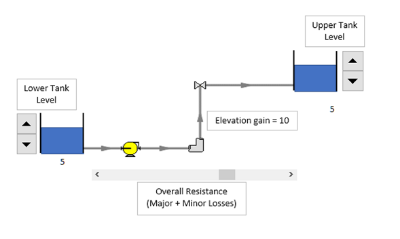
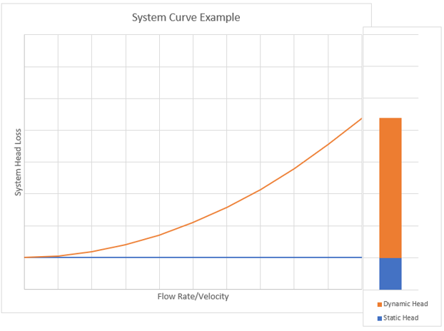

-----
title:   System Curve Demonstration
date:  April 16th, 2019
-----

# Educational Demonstration

This education demonstrator will show how changing the static and frictional losses changes the system curve.

The static head can be varied by changing the supply and destination levels. The overall frictional loss (piping and minor) can be varied by moving the slider. 
This is a representative demonstration and does not have actual values.

