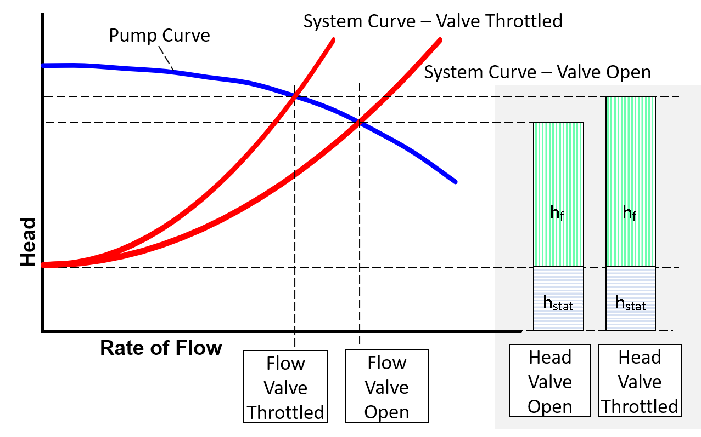
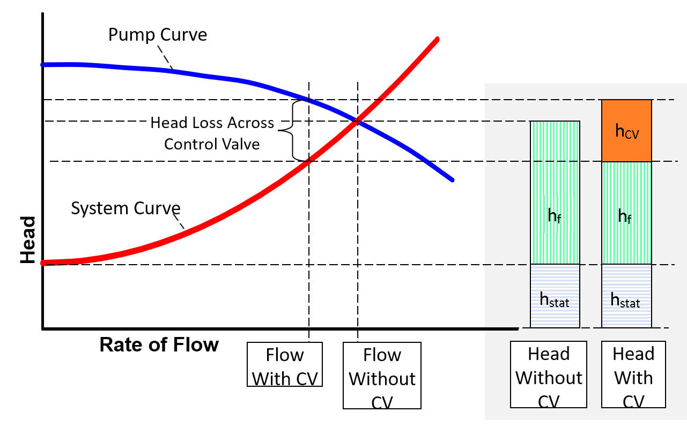
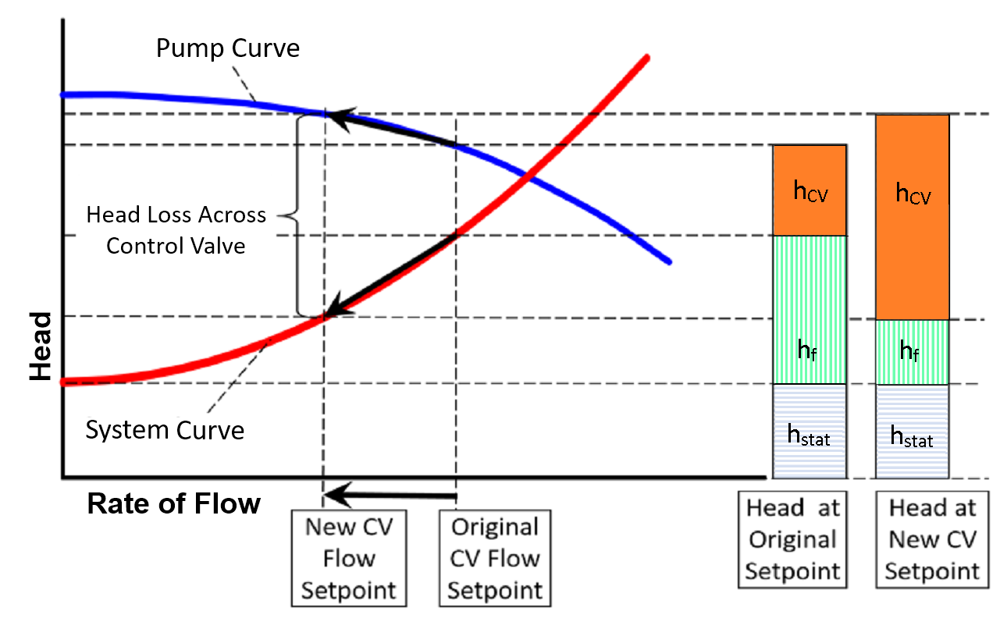
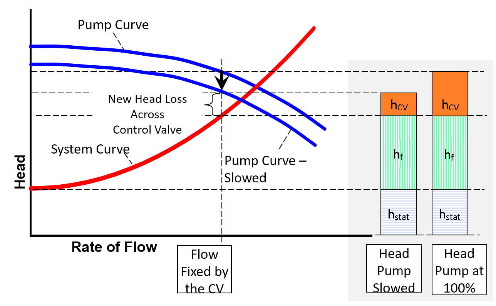

-----
title: Combined Pump & System Curves 
date:  June 12th, 2019
description: Contains a combined pump and systems curves tutorial, demonstration, and worked examples.
-----

# Tutorial

It is important to understand how the pump will interact with the system it is used in over a range of operating conditions. Combining the pump performance curve with the system curve will help 
show where the system will operate. In general, the system flow rate will be where the pump curve intersects the system curve.

Knowing the shape of the system curve will help to understand how the pump operating conditions will change if the system changes due to things like valve position, parts of the system coming
on and off line, and in upset conditions. Additionally, by overlaying the pump curves, it will help in determining if the pump is sized correctly to overcome the static and dynamic head of the system.

Using a pump and system curve will also help evaluate pump speed and impeller trimming. Both of which will change the pump curve and, therefore, where the system will operate. 
This will also help ensure the pump operation will be as close to the Best Efficiency Point (BEP) as possible to reduce energy consumption and increase pump reliability.

## Reading a Pump and System Curve Plot

As the name implies, a pump and system curve plot consists of at least two curves. The system curve will show the static head of the system (the head required to overcome gravity at zero flow) 
and the dynamic head, which is the frictional losses at varying flow rates). The operating point is where the two curves intersect.

## Flow Rate Change Using Manual Throttling Valve

As a manual (or passive) valve is changed (opening or closing) it will change the system curve by affecting the K value. Closing a valve will add resistance to
the system over the entire range of flows (an opening will reduce resistance). This can be shown on the pump system plot with the system curve bending upward. 
Note the static head at zero flow will still be the same. Using the revised pump system plot, a new operating point can be determined.

## Changes in Pump Speed

Changing the pump speed will change the pump curve. This can be represented using the affinity or similarity law. As the pump is slowed the pump curve
will be shifted down and to the left, getting closer to the plot origin.

With a system that has a manual throttling valve (active control valves are discussed later), changing the pump speed will change two things as
shown in the pump system plot – the system flow and the pump head generated. Slowing the pump down, as depicted in the chart, will reduce pump head 
produced and reduce the system flow. Note the static head at zero flow will still be the same.

## Changes in Impeller Size

In selecting the appropriate curve for a pump application to fit the desired system conditions, many centrifugal pumps can use different sized impellers to shift the pump curve.
Trimming the impeller down in size will move the pump curve down much in the same way as reducing the speed of rotation.  The same can be said for selecting a large
r impeller, the curve will shift up.  When sizing a pump for an application in which the pump is not hooked up to a variable speed controller, it is more appropriate
to size the impeller to your desired duty conditions.

## Active Control Valves

An active control valve is one that continually changes position (loss) to maintain a set flow or pressure. It is important to note that there is no human intervention involved.
Since they continuously vary their loss to maintain a flow or pressure, there is no unique valve over a range of system flows. Because of this, they are not normally included in the 
system curve. But they are shown on the pump system plot as the difference between the two curves at the operating point. In other words, a system with an active control valve will not 
operate at the intersection of the pump and system curves since the control valve will fix the system at a certain point. 

This pump system plot shows two things. First, with the control valve in the system, the pump head required is the sum of the static head, frictional losses and the loss across the control valve. 
It also shows that the flow in the system is less than the flow in the system without the control valve.

The plot also is useful in determining the margin available on the control valve. Having sufficient, but not excessive, pressure drop across most control valves is required so the valve can properly control 
to the setpoint.

## Changing the Setpoint on an Active Control Valve

Changing the setpoint (or control point) on an active control valve will change the operating point in the system. This will result in changing the frictional loss, the loss across the
control valve, and the head required on the pump. In the example here, the setpoint is changed so that the flow is decreased. Notice that with this decreased flow, the head 
required for the pump will increase.

## Changing the Pump Speed with an Active Control Valve

When the pump speed is changed and there is an active control valve in the system, the difference in head produced by the pump will be reflected in the difference in 
loss across the control valve, since the system flow rate has not changed.

## Pump Sizing in the Real World

Many real-world applications are designed for system curves that are provided as an envelope. This is due to varying head conditions caused by stormwater expectations, varying reservoir levels, 
piping conditions over time, or the use of pressurized tanks. Further discussion on this topic can be found in the FAQ section here. (**add link?**)

# Parallel and Series System Implications

The overall effect on the system behavior when adding pumps in parallel depends on the type of system, i.e. the shape of the system curve. For friction dominated system (steep system curve) 
the bring additional parallel pumps online may not change the operating point (more flow or head) much. Conversely, adding more parallel pumps to a system that is dominated 
by static head (flatter system curve) will have a greater effect on the operating point.

Since the head is additive for series pumps, the effect would also be different. Using more pumps on a friction dominated system will have a significant increase in head with a lesser increase in
flow. A static dominated system will be the opposite, there will be a significant increase in flow with a lesser increase in head.

# Educational Demonstration

This educational demonstrator will show how changing the pump speed and the system curve will change the operating point. This is a representative demonstration and does not have actual values.

Change the pump speed slider to change the shape of the pump curve. The static head can be varied by changing the supply and destination levels. The overall frictional loss 
(piping and minor) can be varied by moving the slider. 

## Parallel Pumps

This demo explores how three different pumps (A, B, and C) operate in parallel, how impeller diameter and speed affect each of the pumps, and how the system curve interacts with the pump curves.

Explore how speed affects a pump curve by using the toggle buttons in the blue area to increase or decrease speed for a pump. Explore how impeller diameter affects a pump curve by using the 
toggle buttons in the orange area to increase or decrease diameter for a pump.  Change the static head by increasing and/or decreasing the reservoir elevation levels.

**Turn Different Curves On/Off**

1)	Click the chart

2)	Select the "Chart Filters" Icon 

3) Select/deselect desired curves, then click "Apply".

## Series Pumps

This demo explores how three different pumps (A, B, and C) operate in series, how impeller diameter and speed affect each of the pumps, and how the system curve
interacts with the pump curves.

Explore how speed affects a pump curve by using the toggle buttons in the blue area to increase or decrease speed for a pump. Explore how impeller diameter affects 
a pump curve by using the toggle buttons in the orange area to increase or decrease diameter for a pump.  Change the static head by increasing and/or decreasing the 
reservoir elevation levels.

**Turn Different Curves On/Off**

1)	Click the chart

2)	Select the "Chart Filters" Icon 

3) Select/deselect desired curves, then click "Apply".

# Worked Example

Previously we developed a system curve for the system shown below for flows from <units us = "0 to 300 gpm. Using 4-inch pipe, the function in terms of gpm is the following." 
metric = "0 to 0.0189 m3/s. Using 4-inch pipe, the function in terms of m3/s is the following."/>

=+=
[units = us]
$$\Delta h_{system} = 265{feet} + (7.75{E{-04})}{Q^2} $$
=+=

=+=
[units metric]
$$ \Delta h_{system} = 80.77{m} + {{(5.95E{+04})}{Q^2}} $$
=+=

**Verifying the Pump Curve with the System**

We need this system to operate at <units us = "200 GPM. Based on the system curve previously determined, this would require 296 feet of head. Finding the perfect pump from a vendor,
we select some data points from the pump curve which are shown in the following table." 
metric = "0.0126 m3/s. Based on the system curve previously determined, this would require 90.22 meters of head. 
Finding the perfect pump from a vendor,we select some data points from the pump curve which are shown in the following table."/>

=|=
title: Data
data-us: qdH-us.csv
data-metric: qdH-metric.csv
=|=

Using a second-order polynomial curve fit, we get the following pump curve equation:

=+=
[units us]
$$ \Delta h_{pump} = 380 - {0.06Q}-{0.0018Q^2} $$
=+=

=+=
[units metric]
$$ need \,conversion $$
=+=

We can combine the system curve with the pump curve to get an overall understanding of how the system will operate.

Since this system does not have active control devices, the system will operate where the pump and system curves intersect, which is at <units us = "200 gpm and 296 feet." metric = "0.01262 m3/s and 90.22 m."/>

**System Deviations**

Both the pump and the system can deviate from this ideal design case. For example, the pump performance can degrade, or the system losses can increase with fouling
over time. If we combine the pump and system curves we can evaluate what will happen in various cases.

For example, let’s examine what happens with the tank level changes. With all other factors being held constant, this would change the static head of the system. 
The pump would also change its operating point in response. Since the operating point will be where the pump and system curves intersect, we can set the two equations
equal and solve for flow rate.

=+=
$$ \Delta h_{system} = \Delta h_{pump} $$
=+=

=+=
[units = us]
$$ \Delta h_{static} + {7.75e^{-4}}{Q^2} = 380 - {0.06Q} - {0.0018Q^2} $$
=+=

=+=
[units = metric]
$$ need \,conversion $$
=+=

=+=
[units = us]
$$ (\Delta h_{static} - 380) + {0.06Q} + ({{7.75e^{-4}} + 0.0018})Q^2 = 0 $$
=+=

=+=
[units = metric]
$$ need \,conversion $$
=+=

We can solve this equation using the quadratic formula: 

=+=
$$ Q = {{-b \pm \sqrt {b^2 - 4ac} } \over{2a}} $$
=+=

Where:

- <units us = "a = 7.75e^-4^ + 0.0018" metric = "(need conversion)"/>
- <units us = "b = 0.06" metric = "(need conversion)"/>
- <units us = "c = Δh_static_ - 380" metric = "(need conversion)"/>

If, for example, the tank level rises <units us = "10 additional feet, the static head would increase
to 275 feet. Solving the above equation, we determine that the new flow rate into the tank would be 190.6 GPM."
metric = "3.048 additional meters, the static head would increase
to 83.82 m. Solving the above equation, we determine that the new flow rate into the tank would be 0.0120 m3/s."/>

Other cases (e.g. pipe or fitting resistances, pump speed, etc.) would require some corresponding factors to be 
left as variables in the equations so they can be changed. But the methodology would remain the same.

