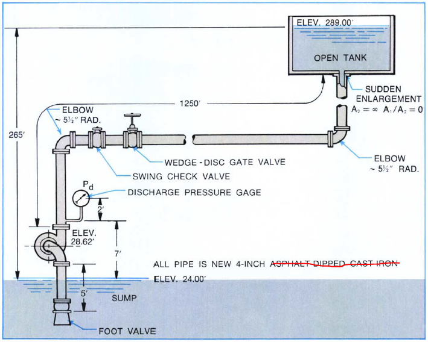

-----
title:   System Curves Worked Example
date:  April 16th, 2019
-----

# Worked Example
Consider the system below and develop a system curve for the flows from 0 to 300 GPM.

**Determine the Static Head**

Since both tanks have the same surface pressure, the static head is only dependent on the difference in surface elevation.

=+=
$$\Delta h_{static} = (z_{destination}-z_{supply}) $$
=+=

=+=
$$\Delta h_{static} = (289{feet}-24{feet}) = 265{feet} $$
=+=

**Determine the Pipe Friction and Properties**

To simplify this example, we will consider the friction factor to be constant at 0.02. In general, the friction factor would vary as the flow rate (velocity) varies. Additionally, the flow would be laminar for low velocities. These considerations should be taken into account when calculating the pipe losses.

A 4-inch, schedule 40 steel pipe has an inner diameter of 4.026 inches (0.3355 feet). The overall pipe length in this example is 1255 feet.

**Determine the Minor or Component Loss**

The losses for the components can be found in tables. In this example we have the following:

- Regular flanged elbow (2), k = 0.31 each
- Swing check valve, k = 2.0
- Wedge-disc gate valve, k = 0.17
- Sudden enlargement, k = 1.0

This gives a total K factor equal to 3.79

Using the combined frictional loss equation above, we can determine the head loss (in feet) as a function of velocity (in ft/sec2)

=+=
$$\Delta h_f = {({fL \over D} + K) * v^2 \over 2g}$$
=+=

=+=
$$\Delta h_f = {({0.02 * 155_{ft} \over 03355_{ft}} + 3.59) * v^2 \over 2 * 32.174 {ft/sec^2}}$$
=+=

=+=
$$\Delta h_f = 1.22v^2$$
=+=

**Determine the System Curve**

The system curve can be calculated by varying the flow rate (velocity) using the above values. Combining the static and dynamic (pipe friction and minor losses)
we have the following as a function of velocity.

=+=
$$\Delta h_{system} = \Delta h_{static} + \Delta h_{f}$$
=+=
=+=
$$\Delta h_{system} = 265{feet} + 1.22v^2$$
=+=

The following can be used to convert a flow rate in gpm (gallons per minute) to a velocity in ft/sec (with the pipe diameter D in inches).

=+=
$$v = 0.002228*Q*({4 \over \pi D^2})$$
=+=

Substituting this in for velocity and using the 4-inch pipe (ID = 4.026 inches) we can get the following as the system curve equation as a function
of flow rate in gpm.
=+=
$$\Delta h_{system} = 265{feet} + {{7.75e^{-4}}{Q^2}}$$
=+=

This, then, give the following system curve data. This is a system that is dominated by the static head (there is a lift of 265 feet compared to little loss in piping and components). 

=/=
title: Data Points
data-us: datapoints_us.csv
data-metric: datapoints_metric.csv
x: 1
series: 3, 2
series_title_index: 0
=/=

=|=
title: Data Points
data-us: datapoints_us.csv
data-metric: datapoints_metric.csv
=|=

