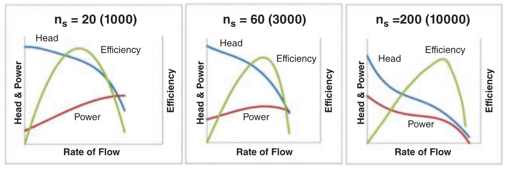
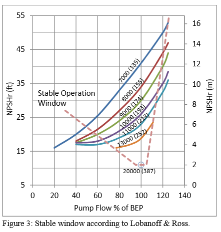
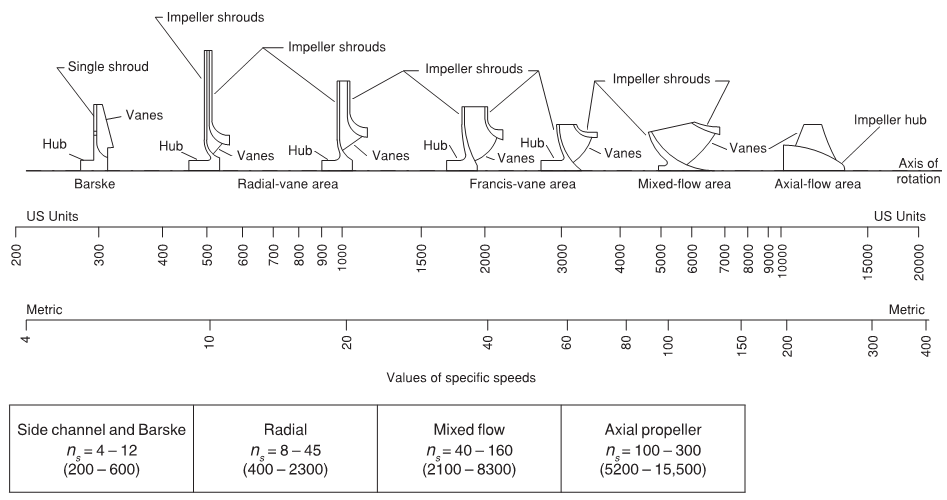
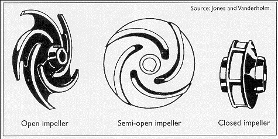
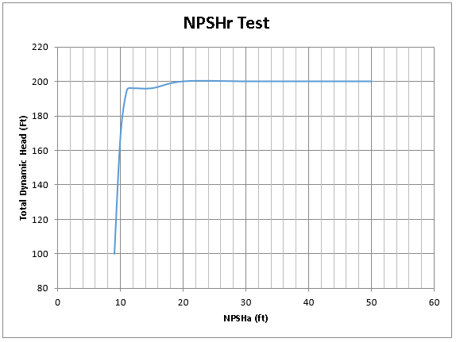

-----
title: Pump Principles
date:  June 18th, 2019
description: Overview of specific speed, suction specific speed, and affinity rules.
-----

# Pump Principles

## Impeller Specific Speed 

**Impeller specific speed** is an index of pump performance at the pump’s best efficiency point (BEP) rate of flow, with the maximum diameter impeller, and at a given rotative speed. Specific  speed is expressed by the following equation:

=+=
[units = us]
$$ Ns = { {n(Q)^{0.5} } \over {(H_{t})^{0.75} } } $$
=+=

=+=
[units = metric]
$$ n_s = { {n(Q)^{0.5} } \over {(H_{t})^{0.75} } } $$
=+=

Where:

- <units us = "Ns = Specific Speed " metric = "n_s_ = Specific Speed "/> 
- n = Rotational speed, in revolutions per minute 
- Q = Discharge at best efficiency point (BEP) <units us = "in gallons per minute" metric = "in cubic meters per second"/> 
- Ht = Total head, <units us = "in feet" metric = "in meters"/> 

The user is cautioned to check carefully the basis of calculation of specific speed and suction specific speed before making comparisons because there are subtle but significant differences in methods used throughout industry and in related textbooks and literature.

When calculating specific speed using units of cubic meters per second for flow rate and meters for head per stage, 51.6 is the conversion factor for specific speed in US gallons per minute and feet (i.e., metric × 51.6 = US customary units.)

The usual symbol for specific speed  is:

=+=
[units = us]
$$ Ns $$
=+=

=+=
[units = metric]
$$ n_s $$
=+=

<units us = "When calculating the value for specific speed and suction specific speed, the unit of measurement used for rate of flow is defined in US gallons per minute (gpm)." 
metric= " When calculating the value for specific speed and suction specific speed, the unit of measurement used within this standard for rate of flow is cubic meters per second (m3/s).
An alternative method of calculating this value is to use (m3/h) as the unit of measurement for rate of flow, which then results in a value that is i.e., 60 times greater."/>

Below is the approximate shape of performance curves based on the impeller specific speed with metric and (US) units:

Below is a graph that shows the maximum practically attainable efficiency for different flow rates. This proves useful in selection of hydraulics for 
particular applications, based on desired flow and head.

**Type number** is a variation of impeller specific speed. It is a dimensionless quantity calculated at the point
of best efficiency, which is defined by the following formula:

=+=
$$ K = {{2πnQ'^{0.5}} \over {(gH')^{0.75}}} = {{ωQ'^{0.5}} \over {(y')^{0.75}}} $$
=+=

where:

- Q’ = discharge per eye, <units us = "in feet cubed per second" metric = "in meters cubed per second"/>
- H’ = head of first stage in <units us = "feet" metric = "meters"/>
- n = rotational speed, in revolutions per minute
- g = gravitational acceleration, <units us = "in feet per second squared" metric = "in meters per second squared "/>
- ω = angular velocity, in radians per second
- y’ = specific energy, <units us = "in British thermal unit per pound mass" metric = "in joule per kilogram"/>

## Suction Specific Speed

**Suction Specific Speed** is an index of pump suction operating characteristics.
It is determined at the BEP flow rate with the maximum diameter impeller.
Suction specific speed is an indicator of the NPSHR for a 3% drop in head (MPSH3) at a given
rate of flow and rotational speed. Suction specific speed is expressed by the following equation:

=+=
[units = us]
$$ Nss = { {n(Q')^{0.5} } \over {(NPSH3)^{0.75} } } $$
=+=

=+=
[units = metric]
$$ S = { {n(Q')^{0.5} } \over {(NPSH3)^{0.75} } } $$
=+=

where:

- <units us = "Nss = Suction Specific Speed" metric = "S = Suction Specific Speed"/>
- n = Rotational speed, in revolutions per minute
- Q' = flow rate per impeller eye *OR* total flow rate for single suction impellers *OR* one half total flow rate for double suction impellers, <units us = "in US gallons per minute" metric = "in cubic meters per second"/>
- NPSH3 = Net positive suctions head required in feet that will cause the total head (or first stage head of multistage pumps) to be reduced by 3%

Suction specific speed derived using cubic meters per second and meters, multiplied by a factor of 51.6, is equal to suction specific speed derived using US gallons per minute and feet. The US customary symbol NSS is sometimes used to designate suction specific speed.

The user is cautioned to check carefully the basis of calculation of specific speed and suction specific speed before making any comparisons because there are subtle but significant differences in methods used throughout industry and in related textbooks and literature.

## Impeller Types

There are many different impeller types (pictured below) based on desired performance characteristics and type of fluid pumped. The main types of impellers are shown below. 
As the flow increases with respect to the developed head, the larger the waterways become and the smaller the diameter becomes.

The three configurations (pictured below) for an impeller are open, semi-open, and closed. Open impellers do not have a front or rear shroud. Semi-open impellers only have a
rear shroud. Closed impellers have a front and rear shroud.

Open impellers are typically used on smaller pumps and are weaker than closed impellers because of the lack of reinforcement of shrouds. They are typically cheaper to 
manufacture and easier to clean, but become inefficient as the pump wears. Closed impellers are more expensive to manufacture, more difficult to clean, and cannot pump
as many types of fluids as open impellers, but they are stronger and experience a much lower decrease in efficiency over the life of the pump. Semi-open impellers 
share some of the advantages and disadvantages of each. The reason for loss of efficiency in an open or semi-open impeller is that the distance between the vanes and 
the pump case surface increases over time due to wear. This allows for leakage back to suction, reducing efficiency. Another benefit of closed impellers is that 
setting axial distance doesn’t need to be as precise for this same reason.

## Net Positive Suction Head (NPSH)

**NPSH is the net positive suction head** in feet (US) or meters (metric). Impellers require a certain amount of head at suction beyond the vapor pressure of the pumped
fluid in order to operate properly. This is due to the fact that there is a drop in pressure as the flow enters the eye of the impeller. If the flow’s pressure drops 
below the vapor pressure of the fluid being pumped, bubbles can form – a phenomenon called cavitation. These bubbles collapse with high energy and can cause damage to
the surrounding parts of the pump through cavitation erosion. In addition to direct damage to the waterways, cavitation can cause higher vibration leading to damage 
to other parts as the pump such as seals and bearings. Below is a simplified graph showing the pressure of a fluid as it moves through a pump, with the bottom graph
showing the fluid reaching a pressure below that of its vapor pressure, causing cavitation.

The **net positive suction head available (NPSHa)**, which is the NPSH available at the pump site, is defined as:

=+=
$$ NPSH_{a} = {h_{sa}} - {h_{vp}} $$
=+=

Where:

- hsa = Total suction head absolute in <units us = "feet = h_atm_ + h_s_" metric = "meters =  h_atm_ + h_s_"/>
- hatm = Atmospheric pressure in head in <units us = "feet" metric = "meters"/>
- hs = Suction head
- hvp = Vapor pressure of fluid in <units us = "feet of head" metric = "meters of head"/>

A pump’s **net positive suction head required (NPSHr)** is important, as it allows a pump user to determine the amount of NPSHa needed at their pump site to ensure pump
performance is met. The occurrence of visible cavitation, increase of noise and vibration due to cavitation, beginning of head or efficiency drop, and cavitation 
erosion can occur when margin above NPSHr is present. NPSH3 is the value of NPSHr when the first-stage total head drops by 3% due to cavitation. 

Below is a common graph seen when testing a pump for NPSHr. This shows that as NPSHa is reduced, there is a point at which the head starts to drop off. On this test,
the NPSH3 is approximately 11 feet, as this is when the head drops 3% - in this case from 200 feet to 194 feet.

## Affinity Rules

*This section will include examples, animations, and a calculator*

Affinity rules are used in turbomachinery to approximately calculate a centrifugal pump’s influence on capacity, head, and power consumption with changing speed or impeller diameter.  