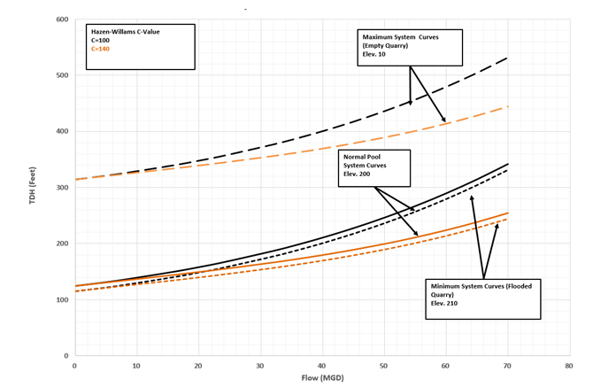
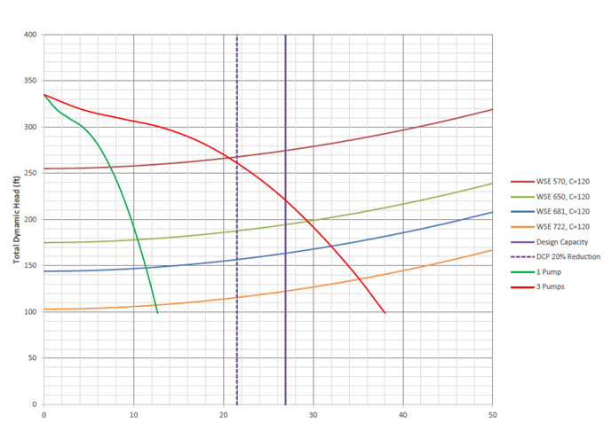

-----
title: Frequently Asked Questions
date:  June 12th, 2019
description: Frequently asked questions regarding pump and system curves; pump systems.
-----

# Frequently Asked Questions

## Pump Sizing in the Real World

Many real-world applications are designed for system curves that are provided as an envelope. This is due to varying head conditions caused by stormwater expectations, varying reservoir levels, 
piping conditions over time, or the use of pressurized tanks. The below is an example of a system curve envelope which dictates all the conditions seen. It is up to the system designer to specify
the important points the selected pumps need to hit.

*NOTE: This image needs to be modified to remove customer references (also change the specific C values to low friction and high friction), maybe take off the specific values.*

For many situations, the use of pumps in parallel or pumps in series can be used to define minimum and maximum conditions considering the use of a Variable Speed Controller in order to cover the
points below the pump curves. Below is an example of 3 identical pumps in parallel being sized to cover a system curve with varying head conditions.

*NOTE: This image needs to be modified to remove customer references (also change the specific C values to low friction and high friction), maybe take off the specific values.*

When selecting the appropriate pump in a situation like this, the use of a Variable Speed Controller is expected which means it is possible to reach duty conditions
that exist within the curve envelope.  Using affinity laws will allow the engineer to calibrate the Variable Speed Controller to cause the pumps to hit any desired
duty condition within the curve envelope.  It is important to remember that at any given time, the only point to dictate pump performance is where the present system
curve will intersect the pump curve.

## Undersized or Oversized Pumps

It is important to note that as the flow increases, the pump head produced will decrease as the system flow losses increases. Oversized or undersized pumps will have curves that do not
intersect at the required flow rate or will not cross at all. This will show that a different pump should be selected.
