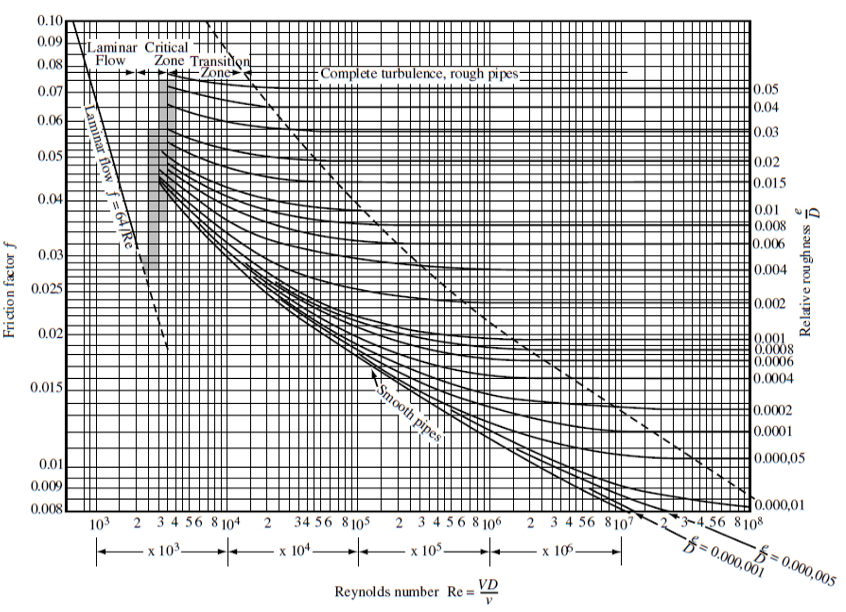

-----
title: E) Other Content
date:  July 2nd, 2019
description: Other content such as Reynolds number, pipe roughness, moody diagram.
-----

## Reynolds Number

### Tutorial

The Reynolds number is a non-dimensional ratio of inertial forces to viscous forces and is used to help scale data over a range of pipe sizes,
fluid properties, and flow conditions. It is used as the basis for the Moody Diagram to determine friction factors and pressure/head losses.

The Reynolds number is defined as: 

=+=
$$ Re = {ρVD \over μ} = {VD \over ν} = {QD \over {νA}} $$
=+=

where, for cylindrical pipes:

- ρ is fluid density
- V is fluid velocity
- D is pipe inner diameter
- μ is dynamic viscosity
- ν is kinematic viscosity
- Q is volumetric flow rate
- A is pipe cross-sectional area

At Reynolds numbers less than about 2300, the flow tends to be laminar where it is traveling in a smooth, orderly manner with little mixing. 
At Reynolds numbers higher than about 4000, the flow is considered turbulent, with eddies forming and irregular motion.

## Pipe Roughness

Pipe roughness varies on pipe material, age, usage, fluid transport and lining. This table gives example values for some clean materials.

=|=
title: Roughness Values
data-us: pipe-roughness-ft.csv
data-metric: pipe-roughness-mm.csv
=|=

Determining the frictional roughness for old pipe is beyond this tutorial. Deterioration of pipes with age depends on the particular chemical properties of the fluid
and the metal with which it is in contact. It is recommended that prior experience or testing be used to determine an accurate value. For commercial installations, 
it is recommended that 15 percent be added to the values shown above.

**(interactive calculators will be added)**

## Moody Diagram

(From L.F. Moody, "Friction factors for Pipe Flow", Trans. A.S.M.E., Vol 66, 1944)