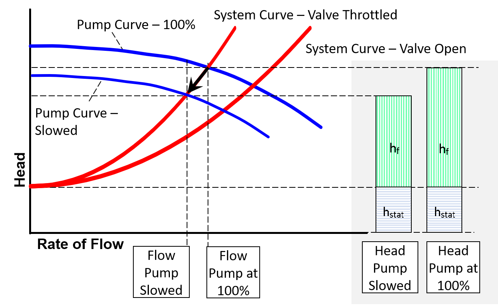

-----
title: Pump & System Curves Tutorial
date:  June 12th, 2019
-----

# Combined Pump & System Curves Tutorial

It is important to understand how the pump will interact with the system it is used in over a range of operating conditions. Combining the pump performance curve with the system curve will help 
show where the system will operate. In general, the system flow rate will be where the pump curve intersects the system curve.

Knowing the shape of the system curve will help to understand how the pump operating conditions will change if the system changes due to things like valve position, parts of the system coming
on and off line, and in upset conditions. Additionally, by overlaying the pump curves, it will help in determining if the pump is sized correctly to overcome the static and dynamic head of the system.

Using a pump and system curve will also help evaluate pump speed and impeller trimming. Both of which will change the pump curve and, therefore, where the system will operate. 
This will also help ensure the pump operation will be as close to the Best Efficiency Point (BEP) as possible to reduce energy consumption and increase pump reliability.

## Reading a Pump and System Curve Plot

As the name implies, a pump and system curve plot consists of at least two curves. The system curve will show the static head of the system (the head required to overcome gravity at zero flow) 
and the dynamic head, which is the frictional losses at varying flow rates). The operating point is where the two curves intersect.

## Flow Rate Change Using Manual Throttling Valve

As a manual (or passive) valve is changed (opening or closing) it will change the system curve by affecting the K value. Closing a valve will add resistance to
the system over the entire range of flows (an opening will reduce resistance). This can be shown on the pump system plot with the system curve bending upward. 
Note the static head at zero flow will still be the same. Using the revised pump system plot, a new operating point can be determined.

## Changes in Pump Speed

Changing the pump speed will change the pump curve. This can be represented using the affinity or similarity law. As the pump is slowed the pump curve
will be shifted down and to the left, getting closer to the plot origin.

With a system that has a manual throttling valve (active control valves are discussed later), changing the pump speed will change two things as
shown in the pump system plot – the system flow and the pump head generated. Slowing the pump down, as depicted in the chart, will reduce pump head 
produced and reduce the system flow. Note the static head at zero flow will still be the same.

## Changes in Impeller Size

In selecting the appropriate curve for a pump application to fit the desired system conditions, many centrifugal pumps can use different sized impellers to shift the pump curve.
Trimming the impeller down in size will move the pump curve down much in the same way as reducing the speed of rotation.  The same can be said for selecting a large
r impeller, the curve will shift up.  When sizing a pump for an application in which the pump is not hooked up to a variable speed controller, it is more appropriate
to size the impeller to your desired duty conditions.

## Active Control Valves

An active control valve is one that continually changes position (loss) to maintain a set flow or pressure. It is important to note that there is no human intervention involved.
Since they continuously vary their loss to maintain a flow or pressure, there is no unique valve over a range of system flows. Because of this, they are not normally included in the 
system curve. But they are shown on the pump system plot as the difference between the two curves at the operating point. In other words, a system with an active control valve will not 
operate at the intersection of the pump and system curves since the control valve will fix the system at a certain point. 

This pump system plot shows two things. First, with the control valve in the system, the pump head required is the sum of the static head, frictional losses and the loss across the control valve. 
It also shows that the flow in the system is less than the flow in the system without the control valve.

The plot also is useful in determining the margin available on the control valve. Having sufficient, but not excessive, pressure drop across most control valves is required so the valve can properly control 
to the setpoint.