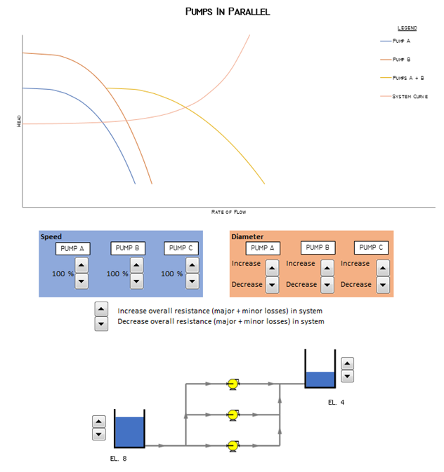

-----
title: Pump & System Curves Demonstration
date:  June 12th, 2019
-----

# Educational Demonstration

This education demonstrator will show how changing the pump speed and the system curve will change the operating point. This is a representative demonstration and does not have actual values.

Change the pump speed slider to change the shape of the pump curve. The static head can be varied by changing the supply and destination levels. The overall frictional loss 
(piping and minor) can be varied by moving the slider. 

## Parallel Pumps

This demo explores how three different pumps (A, B, and C) operate in parallel, how impeller diameter and speed affect each of the pumps, and how the system curve interacts with the pump curves.

Explore how speed affects a pump curve by using the toggle buttons in the blue area to increase or decrease speed for a pump. Explore how impeller diameter affects a pump curve by using the 
toggle buttons in the orange area to increase or decrease diameter for a pump.  Change the static head by increasing and/or decreasing the reservoir elevation levels.

**Turn Different Curves On/Off**

1)	Click the chart

2)	Select the "Chart Filters" Icon 

3) Select/deselect desired curves, then click "Apply".

## Series Pumps

This demo explores how three different pumps (A, B, and C) operate in series, how impeller diameter and speed affect each of the pumps, and how the system curve
interacts with the pump curves.

Explore how speed affects a pump curve by using the toggle buttons in the blue area to increase or decrease speed for a pump. Explore how impeller diameter affects 
a pump curve by using the toggle buttons in the orange area to increase or decrease diameter for a pump.  Change the static head by increasing and/or decreasing the 
reservoir elevation levels.

**Turn Different Curves On/Off**

1)	Click the chart

2)	Select the "Chart Filters" Icon 

3) Select/deselect desired curves, then click "Apply".

