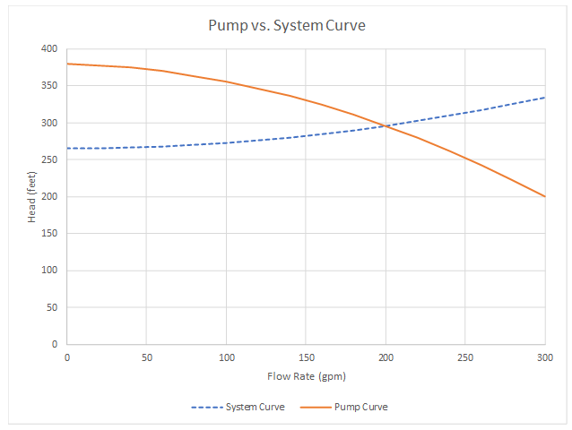

-----
title: Pump & System Curves Worked Example
date:  June 12th, 2019
-----

# Worked Example

Previously we developed a system curve for the system shown below for flows from <units us = "0 to 300 gpm. Using 4-inch pipe, the function in terms of gpm is the following." 
metric = "0 to 68.14 m3/h. Using 4-inch pipe, the function in terms of gpm is the following."/>

=+=
$$\Delta h_{system} = 265{feet} + 7.75{e^{-4}}{Q^2}$$
=+=

**Verifying the Pump Curve with the System**

We need this system to operate at <units us = "200 GPM. Based on the system curve previously determined, this would require 296 feet of head. Finding the perfect pump from a vendor,
we select some data points from the pump curve which are shown in the following table." 
metric = "45.43 m3/h. Based on the system curve previously determined, this would require 90.22 meters of head. 
Finding the perfect pump from a vendor,we select some data points from the pump curve which are shown in the following table."/>

=|=
title: Data
data-us: qdH-us.csv
data-metric: qdH-metric.csv
=|=

Using a second-order polynomial curve fit, we get the following pump curve equation:

=+=
$$\Delta h_{pump} = 380 - {0.06Q}-{0.0018Q^2}$$
=+=

We can combine the system curve with the pump curve to get an overall understanding of how the system will operate.

Since this system does not have active control devices, the system will operate where the pump and system curves intersect, which is at <units us = "200 gpm and 296 feet." 
metric = "45.43 m3/h and 90.22 m."/>

**System Deviations**

Both the pump and the system can deviate from this ideal design case. For example, the pump performance can degrade, or the system losses can increase with fouling
over time. If we combine the pump and system curves we can evaluate what will happen in various cases.

For example, let’s examine what happens with the tank level changes. With all other factors being held constant, this would change the static head of the system. 
The pump would also change its operating point in response. Since the operating point will be where the pump and system curves intersect, we can set the two equations
equal and solve for flow rate.

=+=
$$\Delta h_{system} = \Delta h_{pump}$$
=+=
=+=
$$\Delta h_{static} + {7.75e^{-4}}{Q^2} = 380 - {0.06Q} - {0.0018Q^2}$$
=+=
=+=
$$(\Delta h_{static} - 380) + {0.06Q} + ({{7.75e^{-4}} + 0.0018})Q^2 = 0$$
=+=

We can solve this equation using the quadratic formula: 

=+=
$$Q = {{-b \pm \sqrt {b^2 - 4ac} } \over{2a}}$$
=+=

Where:

- a = 7.75e^{-4} + 0.0018
- b = 0.06
- c = Δh(static) - 380

If, for example, the tank level rises <units us = "10 additional feet, the static head would increase
to 275 feet. Solving the above equation, we determine that the new flow rate into the tank would be 190.6 GPM."
metric = "3.048 additional meters, the static head would increase
to 83.82 m. Solving the above equation, we determine that the new flow rate into the tank would be 43.29 m3/h."/>

Other cases (e.g. pipe or fitting resistances, pump speed, etc.) would require some corresponding factors to be 
left as variables in the equations so they can be changed. But the methodology would remain the same.

